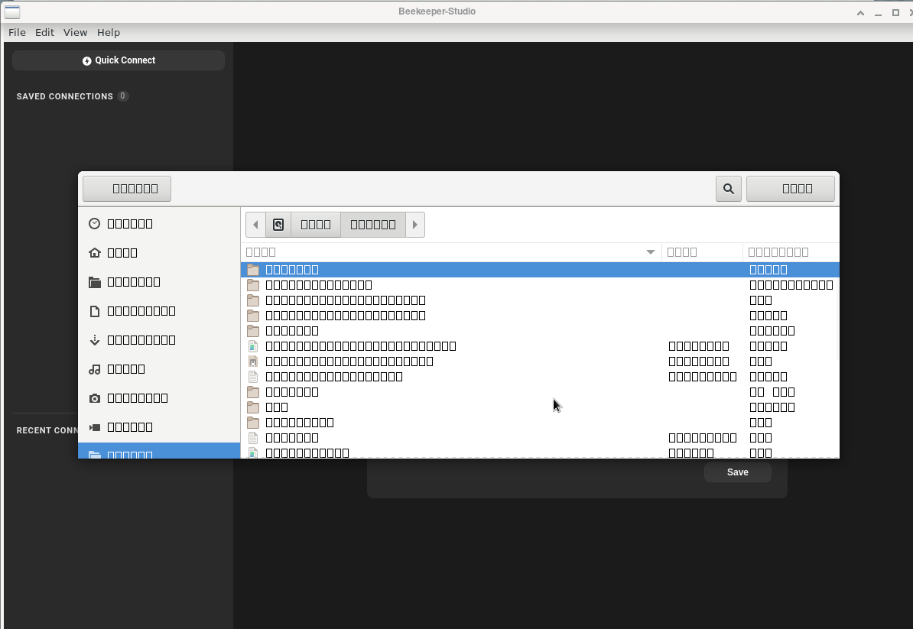

# Troubleshooting

Hopefully you can solve your problems with the details below. If not please [contact us][/contact/] and we'll try our best to help.

[[toc]]


## How to Debug Beekeeper Studio

### Enable Debug Mode and Collect Logs

You can find logs for Beekeeper in these directories:

Linux: ~/.config/beekeeper-studio/logs/{process type}.log
MacOS: ~/Library/Logs/beekeeper-studio/{process type}.log
Windows: %USERPROFILE%\AppData\Roaming\beekeeper-studio\logs\{process type}.log

By default they will only contain uncaught errors.

You can enable extended logging by starting Beekeeper Studio with the debug flag `DEBUG=*`.

On linux, just run the app like this: `DEBUG=* beekeeper-studio`


## MySQL

* This section also applies to MariaDB

### I get a SQL syntax error when trying to create a stored procedure

When using the `mysql` command line client you need to remap delimiters using `DELIMITER`, however this syntax isn't supported by MySQL server itself, so it errors when run through Beekeeper Studio.

You'll likely get an error like `You have an error in your SQL syntax`. Simply remove the delimiter statements to fix it.

For example, change this:
```sql
DELIMITER //

CREATE PROCEDURE simpleproc (OUT param1 INT)
 BEGIN
  SELECT COUNT(*) INTO param1 FROM t;
 END;
//

DELIMITER ;
```

To this:

```sql
CREATE PROCEDURE simpleproc (OUT param1 INT)
 BEGIN
  SELECT COUNT(*) INTO param1 FROM t;
 END;
```


## SQLite

### I get 'permission denied' when trying to access a database on an external drive

If you're on Linux and using the `snap` version of Beekeeper you need to give the app an extra permission.

```bash
sudo snap connect beekeeper-studio:removable-media :removable-media
```

If you're on another platform, please [open a ticket][bug] and we'll try to help you debug the problem.

[bug]: https://github.com/beekeeper-studio/beekeeper-studio/issues/new?template=bug_report.md&title=BUG:

## PostgreSQL

### I get a `column does not exist` error, but the column does exist!

Postgres is weird with case sensitivity. This is usually the cause of the dreaded `column does not exist` error.

Postgres has two behaviors with column names:
- If you define your column name without double quotes postgres downcases the name.
- If you define your column name WITH double quotes, you need to use double quotes forever.

For example:

In this table:

```sql
CREATE table foo("myColumn" int);
```

- This won't work: `select myColumn from foo`
- This will works: `select "myColumn" from foo`

See [this StackOverflow answer](https://stackoverflow.com/a/20880247/18818) or [this section in the PostgreSQL manual](https://www.postgresql.org/docs/current/sql-syntax-lexical.html#SQL-SYNTAX-IDENTIFIERS)

## Linux (Snap)

### The Filepicker shows 'little rectangles' instead of a font



This is an issue with `snapd` itself and how it isolates apps from font config (or doesn't, in this case). This seems to come up with Arch, Manjaro, and Fedora, I guess because the snap team mostly cares about snaps working in Ubuntu.

Workaround:

```bash
sudo rm -f /var/cache/fontconfig/*
rm -f ~/.cache/fontconfig
```

See for reference:
- [Filed bug with snapd](https://bugs.launchpad.net/snappy/+bug/1916816)
- [Discussion on snapcraft forums](https://forum.snapcraft.io/t/snap-store-fonts-on-arch-linux-are-merely-empty-rectangles/15373/9)

