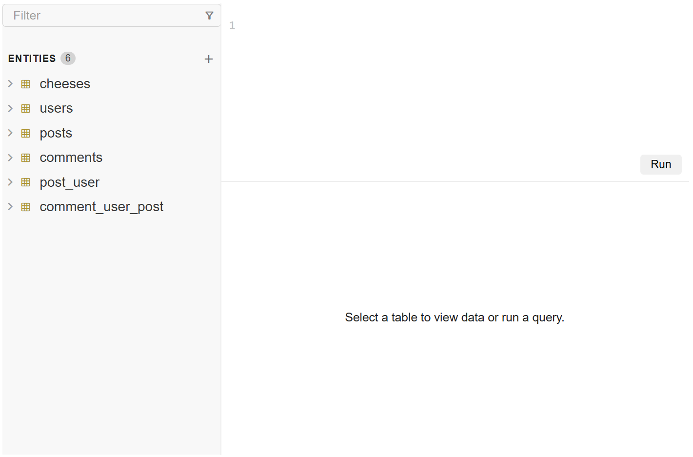

# Data Editor

Data Editor consists of [Table][table], [Entity List][entity-list] and
[SQL Text Editor][sql-text-editor] components in one place.



## Basic Usage

Similar to other components, Data Editor obtain its data from the `entities`
property, which is an array of [Entity][entity-api] objects.

```html
<bks-data-editor></bks-data-editor>
<script>
  const dataEditor = document.querySelector("bks-data-editor");
  dataEditor.entities = [
    {
      name: "users",
      columns: [
        { field: "id", dataType: "integer" },
        { field: "name", dataType: "varchar" },
      ],
      data: [
        { id: 1, name: "John Doe" },
        { id: 2, name: "Jane Smith" },
      ],
    },
  ];
</script>
```

A list of features are including:
- Double-clicking an entity in Entity List to show its data.
- Autocomplete for SQL Text Editor.
- A submit button and keyboard shortcuts for submitting the query.

## Query Submission

Submitting a query can be triggered by:

- `Ctrl + Enter` or `Cmd + Enter`.
- Clicking the "Run" button.

You can listen to the `bks-query-submit` event to handle the query submission.

```js
dataEditor.addEventListener("bks-query-submit", (event) => {
  const query = event.detail.query;
  const result = await runQuery(query);
  dataEditor.setTable({
    name: "result",
    columns: result.columns,
    data: result.data,
  });
})
```

## Changing the Query Result or Table data

You can change the query result or table data using the `setTable` method
which accepts an [Entity][entity-api] object.

```js
dataEditor.setTable({
  name: "result",
  columns: [
    { field: "uuid", dataType: "varchar", primaryKey: true },
    { field: "name", dataType: "varchar" },
    { field: "email", dataType: "varchar" },
  ],
  data: [
    { uuid: "123-456-789", name: "John Doe", email: "john.doe@example.com" },
  ],
});
```

## Inner Components Properties and Events

You can modify inner components by passing their properties as an object.

```js
dataEditor.entityListProps = {
  hiddenEntities: [
    { name: "users", entityType: "table" },
  ],
};
dataEditor.tableProps = {};
dataEditor.sqlTextEditorProps = {};
```

You can listen to inner components events using the same name.

```js
dataEditor.addEventListener("bks-entities-request-columns", (event) => {
  console.log("Emitted from Entity List!");
});
```

## API

See the API reference below for more details.

- [Data Editor API][data-editor-api]
- [Entity API][entity-api]

[table]: ./table.md
[entity-list]: ./entity-list.md
[sql-text-editor]: ./sql-text-editor.md
[data-editor-api]: ./api/data-editor.md
[entity-api]: ./api/entity.md
[context-menu]: ./context-menu.md
