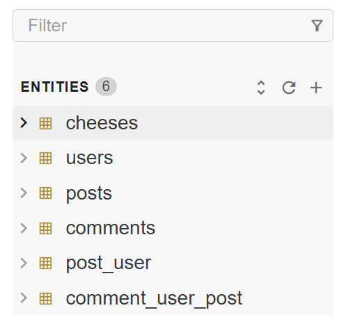

# Entity List

The Entity List displays a list of database objects or entities in a tree
structure that can be expanded and collapsed.



## Basic Usage

An entity list gets its data from the `entities` property, which is an array
of [Entity][entity-api] objects.

```html
<bks-entity-list></bks-entity-list>
<script>
  const entities = [
    {
      name: "users",
      columns: [
        { field: "id", dataType: "integer" },
        { field: "name", dataType: "string" },
      ],
    },
  ];
  const entityList = document.querySelector("bks-entity-list");
  entityList.entities = entities;
</script>
```

The simplest way to make a table entity is to provide a name for the entity.

```js
const entities = [{ name: "users" }, { name: "orders" }];
```

## Schemas

You can provide a `schema` prop as a string to the entity objects and they
will be displayed inside a schema folder.

```js
const entities = [
  {
    name: "users",
    schema: "public",
  },
  {
    name: "orders",
    schema: "public",
  },
];
```

## Entity types

It also recognizes 4 entity types such as `table`, `view`, `materialized-view`,
and `routine`.

```js
const entities = [
  {
    name: "users", // This will default to table
  },
  {
    name: "users",
    entityType: "table",
  },
  {
    name: "order_summary",
    entityType: "view",
  },
  {
    name: "order_summary_2",
    entityType: "materialized-view",
  },
  {
    name: "get_order",
    entityType: "routine",
    returnType: "integer",
    type: "function",
  },
];
```

## Identifier

Entity list uses a combination of `name`, `schema`, and `entityType` as an
identifier. If you want to use a different identifier, you can add an `id`
property to the entity object.

```js
const users = { id: "abc123", name: "users" };
```

## Hiding

Essentially, hiding an entity can be done by not including it to the `entities`
prop. However, entity list provides UI hints and a modal to help listing the
hidden entities.

To enable this, set the `hiddenEntities` property to an array of entities that
you wish to hide.

```js
const entities = [users, orders];
const hiddenEntities = [orders];

entityList.entities = entities;
entityList.hiddenEntities = hiddenEntities;

entityList.addEventListener("bks-entity-unhide", (event) => {
  const entity = event.detail.entity;
  const entities = hiddenEntities.filter(
    (hiddenEntity) => hiddenEntity !== entity
  );
  entityList.hiddenEntities = entities;
});
```

## Pinning

Entity list allows you to show pinned entities above the main list. To enable
this, set the `enablePinning` property to `true` and `pinnedEntities` property
to an array of entities.

```js
const entities = [users, orders];
const pinnedEntities = [orders];

entityList.enablePinning = true;

entityList.entities = entities;
entityList.pinnedEntities = pinnedEntities;

entityList.addEventListener("bks-entity-pin", (event) => {
  const entity = event.detail.entity;
  const entities = pinnedEntities.concat(entity);
  entityList.pinnedEntities = entities;
});

entityList.addEventListener("bks-entity-unpin", (event) => {
  const entity = event.detail.entity;
  const entities = pinnedEntities.filter(
    (pinnedEntity) => pinnedEntity !== entity
  );
  entityList.pinnedEntities = entities;
});
```

## Lazy Loading Columns

Enabling lazy loading columns can be done easily. You can simply **_not_** set
the `columns` property to the entity object or set it to `undefined` and the
component will request for the columns when needed.

Entity list will emit a `bks-entities-request-columns` event when the entity
is expanded. An entity can be expanded by clicking the expand icon next to the
entity icon, or by clicking the expand all icon in the top right corner.

```js
entityList.addEventListener("bks-entities-request-columns", (event) => {
  const entities = event.detail.entities;
  for (const entity of entities) {
    const columns = await fetchColumns(entity)
    entity.columns = columns
  }
});
```

This works for other table-like entities (views and materialized views).

With virtual rendering, the component will only request for entities that are
within the viewport.

If you wish to stop the event from being emitted, you can set the `columns`
property to `[]` (an empty array).

## Virtual Rendering

Entity List uses virtual rendering to render a large list of entities. This
means that it will only render the entities that are within the viewport and
update when the user scrolls.

## Context Menu

More info on how to modify the context menu can be found in
[Context Menu][context-menu] and the [Entity List API][entity-list-api] docs.

## API

See the API reference below for more details.

- [Entity List API][entity-list-api]

[entity-list-api]: ./api/entity-list.md
[context-menu]: ./context-menu.md
[entity-api]: ./api/entity.md
