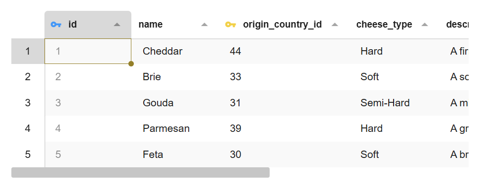

# Table

The Table component displays data of a database table in a tabular form with
spreadsheet like selection.



## Basic Usage

```html
<bks-table></bks-table>
<script>
  const table = document.querySelector("bks-table");
  table.data = [
    { id: 1, name: "John Doe" },
    { id: 2, name: "Jane Smith" },
  ];
  table.columns = [{ field: "id" }, { field: "name" }];
</script>
```

## Primary Keys

Primary keys are indicated by key icon in the column header.

```js
table.columns = [
  {
    field: "id",
    primaryKey: true,
  },
];
```

## Foreign Keys

Similar to primary keys and a button is shown next to the value in the table.

```js
table.columns = [
  {
    field: "userId",
    foreignKey: true,
  },
];
```

To listen to foreign key clicks, use the `bks-foreign-key-go-to` event.

```js
table.addEventListener("bks-foreign-key-go-to", (event) => {
  const { value, field, cell } = event.detail;
  console.log(value, field, cell);
});
```

## Editing

To enable editing, set the `editable` property to `true`.

```js
table.columns = [
  {
    field: "userId",
    editable: true,
  },
];
```

## Context Menu

More info on how to modify the context menu can be found in
[Context Menu][context-menu] and the [Table API][table-api] docs.

## Customization

You can customize the appearance of the Table component by overriding these CSS variables. This allows you to change colors for table headers, cells, selection highlighting, and other visual elements to match your application's theme.

```css
.BksTable {
  --bks-table-bg-color: #ffffff;
  --bks-table-fg-color: rgba(0, 0, 0, 0.87);
  --bks-table-header-bg-color: #ffffff;
  --bks-table-header-bg-color-selected: #f6df72;
  --bks-table-header-bg-color-highlight: #d9d9d9;
  --bks-table-header-fg-color: unset;
  --bks-table-header-fg-color-selected: #000000;
  --bks-table-header-fg-color-highlight: unset;
  --bks-table-header-border-color: #d9d9d9;

  --bks-table-header-col-bg-color: #ffffff;
  --bks-table-header-col-border-color: transparent;

  --bks-table-row-odd-bg-color: rgba(0, 0, 0, 0.02);

  --bks-table-cell-fg-color: unset;
  --bks-table-cell-bg-color-hover: rgba(0, 0, 0, 0.05);
  --bks-table-cell-bg-color-selected: rgba(0, 0, 0, 0.05);

  --bks-table-sorter-fg-color-active: #000000;
  --bks-table-sorter-fg-color-inactive: rgba(0, 0, 0, 0.35);

  --bks-table-range-border-color: #caa900;

  --bks-table-tooltip-bg-color: #292a2d;
  --bks-table-tooltip-fg-color: lightgray;
}
```
## API

See the API reference below for more details.

- [Table API][table-api]

[table-api]: ./api/table.md
[context-menu]: ./context-menu.md
