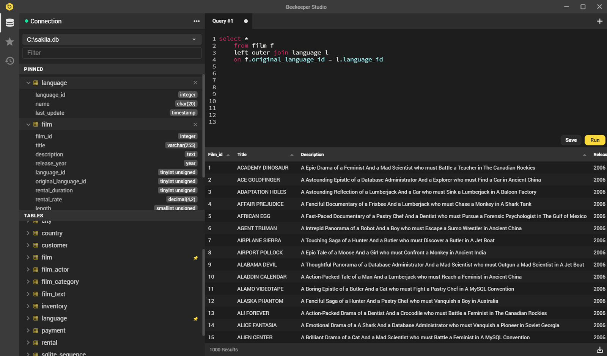

## FAQ

### Who is behind Beekeeper Studio?

Beekeeper Studio is built and maintained by Matthew Rathbone and Gregory Garden. You can learn more about them [on the Beekeeper Studio website](https://www.beekeeperstudio.io/about/)

### What data does the app collect about me?

None. We don't collect any telemetry or usage data from you when you use the app. [It's none of our business](https://www.beekeeperstudio.io/mission/).

The only 'dial-home' the app does is to check for a new available version. This simply checks the `releases` page of our [GitHub repository](https://github.com/beekeeper-studio/beekeeper-studio) and is not recorded by us.

### How do you make money?

We don't. The app is 100% open source and free. We will *never* hide any core database GUI features behind a paywall. 

That said we do want to work on Beekeeper Studio full time. So there will be some sort of way to support us in the future, stay tuned!

### Why do you spend time building a free app?

We love writing software, and we love using nicely crafted software. When building apps and websites we've suffered through one too many clunky database interfaces, so decided to do something about it.

### Why make it open source and not just free?

The tools and databases we use are all open source, and we think they deserve quality open source tooling to go with them.

Also, are commercial freemium apps ever really free? We don't want you to think we're collecting your personal information or stealing your company secrets. We [don't ever want to do that][mission]. Data privacy shouldn't be a privlige for those who can pay.

[mission]: https://www.beekeeperstudio.io/mission/

### What third party data collection tools do you use?

On our website (not in our app) we pay for [Fathom Analytics](https://usefathom.com) to record user visits in a totally private and anonymous way. We also host the website on [Netlify](https://netlify.com).

We don't use any data collection tools in the app.
