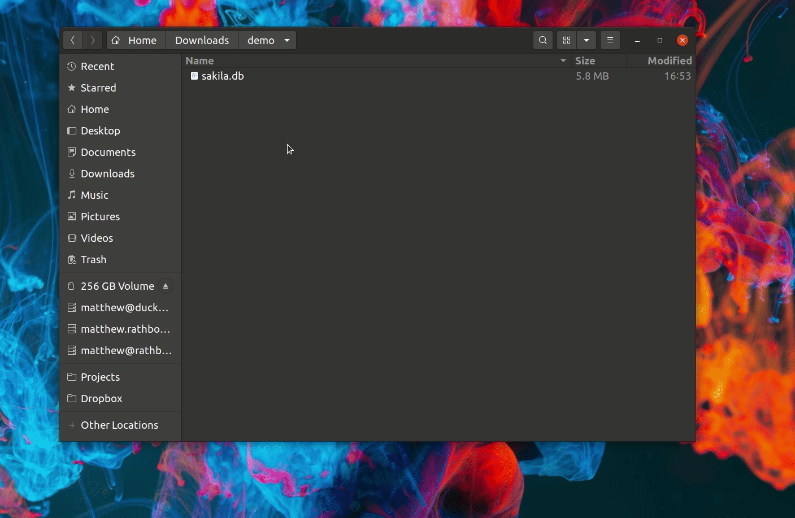
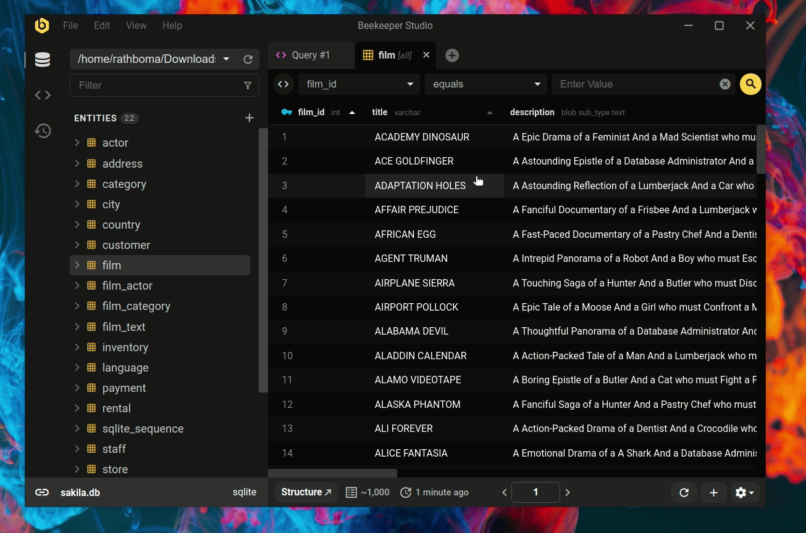

Hola y bienvenido a la comunidad de Beekeeper Studio. Creo que te va a gustar estar aqui.

Beekeeper Studio es mas que una aplicacion, ven a saludar:

- [Unete al grupo de Slack de la comunidad](https://beekeeperstudio.io/slack)
- [Explora las solicitudes de funciones en Github](https://github.com/beekeeper-studio/beekeeper-studio)


!!! note "Hola!"
    Esta pagina te ayudara a familiarizarte con Beekeeper Studio. Si has usado aplicaciones similares en el pasado, sientete libre de explorar el resto del sitio de documentacion, o simplemente comienza a usar Beekeeper Studio (es bastante intuitivo!)


Si eres nuevo en las aplicaciones de gestion de bases de datos en general, puede ser util ver este recorrido por Beekeeper Studio, donde repaso varias funciones importantes

<iframe width="100%" height="315" src="https://www.youtube-nocookie.com/embed/id37-ZRZNkQ" title="YouTube video player" frameborder="0" allow="accelerometer; autoplay; clipboard-write; encrypted-media; gyroscope; picture-in-picture; web-share" allowfullscreen></iframe>

[Ver el recorrido de Beekeeper Studio en YouTube](https://www.youtube.com/watch?v=id37-ZRZNkQ)

## Primer paso - instalar Beekeeper Studio


Beekeeper Studio es una aplicacion de escritorio, asi que el primer paso es [Instalar Beekeeper Studio](./installation/index.md)


## Exploremos Beekeeper Studio con una base de datos de demostracion

Una forma rapida y facil de explorar la funcionalidad de Beekeeper Studio es con la base de datos de demostracion `Sakila` -- es una base de datos de ejemplo que modela una antigua tienda de alquiler de DVD, como un Blockbuster.


!!! tip "Los expertos pueden saltar al final"
    Si ya tienes una base de datos que quieres ver, editar y consultar, adelante!

    Estos temas te ayudaran a comenzar con las funciones mas utilizadas de Beekeeper Studio

    - [Conectarse a una base de datos](./user_guide/connecting/connecting.md)
    - [Escribir SQL](./user_guide/sql_editor/editor.md)
    - [Explorar y editar datos de tablas](./user_guide/editing-data.md)
    - [Crear y modificar tablas](./user_guide/modify-tables.md)


### Comenzando con Sakila y Beekeeper Studio

1. Asegurate de tener Beekeeper Studio [descargado e instalado](./installation/index.md)
1. [Descarga la base de datos Sakila](https://github.com/ivanceras/sakila/raw/master/sqlite-sakila-db/sakila.db) - este es un archivo `.db` - un archivo de base de datos SQLite autocontenido.
2. Haz doble clic en el archivo `sakila.db` que acabas de descargar.

Beekeeper se abrira, mostrandote el contenido de la base de datos:



### Abre una tabla y cambia algunos datos

Haz doble clic en la tabla `film` en la barra lateral izquierda. Esto abrira la vista de datos para esa tabla.

Recuerda - esta es solo una base de datos de demostracion, puedes hacer lo que quieras con ella sin ningun riesgo. Intenta hacer clic en la celda `title` de una pelicula y cambiar el nombre de la pelicula. Puedes guardar tus cambios haciendo clic en el boton `apply` en el pie de pagina.




### Escribe tu primera consulta SQL

Ahora que sabes como ver y editar datos de tablas, por que no escribir algo de SQL personalizado para extraer datos interesantes de la base de datos.

Aqui hay una consulta de ejemplo para contar el numero de peliculas en la base de datos agrupadas por clasificacion (como PG-13):

```sql
SELECT
    film.rating, COUNT(DISTINCT inventory.film_id) AS film_count
    FROM film JOIN inventory
    ON film.film_id = inventory.film_id
    GROUP BY film.rating
    ORDER BY COUNT(inventory.film_id) DESC
```

Ejecutar esto produce el siguiente resultado:

| rating | film_count |
|--------|------------|
| PG-13  | 213        |
| NC-17  | 202        |
| PG     | 183        |
| R      | 189        |
| G      | 171        |

### Explora otras funciones de Beekeeper Studio

Es hora de volar del nido y explorar Beekeeper Studio por tu cuenta.

- Intenta [crear una nueva tabla](./user_guide/modify-tables.md)
- Quizas [exportar algunos datos a Excel](./user_guide/data-export.md)
- Tambien revisa [embellecer tus resultados con Query Magics](./user_guide/query-magics.md)


## Contactanos si necesitas ayuda

Atascado? Confundido? Envianos un correo y te ayudaremos - [support@beekeeperstudio.io](mailto:support@beekeeperstudio.io)
