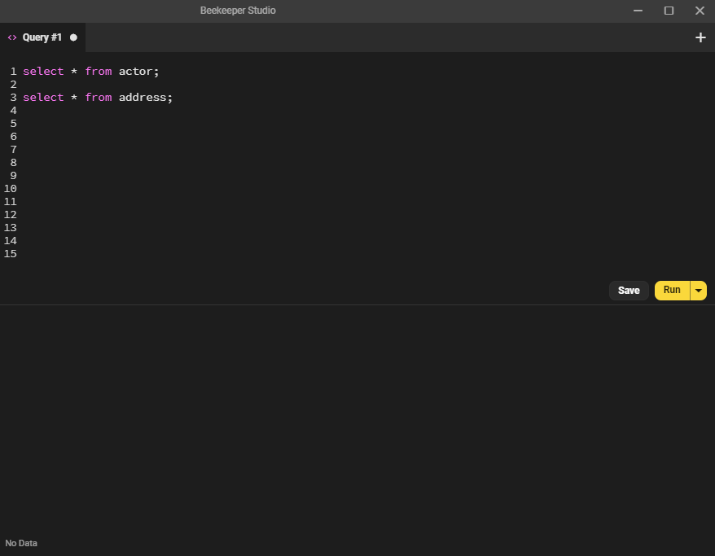
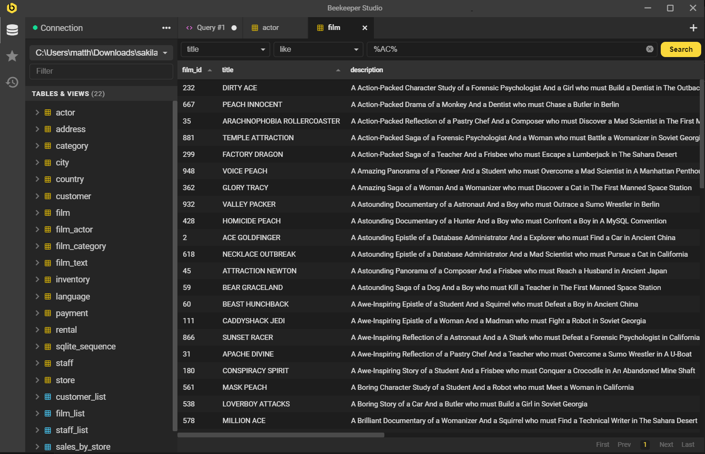

Once you are connected to your database Beekeeper Studio allows you to open tabs to do the following things:

1. SQL Editor: Write and execute SQL Queries (this is what tabs do by default)
2. Table Explorer: View table contents

## SQL Editor

Writing SQL is such a fundamental part of interacting with a relational database that we put this functionality front and center.

You can use the SQL query tab to write, and run, SQL queries quickly and easily.

### Code Completion

We have tried to make our code completion useful but not intrusive. 

Code suggestions will automatically appear in the following situations:

- `tables` will be suggested after typing `from` or `join`
- `columns` will be suggested after typing a tablename, or table alias, followed by a period, eg `film.`

In these situations, Beekeeper will automatically resolve the correct table and column names for the entity you are querying.

Oh, you want to manually trigger code-suggestions? The default key combo is `Ctrl+Space`, or `Cmd+Space`.

### Run Contexts

If you like writing big long SQL scripts with multiple queries in the same editor pane (I know I do), you might want to only run a portion of your script at a time.

Beekeeper allows you to:

1. Run everything (this is the default)
2. Run only the 'current' query (Beekeeper highlights this query for you so you know what will run)
3. Run only what you have selected.

## Table Explorer

Click the little `open` button next to a table name to open the table in a table-tab.

Now you can filter, sort, and explore your table data all day.

