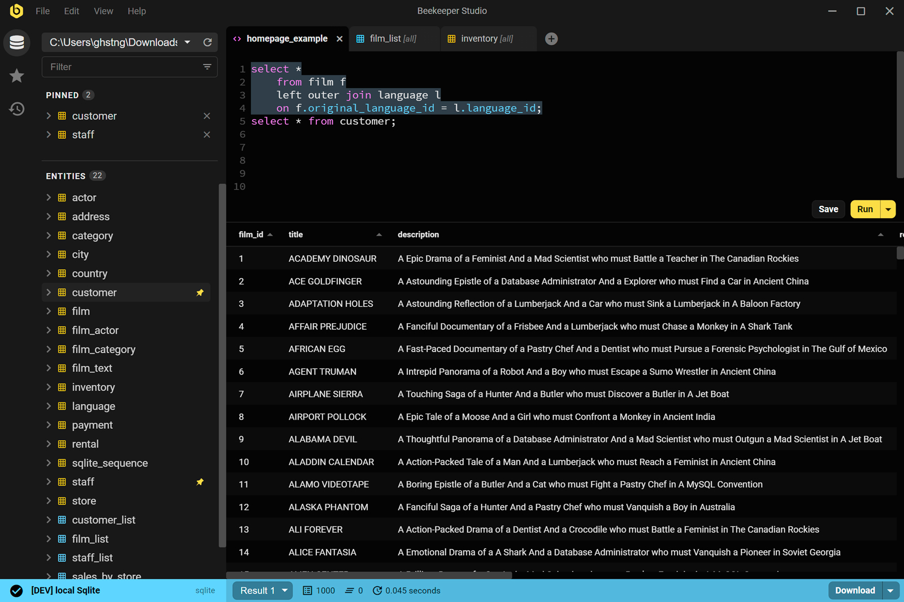

## Que es Beekeeper Studio?

Beekeeper Studio es un gestor de bases de datos e interfaz grafica SQL. Es una aplicacion de escritorio facil de usar. Es una alternativa visual a las herramientas de linea de comandos como `psql` o `mysql`, y ademas proporciona muchas funciones adicionales utiles.

### Bases de datos compatibles con Beekeeper Studio



### Plataformas compatibles con Beekeeper Studio

Beekeeper Studio esta disponible para computadoras portatiles y de escritorio con [MacOS](./installation/macos-m1-intel.md), [Windows](./installation/windows.md) y [Linux](./installation/linux.md).

Es importante destacar que Beekeeper Studio ofrece **paridad total de funciones** en todos los sistemas operativos compatibles.

Lamentablemente, actualmente no tenemos planes de portar Beekeeper Studio a dispositivos iOS o Android.

