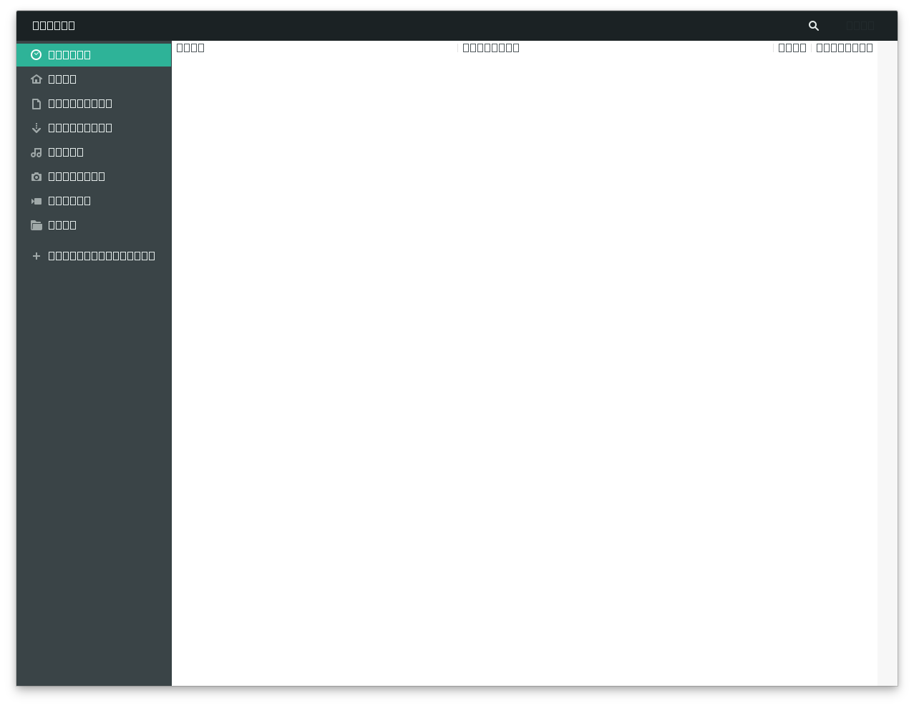

Hay varias formas de instalar Beekeeper Studio en sistemas Linux.

Arquitecturas soportadas: `x86-64` (la mayoria de laptops y computadoras de escritorio) y `ARM64` (Raspberry Pi).

!!! info "Recomendamos usar AppImage"
    Encontramos que proporcionan la experiencia mas consistente en todas las distribuciones de Linux.

## AppImage

!!! info "Ubuntu requiere bibliotecas Fuse"
    En Ubuntu necesitaras instalar libfuse para que funcione el AppImage. Asi es como:
    Ubuntu < 22.04 usa: `sudo apt-get install fuse libfuse2`
    Ubuntu >= 22.04 usa: `sudo apt install libfuse2`

Los AppImages se pueden descargar y ejecutar directamente en la mayoria de las distribuciones de Linux sin ningun tipo de instalacion. Esto es ideal si no tienes acceso root, pero aun quieres usar Beekeeper Studio.

La distribucion AppImage de Beekeeper Studio proporciona actualizaciones automaticas.

Descarga el ultimo AppImage [desde la pagina principal de Beekeeper Studio](https://www.beekeeperstudio.io/)

Si deseas integrar el AppImage en el shell de tu sistema (para que aparezca en tu menu de aplicaciones), te recomendamos [instalar AppImageLauncher](https://github.com/TheAssassin/AppImageLauncher/releases/latest).

## DEB
Se proporciona un repositorio para Debian y Ubuntu 22.04+.

Las compilaciones DEB estan disponibles tanto para sistemas x86_64 como ARM64.

Configura el repositorio usando el codigo a continuacion, o [descarga el archivo deb de la ultima version](https://github.com/beekeeper-studio/beekeeper-studio/releases/latest), y automaticamente instalara el repositorio durante la instalacion.

```bash
# Instalar nuestra clave GPG
curl -fsSL https://deb.beekeeperstudio.io/beekeeper.key | sudo gpg --dearmor --output /usr/share/keyrings/beekeeper.gpg \
  && sudo chmod go+r /usr/share/keyrings/beekeeper.gpg \
  && echo "deb [signed-by=/usr/share/keyrings/beekeeper.gpg] https://deb.beekeeperstudio.io stable main" \
  | sudo tee /etc/apt/sources.list.d/beekeeper-studio-app.list > /dev/null

# Actualizar apt e instalar
sudo apt update && sudo apt install beekeeper-studio -y
```

## RPM

Las compilaciones RPM estan disponibles tanto para sistemas x86_64 como ARM64

Configura el repositorio usando el codigo a continuacion, o [descarga el archivo rpm de la ultima version](https://github.com/beekeeper-studio/beekeeper-studio/releases/latest), y automaticamente instalara el repositorio durante la instalacion.

```bash
# Descargar una copia de nuestro archivo .repo (para manejar actualizaciones de software)
sudo curl -o /etc/yum.repos.d/beekeeper-studio.repo https://rpm.beekeeperstudio.io/beekeeper-studio.repo


# Agregar nuestra clave publica GPG
sudo rpm --import https://rpm.beekeeperstudio.io/beekeeper.key

# Verificar si el repositorio esta configurado correctamente
dnf repolist

# Luego
sudo dnf install beekeeper-studio
# o, en sistemas antiguos
sudo yum install beekeeper-studio
```

## Arch Linux (y derivados)

Los paquetes Pacman (instalados como paquetes locales usando `pacman -U`) estan disponibles tanto para sistemas x86_64 como ARM64, puedes descargarlos desde [la ultima version](https://github.com/beekeeper-studio/beekeeper-studio).

La integracion real con AUR llegara pronto.

## Flatpak

Los archivos Flatpak (.flatpak) se proporcionan por separado tanto para sistemas x86_64 como ARM64, puedes descargarlos desde [la ultima version](https://github.com/beekeeper-studio/beekeeper-studio).

La integracion con Flathub llegara pronto.

## Snap

Tambien puedes instalar Beekeeper Studio a traves de Snapcraft (tambien parte de la Ubuntu Store). Usa el enlace de Snap Store a continuacion, o instala a traves de la terminal.

!!! warning
    Algunas funciones no estan disponibles en la version Snap de Beekeeper Studio debido al modelo de seguridad de los paquetes Snap.

`snap` viene preinstalado en Ubuntu 16.04+, y se puede instalar en [Fedora](https://snapcraft.io/docs/installing-snap-on-fedora) y [Arch](https://snapcraft.io/docs/installing-snap-on-arch-linux)

Ve Beekeeper en la [Snap Store](https://snapcraft.io/beekeeper-studio), o instala usando la terminal:

```bash
sudo snap install beekeeper-studio
```

### Problemas de renderizado de fuentes

Hay algunos problemas de renderizado de fuentes con Snaps en la ultima version de Gnome con la version `snap` de Beekeeper Studio. Esto solo es realmente visible en la pantalla de seleccion de archivos. [Esperamos que se solucione pronto](https://forum.snapcraft.io/t/snapped-app-not-loading-fonts-on-fedora-and-arch/12484/66)

Si ves algo como esto, te recomendamos que cambies a la version [AppImage](#appimage).



Problemas de renderizado de fuentes en Gnome 3.38+ con el paquete snap
{: .text-muted .small .text-center }


### Acceso a claves SSH para Snap
Debido al modelo de seguridad de Snap, necesitas habilitar manualmente el acceso al directorio .ssh si deseas usar tuneles SSH.
Ejecuta `sudo snap connect beekeeper-studio:ssh-keys :ssh-keys`.

- **Agente SSH**: Desafortunadamente, los Snaps no tienen forma de acceder a tu agente SSH, por lo que si necesitas usar el agente SSH, te recomendamos que uses la version `deb` o `AppImage` de la aplicacion.

## Soporte de Wayland (incluyendo escalado fraccional)

Beekeeper Studio es totalmente compatible con Wayland (probado solo en Gnome) con escalado fraccional tambien.

Si experimentas una interfaz de aplicacion borrosa usando el modo Wayland y escalado fraccional, habilita el modo nativo de Wayland a continuacion.

Sin embargo, el modo nativo de Wayland no esta habilitado por defecto debido a los problemas con los controladores de Nvidia y los renderizadores de Wayland (que lastima).

Para habilitar el modo nativo de Wayland, crea un archivo `~/.config/bks-flags.conf`. Esta idea esta copiada de la [implementacion AUR de code-flags para VSCode en el wrapper visual-studio-code-bin](https://aur.archlinux.org/cgit/aur.git/commit/?h=visual-studio-code-bin&id=a0595836467bb205fcabb7e6d44ad7da82b29ed2).


### Habilitando soporte de Wayland

1. Crea ~/.config/bks-flags.conf
2. Agrega flags para habilitar el soporte de Wayland

```bash
# crear el archivo
touch ~/.config/bks-flags.conf
```

```bash
# agregar los flags
echo "--ozone-platform-hint=auto" >> ~/.config/bks-flags.conf
echo "--enable-features=UseOzonePlatform" >> ~/.config/bks-flags.conf
```
