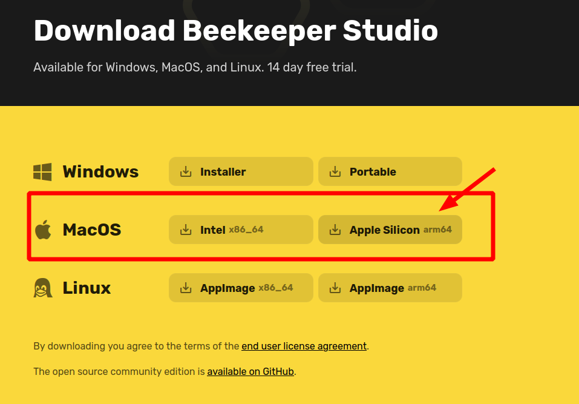

## Descargar desde nuestro sitio web
Para instalar Beekeeper Studio, descarga el archivo instalador `dmg` desde [nuestro sitio web](https://beekeeperstudio.io), luego arrastra la aplicacion Beekeeper Studio a tu carpeta de aplicaciones.

Ten en cuenta que, por defecto, MacOS te impedira instalar aplicaciones distribuidas por terceros (fuera de la Mac App Store). Para habilitar esto, navega a `Configuracion -> Seguridad y privacidad`, y habilita `App Store y desarrolladores identificados`:

## Apple Silicon vs Intel

Los instaladores de Beekeeper Studio estan disponibles tanto para Macs con Intel como con Apple Silicon. Puedes elegir tu tipo de instalador preferido al descargar desde el sitio web.

!!! warning "Las bibliotecas de Oracle Database no son compatibles con Apple Silicon"
    Las bibliotecas y paquetes de Oracle Database **aun no** estan disponibles para Apple Silicon. Por lo tanto, si deseas conectar Beekeeper Studio a tu Oracle Database, debes instalar la version Intel de Beekeeper Studio y [ejecutarla en Rosetta 2](https://support.apple.com/en-us/HT211861)

### Elige tu arquitectura
Al descargar Beekeeper Studio, asegurate de elegir la version que coincida con la arquitectura de tu MacOS.

