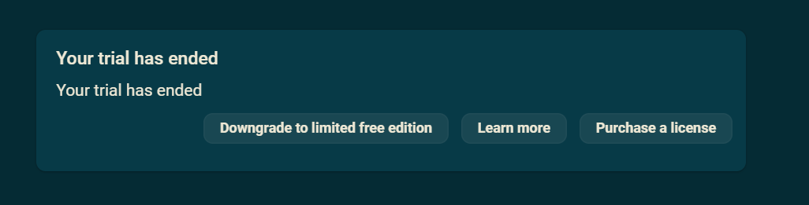
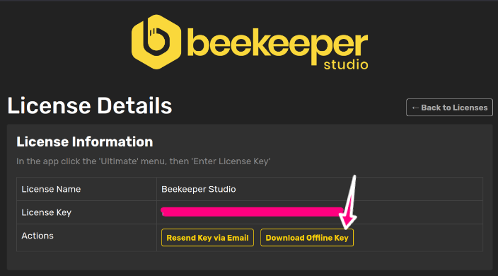
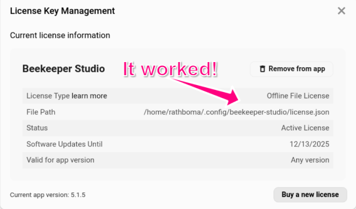

Cuando compras una licencia de Beekeeper Studio, por defecto se te dara un nombre de licencia y una clave de licencia para ingresar en la aplicacion.

Esta clave de licencia y nombre seran validados contra los servidores de Beekeeper Studio.

Esto funciona genial para el 99% de los usuarios, pero a veces la validacion en linea de una clave de licencia puede no funcionar, y la aplicacion te dira que no tienes una licencia valida (incluso cuando la tienes)

Para resolver este problema, si compraste una licencia empresarial anual o licencia de equipo puedes descargar la clave para validacion 100% offline.

## Como usar una licencia offline

1. Ve al [panel de gestion de licencias](https://app.beekeeperstudio.io/purchases)
2. Haz clic en tu licencia
3. Haz clic en `Download offline key` - esto te dara tu clave de licencia offline
  
4. Guarda el archivo como `license.json` en el directorio de configuracion de Beekeeper Studio:
    - Linux: `~/.config/beekeeper-studio/license.json`
    - Linux (snap): `~/snap/beekeeper-studio/current/.config/beekeeper-studio/license.json`
    - Windows: `~\AppData\Roaming\beekeeper-studio\license.json`
    - MacOS: `~/Library/Application Support/beekeeper-studio/license.json`
5. Reinicia Beekeeper Studio
6. Verifica `Ayuda -> Administrar Claves de Licencia` y deberias verla registrada
  

## Como funcionan las licencias offline

El archivo de licencia offline contiene una clave de licencia firmada digitalmente que Beekeeper Studio puede verificar localmente sin contactar ningun servidor. Cuando esta presente, la licencia offline tiene prioridad sobre cualquier licencia en linea. La aplicacion verifica la firma de la licencia usando una clave publica que esta incluida con la aplicacion.

## Renovaciones de suscripcion y licencias offline

La licencia que descargas solo es valida para tu periodo de suscripcion pagado. Eso significa que cada vez que tu suscripcion se renueva necesitaras descargar un nuevo archivo de licencia.

Por eso recomendamos comprar una suscripcion anual si planeas usar licencias offline.

## Solucion de problemas

Si tu licencia offline no es reconocida:

- Asegurate de que el archivo se llame exactamente `license.json`
- Verifica que el archivo este en el directorio correcto para tu sistema operativo
- Comprueba que el archivo no se haya corrompido durante la descarga
- Intenta descargar el archivo de licencia nuevamente desde el panel
