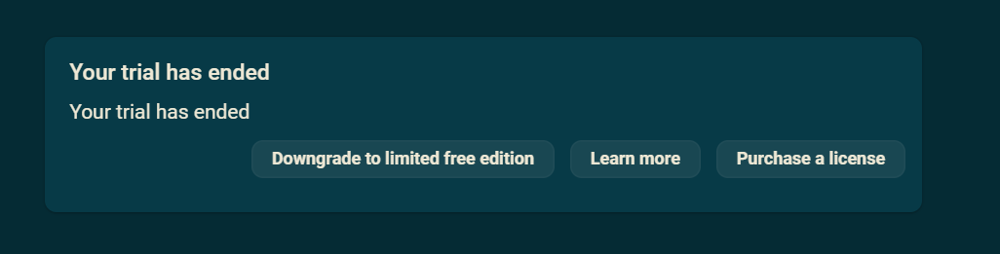

When you purchase a Beekeeper Studio license by default you'll be given a license name and license key to enter into the app.

This license key and name will be validated against the Beekeeper Studio servers.

This works great for 99% of users, but sometimes online validation of a license key might not work, and the app will tell you that you don't have a valid license (even when you do)

To solve this problem, if you purchased a yearly professional license or team license you can download the key for 100% offline validation.

## How to use an offline license

1. Go to [the license management dashboard](https://app.beekeeperstudio.io/purchases)
2. Click the `menu` button next to your license
3. Click `Download offline key` - this will give your your offline license key
4. Place the key in the Beekeeper Studio configuration directory:
    - Linux: `~/.config/beekeeper-studio`
    - Linux (snap): `~/snap/beekeeper-studio/current/.config/beekeeper-studio`
    - Windows: `~\AppData\Roaming\beekeeper-studio`
    - MacOS: `~/Library/Application Support/beekeeper-studio`
