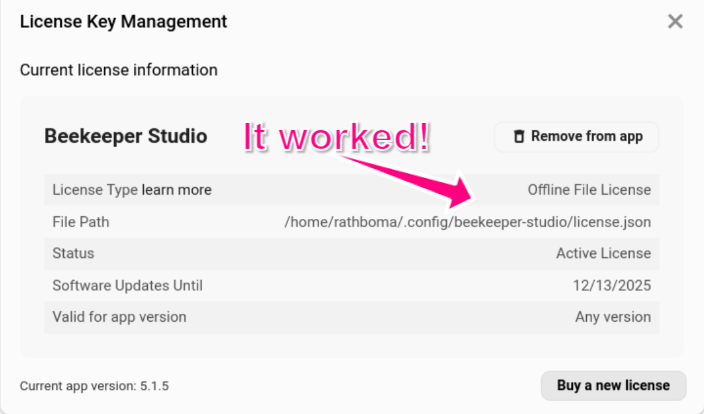

Quando você compra uma licença do Beekeeper Studio, por padrão você receberá um nome de licença e chave de licença para inserir no aplicativo.

Esta chave de licença e nome serão validados contra os servidores do Beekeeper Studio.

Isso funciona perfeitamente para 99% dos usuários, mas às vezes a validação online de uma chave de licença pode não funcionar, e o aplicativo dirá que você não tem uma licença válida (mesmo quando você tem)

Para resolver este problema, se você comprou uma licença anual de negócios ou licença de equipe, você pode baixar a chave para validação 100% offline.

## Como usar uma licença offline

1. Vá para [o painel de gerenciamento de licenças](https://app.beekeeperstudio.io/purchases)
2. Clique na sua licença
3. Clique `Download offline key` - isso lhe dará sua chave de licença offline
  
4. Salve o arquivo como `license.json` no diretório de configuração do Beekeeper Studio:
    - Linux: `~/.config/beekeeper-studio/license.json`
    - Linux (snap): `~/snap/beekeeper-studio/current/.config/beekeeper-studio/license.json`
    - Windows: `~\AppData\Roaming\beekeeper-studio\license.json`
    - MacOS: `~/Library/Application Support/beekeeper-studio/license.json`
5. Reinicie o Beekeeper Studio
6. Verifique `Ajuda -> Gerenciar Chaves de Licença` e você deve vê-la registrada
  

## Como funcionam as licenças offline

O arquivo de licença offline contém uma chave de licença assinada digitalmente que o Beekeeper Studio pode verificar localmente sem contactar nenhum servidor. Quando presente, a licença offline tem prioridade sobre qualquer licença online. O aplicativo verifica a assinatura da licença usando uma chave pública que vem junto com o aplicativo.

## Renovações de assinatura e licenças offline

A licença que você baixa é válida apenas para o seu período de assinatura paga. Isso significa que toda vez que sua assinatura renovar você precisará baixar um novo arquivo de licença.

Por causa disso recomendamos comprar uma assinatura anual se você pretende usar licenças offline.

## Solução de Problemas

Se sua licença offline não for reconhecida:

- Certifique-se de que o arquivo se chama exatamente `license.json`
- Verifique se o arquivo está no diretório correto para seu sistema operacional
- Verifique se o arquivo não foi corrompido durante o download
- Tente baixar o arquivo de licença novamente do painel