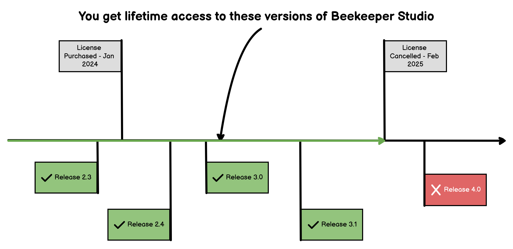

Puedes comprar una licencia de Beekeeper Studio desde [la pagina de precios](https://beekeeperstudio.io/pricing).

Las licencias se emiten a *personas*, no a maquinas. Asi que compra una licencia por cada persona individual que use la aplicacion. Compara planes [en la pagina de precios](https://beekeeperstudio.io/pricing)

## Acceso de Por Vida

Ya sea que elijas un plan de suscripcion anual o mensual para Beekeeper Studio, eres elegible para una **licencia de uso de por vida**. Esto significa que obtienes acceso perpetuo a cualquier version de Beekeeper Studio lanzada dentro de tu periodo de suscripcion, permitiendote usar el software indefinidamente sin pagos adicionales.

### Los suscriptores anuales obtienen acceso de por vida de inmediato

Supongamos que inicias una suscripcion anual el 10 de marzo de 2021. Recibiras una licencia de por vida para cualquier version de Beekeeper Studio lanzada hasta el 10 de marzo de 2022. Incluso si tu suscripcion termina, puedes continuar usando cualquiera de estas versiones para siempre.

### Los suscriptores mensuales obtienen acceso de por vida despues de 12 meses

Si optas por una suscripcion mensual y completas 12 meses consecutivos, el mismo beneficio aplica. Por ejemplo, si comienzas tu suscripcion mensual el 10 de marzo de 2021, y la mantienes hasta marzo de 2022, tendras acceso de por vida a las versiones lanzadas durante este periodo, incluso despues de cancelar tu suscripcion.

### Ejemplo de Acceso de Por Vida

- Te suscribes a Beekeeper Studio el 1 de enero de 2024
- Tu suscripcion termina el 28 de febrero de 2025
- Puedes usar cualquier version de Beekeeper Studio (con las caracteristicas que pagaste) lanzada hasta el 28 de febrero de 2025 para siempre. No se requieren mas pagos

## Por Que Nuestros Suscriptores Se Quedan

Nuestros clientes estan encantados con la licencia de por vida, pero hay mas en Beekeeper Studio que los mantiene suscritos:

1. **20% de Descuento en Renovacion**: Quedate con nosotros mas de 12 meses y recibe un 20% de descuento en pagos de suscripcion futuros.
2. **Actualizaciones de Software Continuas**: Como suscriptor, tendras acceso inmediato a todas las nuevas caracteristicas y actualizaciones de Beekeeper Studio.
3. **Acceso a Almacenamiento en la Nube y Espacios de Trabajo en Equipo**: Mejora tu productividad con [almacenamiento en la nube y espacios de trabajo colaborativos](https://www.beekeeperstudio.io/features/workspace).
4. **Soporte por Email Garantizado**: Siempre estamos aqui para ayudar, asegurando que tu experiencia con Beekeeper Studio sea fluida y agradable.
5. **Precio Bloqueado**: Tu precio de suscripcion esta bloqueado, incluso si aumentamos nuestros precios en el futuro. (lo cual deberiamos porque es bastante barato!)

## Por Que Solo Vendemos Suscripciones

Las suscripciones nos permiten continuar proporcionando actualizaciones y mantenimiento para cosas como nuevas versiones de bases de datos y nuevos requisitos de sistemas operativos. Tambien nos permite invertir en nuevas caracteristicas y mejoras de la aplicacion.

Puedes cancelar tu suscripcion en cualquier momento pero ya no tendras acceso a las ultimas mejoras.

## Pagos Unicos

No ofrecemos pagos unicos para Beekeeper Studio

## Terminos NET y Acuerdos de Servicios Maestros

La facturacion NET esta disponible si te comprometes a 2 anos del plan team unlimited, o si compras un plan enterprise.

[Contactanos](mailto:sales@beekeeperstudio.io) para mas informacion.
