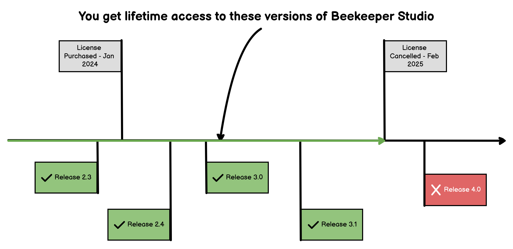

Você pode comprar uma licença do Beekeeper Studio na [página de preços](https://beekeeperstudio.io/pricing).

Licenças são emitidas para *pessoas*, não máquinas. Então compre uma licença para cada pessoa individual usando o aplicativo. Compare planos [na página de preços](https://beekeeperstudio.io/pricing)

## Acesso Vitalício

Seja você escolhendo um plano de assinatura anual ou mensal para o Beekeeper Studio, você é elegível para uma **licença de uso vitalício**. Isso significa que você ganha acesso perpétuo a qualquer versão do Beekeeper Studio lançada dentro do seu período de assinatura, permitindo que você use o software indefinidamente sem nenhum pagamento adicional.

### Assinantes anuais obtêm acesso vitalício imediatamente

Suponha que você inicie uma assinatura anual em 10 de março de 2021. Você receberá uma licença vitalícia para qualquer versão do Beekeeper Studio lançada até 10 de março de 2022. Mesmo se sua assinatura terminar, você pode continuar usando qualquer uma dessas versões para sempre.

### Assinantes mensais obtêm acesso vitalício após 12 meses

Se você optar por uma assinatura mensal e completar 12 meses consecutivos, o mesmo benefício se aplica. Por exemplo, se você começar sua assinatura mensal em 10 de março de 2021, e mantê-la até março de 2022, você terá acesso vitalício a versões lançadas durante este período, mesmo depois de cancelar sua assinatura.

### Exemplo de Acesso Vitalício

- Você assina o Beekeeper Studio em 1 de janeiro de 2024
- Sua assinatura termina em 28 de fevereiro de 2025
- Você pode usar qualquer versão do Beekeeper Studio (com os recursos pelos quais pagou) lançada até 28 de fevereiro de 2025 para sempre. Nenhum pagamento adicional necessário

## Por Que Nossos Assinantes Continuam Conosco

Nossos clientes são apaixonados pela licença vitalícia, mas há mais no Beekeeper Studio que os mantém assinando:

1. **Desconto de Renovação de 20%**: Fique conosco além de 12 meses e receba um desconto de 20% em pagamentos de assinatura futuros.
2. **Atualizações Contínuas de Software**: Como assinante, você terá acesso imediato a todos os novos recursos e atualizações do Beekeeper Studio.
3. **Acesso a Armazenamento em Nuvem e Workspaces de Equipe**: Melhore sua produtividade com [armazenamento em nuvem e workspaces colaborativos](https://www.beekeeperstudio.io/features/workspace).
4. **Suporte de Email Garantido**: Estamos sempre aqui para ajudar, garantindo que sua experiência com o Beekeeper Studio seja suave e agradável.
5. **Preço Travado**: Seu preço de assinatura fica travado, mesmo se aumentarmos nossos preços no futuro. (que deveríamos porque está bem barato!)

## Por Que Vendemos Apenas Assinaturas

Assinaturas nos permitem continuar fornecendo atualizações e manutenção para coisas como novos lançamentos de bancos de dados e novos requisitos de sistema operacional. Também nos permite investir em novos recursos e melhorias para o aplicativo.

Você pode cancelar sua assinatura a qualquer momento, mas não terá mais acesso às melhorias mais recentes.

## Pagamentos Únicos

Nós não oferecemos pagamentos únicos para o Beekeeper Studio

## Termos NET e Acordos de Serviços Principais

Faturamento NET está disponível se você se comprometer com 2 anos do plano ilimitado de equipe, ou se você comprar um plano enterprise.

[Entre em Contato](mailto:sales@beekeeperstudio.io) para mais informações.