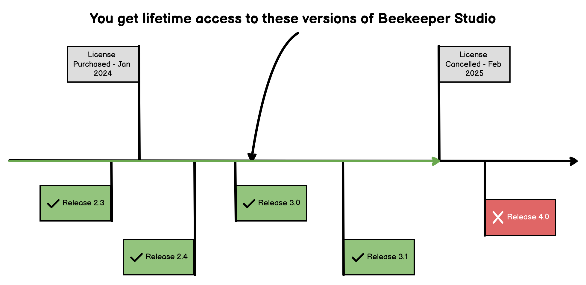

# Why and How To Upgrade Beekeeper Studio

Upgrading to a paid version of Beekeeper Studio gives you:

- [Lifetime access](#lifetime-access) to the app.
- 10+ more database engines.
- Power features like AI integration and the JSON row viewer.
- Cloud workspaces for team collaboration.
- Good vibes for supporting an indie software business you believe in.

??? info "Compare pricing plan features"
    ### Database engines
    
    

Buy a license, and compare your options on the [pricing page](https://beekeeperstudio.io/pricing).

Upgrading does not require a separate install, and all of your data carries over from the community edition.

## Is a paid license really worth it?

Of course! 

Obviously I'm biased :-), here are some data points that might help you decide:

- In surveys, users tell us that Beekeeper Studio **improves their productivity by 30%** (when working with databases of course).
- Other developers (like you!) *gush* about how much they **love** using Beekeeper Studio, many of them are kind enough to leave a testimonial. You can [read them here](https://beekeeperstudio.io/testimonials).
- We're a customer-funded business, we have no rich parents or venture capitalists to keep us going, only thousands of happy customers.
- We offer a **30 day, no questions asked, money back guarantee**.

You can see more of our pro-consumer policies [on the pricing page](https://beekeeperstudio.io/pricing)

## Lifetime Access

Speaking of pro-consumer policies, when you pay for 1+ years of a Beekeeper Studio license, you get **lifetime access** to any version of Beekeeper Studio released within your subscription window.

This means you can use the version of Beekeeper Studio you purchased forever, even if you don't renew your license.

We think this is a fair compromise between subscriptions and one-time payments, we hope you do too.

[More details about lifetime licenses](../purchasing/purchasing-a-license.md#lifetime-access)

## Get your boss to buy it

If you work for a company, you can ask your boss to pay for Beekeeper Studio. It's a business expense, and they will be happy to pay for it when they realize how much time it will save you.

!!! tip "Draft the request from the app"
    Open `Help -> Manage License Keys` and click **Draft manager approval request** (the same link appears in the upgrade prompts and when the free trial ends). It opens a page on beekeeperstudio.io with a short, plain-text request already written: the ask and its cost, the seat count (one license by default, adjustable), the lifetime-access terms, how to buy or get a formal quote, and the security details a manager usually asks about. If you used the free trial, it also lists the paid features you actually used. Edit anything, then copy it into email or chat.

If your boss asks you for why they should pay for Beekeeper Studio, you can tell them:

1. **Increased Productivity**: Beekeeper Studio saves you time. According to user surveys, Beekeeper Studio saves most developers about **30% of their time** spent on database tasks. That's a lot of time!
2. **Great ROI**: You can calculate your specific return on investment on our handy [ROI calculator](https://beekeeperstudio.io/roi).
4. **Easy Collaboration**: Beekeeper Studio makes it super easy to collaborate with your team by sharing connections and queries through our [cloud workspaces](https://beekeeperstudio.io/workspaces).
5. **Onboard non-technical users**: Beekeeper's streamlined UI makes it easy for less-technical team members to work with databases, which can help your team be more productive.
6. **One-time payments**: If they don't like subscriptions, tell them you can make a 1 time payment, simply follow the guide above.
7. **Security:** Our code is open source and undergoes continual vulnerability testing with GitHub enterprise. Plus Beekeeper never sends any data to our servers, and we don't track you in any way. Read more in our  [mission](https://beekeeperstudio.io/mission).

### What other bosses say

> Our efficiency for managing our SQL code is a **2-3x improvement** using Beekeeper compared to before. I'm not sure I know what we would be doing without Beekeeper

*- Jeff Richter (VP Information Products)*

> Beekeeper Studio is BY FAR the most user-friendly DB GUI out there! I started using it a year ago and now our whole team bought a license. The multi-DB support is simply awesome as I use 4 different types of databases on a regular basis. Plus it works on Windows and Mac.

*- Matt K (VP Engineering)*

> I work in Support at a Tech company. Once our devs made the switch **it was a game changer for me**. So much easier to navigate than the previous system and having multiple queries open at once boosted my efficiency. Thank you!

*- Naomi (Support Engineer)*

## Purchases support a small independent team

Beekeeper Studio is run by a small team. We've bootstrapped Beekeeper Studio from nothing without family money, VC investment, or a corporate sponsor.

Building quality software is hard work, especially for such a small team! Even so we're committed to open sourcing the [majority of our code base](https://github.com/beekeeper-studio/beekeeper-studio), and offering a lot of features for free.

When you buy a copy of Beekeeper Studio you directly support our business, and our efforts in open source. Thank you! 🙏

## How to purchase a license

1. Purchase a license key from our [pricing page](https://beekeeperstudio.io/pricing).
1. You'll receive your license key after your purchase completes.
1. Click `Help -> Manage License Keys` in the app.
1. Enter the license key into Beekeeper Studio

!!! note "All your data carries over from the community edition"
    Upgrading does not require a separate install, and all of your data carries over from the community edition.

    Simply enter your license into the app and you're good to go.

### If you have a procurement department

If you work for a big company with a procurement department and a multi-step purchase authorization process, fear not we also have you covered.

Formal quotes, NET-term invoicing, and security questionnaires can all be handled. Have your procurement team reach out to us at [sales@beekeeperstudio.io](mailto:sales@beekeeperstudio.io)

### Airgapped systems

If you work in a network that **must not** ever connect to the internet, simply buy a Business-tier license to use [offline airgapped license activation](../purchasing/license-types) for zero-internet installation of your license.
