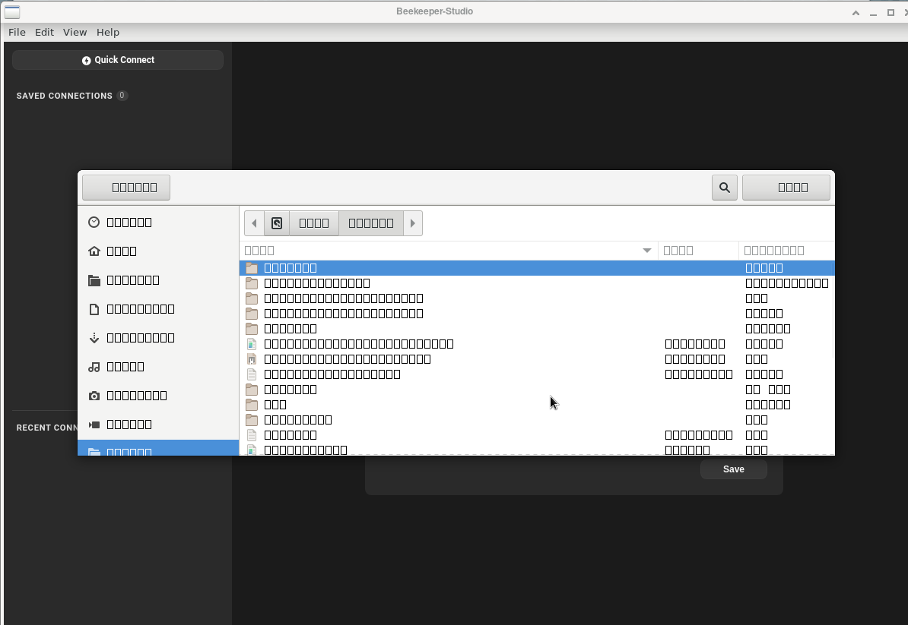

Esperamos que puedas resolver tus problemas con los detalles a continuacion. Si no, por favor [Contacta Soporte](./contact-support.md) e intentaremos ayudarte lo mejor posible.


## No seas timido, saluda!

Sientete libre de abrir un issue o iniciar una discusion, incluso si no estas seguro de si algo esta mal. Somos una comunidad super amable, y todos nos ayudamos mutuamente.

- [Abrir un issue](https://github.com/beekeeper-studio/beekeeper-studio/issues/new/choose)
- [Iniciar una discusion](https://github.com/beekeeper-studio/beekeeper-studio/discussions/new)


## Herramientas para tomar grabaciones de pantalla al reportar problemas.

Las grabaciones de pantalla son MUY utiles cuando un problema es dificil de replicar para mi.

Aqui estan las herramientas que recomiendo para tomar capturas de pantalla rapidas y faciles como archivos GIF o MKV:

1. MacOS: [Kap](https://getkap.co/) - es completamente de codigo abierto. Funciona genial. Yo uso esto.
2. Linux: [Peek](https://github.com/phw/peek) - tambien completamente de codigo abierto. Funciona genial. Yo uso esto.
3. Windows: [Captura](https://github.com/MathewSachin/Captura) - Tambien de codigo abierto, tambien funciona genial.

Solo copia/pega la grabacion de pantalla en tu issue de GitHub y GitHub se encargara del resto.


## Como Depurar Beekeeper Studio

### Verificar Developer Tools en busca de errores

Haz clic en `Ayuda -> Mostrar Developer Tools`, luego en la parte superior derecha de la consola cambia el dropdown de 'levels' a solo 'errors'.

Hay algun error aqui? Toma una captura de pantalla y adjuntala a un nuevo issue!

### Habilitar Modo Debug y Recolectar Logs

Puedes encontrar logs para Beekeeper en estos directorios:

Linux: ~/.config/beekeeper-studio/logs/{tipo de proceso}.log
MacOS: ~/Library/Logs/beekeeper-studio/{tipo de proceso}.log
Windows: %USERPROFILE%\AppData\Roaming\beekeeper-studio\logs\{tipo de proceso}.log

Por defecto solo contendran errores no capturados.

Puedes habilitar el registro extendido iniciando Beekeeper Studio con el flag de debug `DEBUG=*`.

En Linux, solo ejecuta la aplicacion asi: `DEBUG=* beekeeper-studio`


## MySQL

* Esta seccion tambien aplica a MariaDB

### No puedo crear un indice descendente

Antes de la version 8.0 MySQL no soportaba indices `DESC`, pero si soportaba la sintaxis.

Esta es una 'caracteristica' de MySQL para hacerlo mas compatible con otros motores.

Si editas tus indices en Beekeeper Studio y creas un indice `DESC` simplemente creara un indice `ASC` en su lugar.

A partir de la version 8.0 este problema ha sido resuelto.

### Obtengo un error de sintaxis SQL al intentar crear un stored procedure

Al usar el cliente de linea de comandos `mysql` necesitas remapear delimitadores usando `DELIMITER`, sin embargo esta sintaxis no es soportada por el servidor MySQL en si, asi que da error cuando se ejecuta a traves de Beekeeper Studio.

Probablemente obtendras un error como `You have an error in your SQL syntax`. Simplemente elimina las declaraciones de delimitador para solucionarlo.

Por ejemplo, cambia esto:
```sql
DELIMITER //

CREATE PROCEDURE simpleproc (OUT param1 INT)
 BEGIN
  SELECT COUNT(*) INTO param1 FROM t;
 END;
//

DELIMITER ;
```

A esto:

```sql
CREATE PROCEDURE simpleproc (OUT param1 INT)
 BEGIN
  SELECT COUNT(*) INTO param1 FROM t;
 END;
```


## SQLite

### No such column: x

Si estas escribiendo una consulta SQL para SQLite y recibes el error `no such column`, el problema es que estas usando comillas dobles `"` para identificar strings en lugar de comillas simples `'`.

- Las comillas dobles son para identificadores (tablas, columnas, funciones, etc)
- Las comillas simples son para strings.


SQLite originalmente permitia tanto strings con comillas simples (`'algun string'`) como strings con comillas dobles (`"algun string"`) para mantenerse compatible con MySQL, pero los mantenedores desde entonces han declarado que lamentan este movimiento, y ahora recomiendan que [sqlite sea compilado con esta caracteristica desactivada](https://www.sqlite.org/compile.html#recommended_compile_time_options). Beekeeper Studio sigue las opciones de compilacion recomendadas.

Para solucionar este problema, cambia tus strings con comillas dobles a strings con comillas simples:

```sql
-- esto no funcionara
select "string" as my_column from foo

-- esto funcionara
select 'string' as my_column from foo

```


### Obtengo 'permission denied' al intentar acceder a una base de datos en un disco externo

Si estas en Linux y usas la version `snap` de Beekeeper necesitas darle a la aplicacion un permiso extra.

```bash
sudo snap connect beekeeper-studio:removable-media :removable-media
```

Si estas en otra plataforma, por favor [abre un ticket][bug] e intentaremos ayudarte a depurar el problema.

[bug]: https://github.com/beekeeper-studio/beekeeper-studio/issues/new?template=bug_report.md&title=BUG:

## PostgreSQL

Ten en cuenta que Beekeeper Studio solo soporta oficialmente Postgres 9.3+, aunque versiones anteriores pueden funcionar mayormente.

### Obtengo un error `column does not exist`, pero la columna si existe!

Postgres es raro con la sensibilidad a mayusculas y minusculas. Esta es usualmente la causa del temido error `column does not exist`.

Postgres tiene dos comportamientos con nombres de columna:
- Si defines tu nombre de columna sin comillas dobles, postgres pone el nombre en minusculas.
- Si defines tu nombre de columna CON comillas dobles, necesitas usar comillas dobles para siempre.

Por ejemplo:

En esta tabla:

```sql
CREATE table foo("myColumn" int);
```

- Esto no funcionara: `select myColumn from foo`
- Esto funcionara: `select "myColumn" from foo`

Ve [esta respuesta de StackOverflow](https://stackoverflow.com/a/20880247/18818) o [esta seccion en el manual de PostgreSQL](https://www.postgresql.org/docs/current/sql-syntax-lexical.html#SQL-SYNTAX-IDENTIFIERS)

## Linux (Snap)

### El selector de archivos muestra 'rectangulitos' en lugar de una fuente


Este es un problema con `snapd` en si y como aisla las aplicaciones de la configuracion de fuentes (o no lo hace, en este caso). Esto parece surgir con Arch, Manjaro, y Fedora, supongo que porque el equipo de snap se preocupa principalmente de que los snaps funcionen en Ubuntu.

Solucion alternativa:

```bash
sudo rm -f /var/cache/fontconfig/*
rm -f ~/.cache/fontconfig
```

Ve como referencia:
- [Bug reportado con snapd](https://bugs.launchpad.net/snappy/+bug/1916816)
- [Discusion en los foros de snapcraft](https://forum.snapcraft.io/t/snap-store-fonts-on-arch-linux-are-merely-empty-rectangles/15373/9)

## Windows

### La aplicacion esta atascada ejecutandose en segundo plano
Si acabas de instalar la aplicacion en Windows y la aplicacion se niega a iniciar (con tu administrador de tareas reportando que esta ejecutandose), puede que necesites instalar los [MSVC Redistributables](https://learn.microsoft.com/en-us/cpp/windows/latest-supported-vc-redist?view=msvc-170) para tu arquitectura.

Este es un problema con una de nuestras dependencias nativas, y estamos trabajando en una solucion mas permanente para este problema en el instalador.
