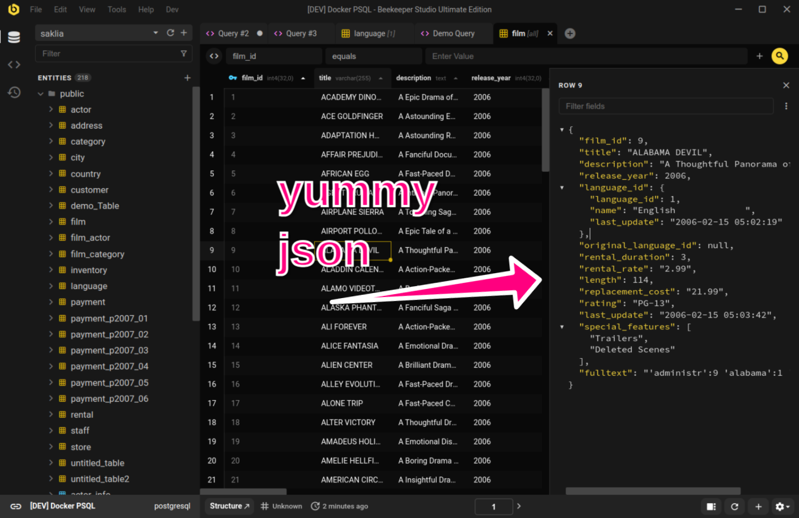

# Actualizar Desde la Edicion Comunitaria

Actualizar a la version de pago de Beekeeper Studio es facil, no necesitas descargar una nueva aplicacion. Simplemente compra una clave de licencia e ingresala en la aplicacion cuando se te solicite.

1. Compra una clave de licencia desde nuestra [pagina de precios](https://beekeeperstudio.io/pricing).
1. Recibiras tu clave de licencia despues de que se complete tu compra.
1. Haz clic en `Ayuda -> Administrar Claves de Licencia` en la aplicacion.
1. Ingresa la clave de licencia en Beekeeper Studio

!!! info "Sistemas sin conexion a internet"
    Nuestra licencia empresarial soporta activacion offline. Lee mas sobre [soporte de licencia offline](../purchasing/license-types.md)

## Por que Actualizar Beekeeper Studio?

Eso es facil -- un monton de caracteristicas utiles solo estan disponibles en la version de pago de Beekeeper Studio.

Por ejemplo, la version completa incluye un **visor de filas JSON** y opciones de importacion/exportacion mas completas.

Hay muchas mas caracteristicas increibles en la version completa de Beekeeper Studio, puedes verlas todas [en la pagina de precios](https://beekeeperstudio.io/pricing).

??? info "Soporte de Bases de Datos en la Version Completa"
    

## Acceso de Por Vida

Cuando pagas por 1+ anos de una licencia de Beekeeper Studio, obtienes **acceso de por vida** a cualquier version de Beekeeper Studio lanzada dentro de tu periodo de suscripcion.

Esto significa que puedes usar la version de Beekeeper Studio que compraste para siempre, incluso si no renuevas tu licencia.

Creemos que esto es un compromiso justo entre suscripciones y pagos unicos, esperamos que tu tambien lo pienses.

[Lee mas sobre licencias de por vida y como funcionan](../purchasing/purchasing-a-license.md#lifetime-access)

## Haz Que Tu Jefe Pague

Si trabajas para una empresa, puedes pedirle a tu jefe que pague por Beekeeper Studio. Es un gasto empresarial, y estaran felices de pagarlo cuando se den cuenta de cuanto tiempo te ahorrara.

Si tu jefe te pregunta por que deberian pagar por Beekeeper Studio, puedes decirles:

1. **Mayor Productividad**: Beekeeper Studio te ahorra tiempo. Segun encuestas de usuarios, Beekeeper Studio ahorra a la mayoria de los desarrolladores aproximadamente **30% de su tiempo** dedicado a tareas de bases de datos. Eso es mucho tiempo!
2. **Gran ROI**: Puedes calcular tu retorno de inversion especifico en nuestra practica [calculadora de ROI](https://beekeeperstudio.io/roi).
4. **Colaboracion Facil**: Beekeeper Studio hace super facil colaborar con tu equipo compartiendo conexiones y consultas a traves de nuestros [espacios de trabajo en la nube](https://beekeeperstudio.io/workspaces).
5. **Incorporar usuarios no tecnicos**: La interfaz simplificada de Beekeeper facilita que los miembros del equipo menos tecnicos trabajen con bases de datos, lo que puede ayudar a tu equipo a ser mas productivo.
6. **Pagos unicos**: Si no les gustan las suscripciones, diles que pueden hacer un pago unico, simplemente sigue la guia de arriba.
7. **Seguridad:** Nuestro codigo es de codigo abierto y se somete a pruebas continuas de vulnerabilidades con GitHub enterprise. Ademas, Beekeeper nunca envia ningun dato a nuestros servidores, y no te rastreamos de ninguna manera. Lee mas en nuestra [mision](https://beekeeperstudio.io/mission).

### Lo que dicen otros jefes

> Nuestra eficiencia para administrar nuestro codigo SQL es una **mejora de 2-3x** usando Beekeeper comparado con antes. No estoy seguro de lo que estariamos haciendo sin Beekeeper

*- Jeff Richter (VP Information Products)*

> Beekeeper Studio es CON DIFERENCIA la GUI de base de datos mas facil de usar que existe! Empece a usarla hace un ano y ahora todo nuestro equipo compro una licencia. El soporte multi-BD es simplemente increible ya que uso 4 tipos diferentes de bases de datos regularmente. Ademas funciona en Windows y Mac.

*- Matt K (VP Engineering)*

> Trabajo en Soporte en una empresa de tecnologia. Una vez que nuestros desarrolladores hicieron el cambio **fue un cambio de juego para mi**. Mucho mas facil de navegar que el sistema anterior y tener multiples consultas abiertas a la vez aumento mi eficiencia. Gracias!

*- Naomi (Support Engineer)*

## Las compras apoyan a un pequeno equipo independiente

Beekeeper Studio esta dirigido por un equipo pequeno. Hemos construido Beekeeper Studio desde cero sin dinero familiar, inversion de VC, o un patrocinador corporativo.

Construir software de calidad es un trabajo duro, especialmente para un equipo tan pequeno! Aun asi estamos comprometidos a hacer codigo abierto la [mayoria de nuestra base de codigo](https://github.com/beekeeper-studio/beekeeper-studio), y ofrecer muchas caracteristicas gratis.

Cuando compras una copia de Beekeeper Studio apoyas directamente nuestro negocio, y nuestros esfuerzos en codigo abierto. Gracias!
