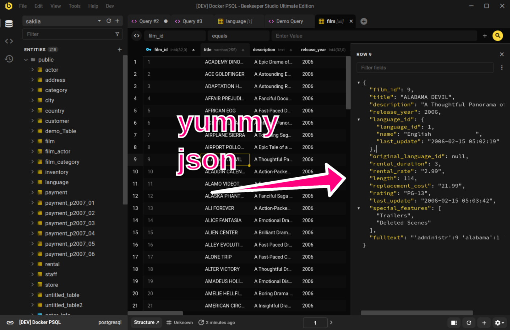

# Atualizando da Edição Comunitária

Atualizar para a versão paga do Beekeeper Studio é fácil, você não precisa baixar um novo app. Simplesmente compre uma chave de licença e insira-a no app quando solicitado.

1. Compre uma chave de licença em nossa [página de preços](https://beekeeperstudio.io/pricing).
1. Você receberá sua chave de licença após sua compra ser concluída.
1. Clique em `Help -> Manage License Keys` no app.
1. Insira a chave de licença no Beekeeper Studio

!!! info "Sistemas isolados da internet"
    Nossa licença empresarial suporta ativação offline. Leia mais sobre [suporte de licença offline](../purchasing/license-types.md)

## Por que Atualizar o Beekeeper Studio?

É fácil -- um monte de recursos úteis estão disponíveis apenas na versão paga do Beekeeper Studio.

Por exemplo, a versão completa inclui um **visualizador de linha JSON** e opções mais abrangentes de import/export.

Há muito mais recursos incríveis na versão completa do Beekeeper Studio, você pode ver todos eles [na página de preços](https://beekeeperstudio.io/pricing).

??? info "Suporte de Banco de Dados da Versão Completa"
    

## Acesso Vitalício

Quando você paga por 1+ anos de uma licença do Beekeeper Studio, você obtém **acesso vitalício** a qualquer versão do Beekeeper Studio lançada dentro da sua janela de assinatura.

Isso significa que você pode usar a versão do Beekeeper Studio que comprou para sempre, mesmo que não renove sua licença.

Achamos que este é um compromisso justo entre assinaturas e pagamentos únicos, esperamos que você pense o mesmo.

[Leia mais sobre licenças vitalícias e como elas funcionam](../purchasing/purchasing-a-license.md#lifetime-access)

## Peça para seu Chefe Pagar

Se você trabalha para uma empresa, pode pedir para seu chefe pagar pelo Beekeeper Studio. É uma despesa empresarial, e eles ficarão felizes em pagar quando perceberem quanto tempo isso economizará para você.

Se seu chefe perguntar por que deveria pagar pelo Beekeeper Studio, você pode dizer:

1. **Aumento de Produtividade**: O Beekeeper Studio economiza seu tempo. De acordo com pesquisas de usuários, o Beekeeper Studio economiza para a maioria dos desenvolvedores cerca de **30% do tempo** gasto em tarefas de banco de dados. Isso é muito tempo!
2. **Ótimo ROI**: Você pode calcular seu retorno específico sobre investimento em nossa útil [calculadora de ROI](https://beekeeperstudio.io/roi).
4. **Colaboração Fácil**: O Beekeeper Studio torna super fácil colaborar com sua equipe compartilhando conexões e consultas através de nossos [workspaces em nuvem](https://beekeeperstudio.io/workspaces).
5. **Integrar usuários não-técnicos**: A UI simplificada do Beekeeper torna fácil para membros menos técnicos da equipe trabalharem com bancos de dados, o que pode ajudar sua equipe a ser mais produtiva.
6. **Pagamentos únicos**: Se eles não gostam de assinaturas, diga que você pode fazer um pagamento único, simplesmente siga o guia acima.
7. **Segurança:** Nosso código é open source e passa por testes contínuos de vulnerabilidade com GitHub enterprise. Além disso, o Beekeeper nunca envia dados para nossos servidores, e não rastreamos você de forma alguma. Leia mais em nossa [missão](https://beekeeperstudio.io/mission).

### O que outros chefes dizem

> Nossa eficiência para gerenciar nosso código SQL é uma **melhoria de 2-3x** usando o Beekeeper comparado a antes. Não tenho certeza do que estaríamos fazendo sem o Beekeeper

*- Jeff Richter (VP Information Products)*

> O Beekeeper Studio é DE LONGE a GUI de DB mais amigável por aí! Comecei a usar há um ano e agora nossa equipe toda comprou uma licença. O suporte multi-DB é simplesmente incrível já que uso 4 tipos diferentes de bancos de dados regularmente. Além disso, funciona no Windows e Mac.

*- Matt K (VP Engineering)*

> Trabalho em Suporte em uma empresa de Tech. Uma vez que nossos devs fizeram a mudança **foi um divisor de águas para mim**. Muito mais fácil de navegar que o sistema anterior e ter múltiplas consultas abertas ao mesmo tempo aumentou minha eficiência. Obrigado!

*- Naomi (Support Engineer)*

## Compras apoiam uma pequena equipe independente

O Beekeeper Studio é executado por uma pequena equipe. Nós bootstrappeamos o Beekeeper Studio do nada sem dinheiro da família, investimento VC, ou um patrocinador corporativo.

Construir software de qualidade é trabalho duro, especialmente para uma equipe tão pequena! Mesmo assim estamos comprometidos em tornar open source a [maioria de nossa base de código](https://github.com/beekeeper-studio/beekeeper-studio), e oferecer muitos recursos gratuitamente.

Quando você compra uma cópia do Beekeeper Studio você apoia diretamente nosso negócio, e nossos esforços em open source. Obrigado!