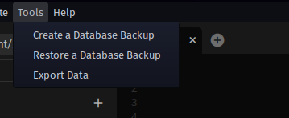
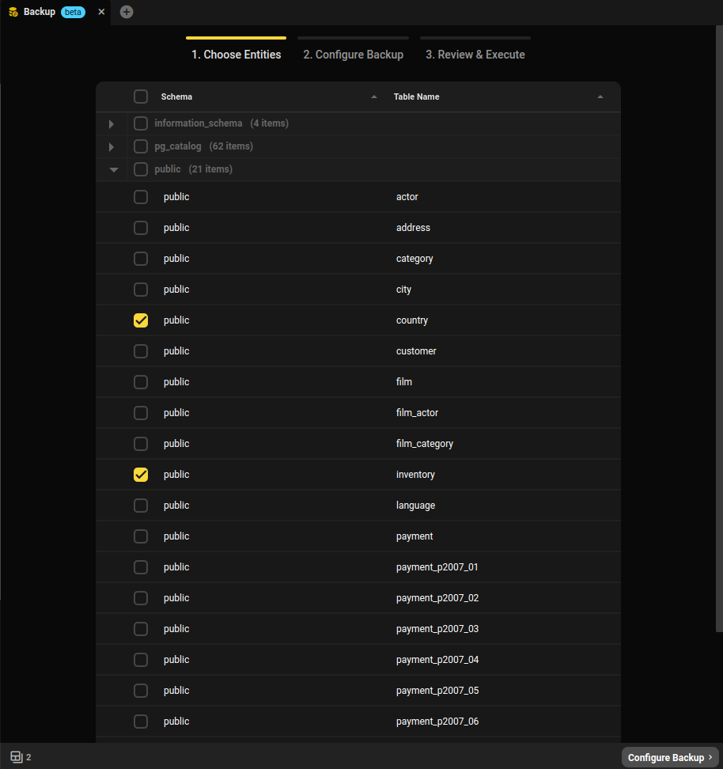
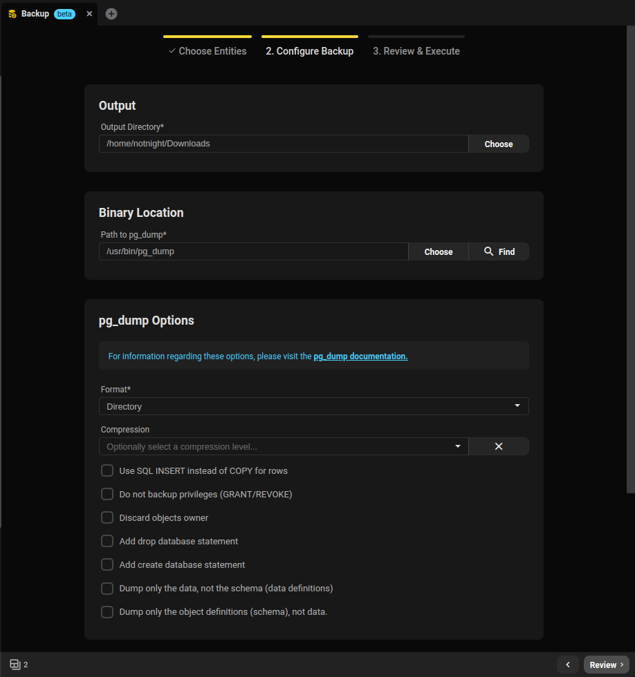
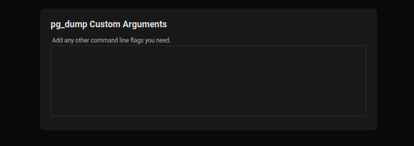
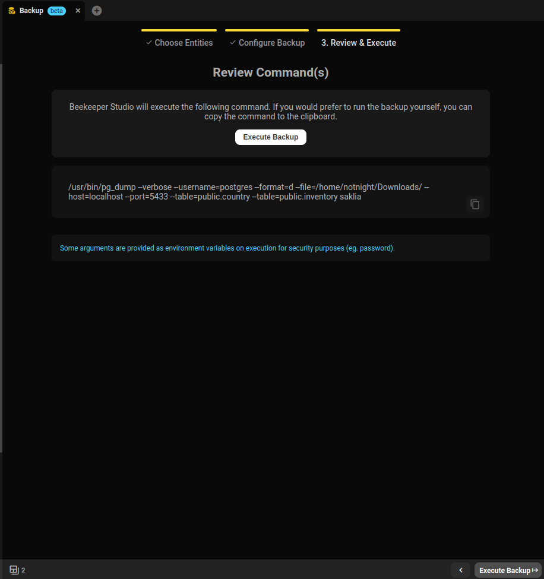
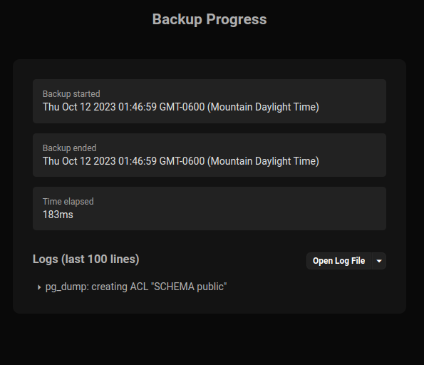

Beekeeper Studio proporciona una interfaz a herramientas nativas para respaldar y restaurar facilmente tus bases de datos.

## Herramientas soportadas
- Postgres
	- `pg_dump` y `pg_restore`
- MySQL/MariaDb
	- `mysqldump` y `mysql`
- SQLite
	- `sqlite3`

## Respaldar o restaurar una base de datos
Tanto Respaldo como Restauracion se pueden encontrar en la seccion de herramientas del menu de la aplicacion:

Despues de seleccionar Respaldo o Restauracion, seras guiado a traves de una serie de pasos para generar el comando para la herramienta de base de datos proporcionada por el proveedor.

La pestana de Respaldo:
1. Elegir entidades
2. Configurar respaldo
3. Revisar y ejecutar

La pestana de Restauracion:
1. Configurar restauracion
2. Revisar y ejecutar

### Elegir entidades
Aqui puedes elegir que quieres respaldar de tu base de datos. Para todos los dialectos soportados, no seleccionar ninguna entidad resultara en un respaldo completo de la base de datos.

### Configurar respaldo/restauracion
Aqui es donde configuraras exactamente como se comportara la herramienta nativa de respaldo/restauracion. Tenemos una seleccion de configuraciones comunmente usadas que podemos colocar por ti con el clic de una casilla de verificacion o una seleccion de un menu desplegable.

### Argumentos personalizados
Si una opcion que necesitas no es soportada, tambien te proporcionamos la capacidad de agregar flags personalizados al comando.

### Revisar y ejecutar
Finalmente puedes ver el comando generado que se ejecutara (menos cualquier informacion sensible, que se proporciona en variables de entorno).

Si prefieres ejecutar este comando en la terminal tu mismo, tambien puedes copiarlo a tu portapapeles aqui! Puede que tengas que establecer algunas variables de entorno para permitir que la herramienta se conecte correctamente a tu base de datos.

De lo contrario, puedes dejarnos ejecutar el comando por ti y verlo suceder dentro de la aplicacion.

## Monitorear el progreso de respaldo/restauracion
Si eliges ejecutar el proceso dentro de la aplicacion, puedes monitorear el progreso del comando mientras se ejecuta desde esta pantalla:

Te mostramos las ultimas 100 lineas aproximadamente de los logs para que las leas mientras la herramienta hace su trabajo, pero si algo sale muy mal, tambien volcamos todos los logs a un archivo temporal para todas tus necesidades de depuracion.
