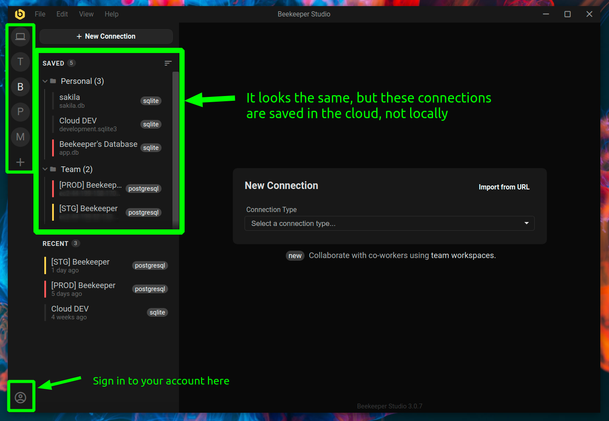

Los espacios de trabajo facilitan el trabajo en multiples computadoras al almacenar tus datos (conexiones y consultas) en la nube.

Aun mejor, los espacios de trabajo permiten que multiples personas trabajen desde el mismo conjunto de datos de forma colaborativa.

Las consultas y conexiones almacenadas en un espacio de trabajo solo estan disponibles para usar a traves de la aplicacion Beekeeper Studio, no a traves de una interfaz web.

## Conceptos

1. **Espacio de trabajo** - Un espacio colaborativo en linea para que los `miembros` trabajen en `consultas` y `conexiones`. Obtienes uno de estos cuando creas una suscripcion en el [panel de cuenta](https://app.beekeeperstudio.io)
2. **Miembro del espacio de trabajo** - Alguien con acceso para ver y editar consultas y conexiones.
3. **Administrador del espacio de trabajo** - Un miembro del espacio de trabajo con privilegios adicionales, incluyendo la capacidad de invitar nuevos usuarios al espacio de trabajo.
4. **Propietario del espacio de trabajo** - La persona que creo el espacio de trabajo. Los propietarios pueden agregar y eliminar miembros, promover miembros a administradores y gestionar el espacio de trabajo.
5. **Carpeta personal** - Cada miembro del espacio de trabajo tiene una carpeta `personal` donde se guardan las nuevas consultas y conexiones por defecto. Los elementos en tu carpeta personal *no* se comparten con otros.
6. **Carpeta de equipo** - Si quieres compartir una conexion o consulta con companeros de equipo, mueela a la carpeta de equipo. Todos en el espacio de trabajo tienen acceso a esta carpeta.

## Acceso al espacio de trabajo

Los espacios de trabajo son gratuitos siempre que mantengas una suscripcion activa de Beekeeper Studio.

## Primeros pasos

Solo toma unos minutos comenzar con los espacios de trabajo.

Cuando estas conectado a un espacio de trabajo, solo puedes usar conexiones y consultas que esten guardadas en ese espacio de trabajo (no puedes usar conexiones o consultas de tu espacio de trabajo local). Esto hace que los espacios de trabajo en la nube sean excelentes para segmentar tareas de base de datos por cliente, equipo o proyecto.

No te preocupes - Puedes importar facilmente consultas y conexiones existentes a tu espacio de trabajo.

<video controls>
    <source id="workspaces" type="video/mp4" src="https://assets.beekeeperstudio.io/workspaces-walkthrough.mp4" />
</video>
<small>Video de recorrido sobre como usar espacios de trabajo</small>

### 1. Registrate y crea un espacio de trabajo

Haz clic en el boton `(+)` en la barra lateral global para crear un espacio de trabajo. Dale el nombre que quieras! Si aun no tienes una cuenta de espacio de trabajo de Beekeeper Studio, seras redirigido a la interfaz web para crear una.

### 2. Agrega conexiones a tu espacio de trabajo

Haz clic en `importar` para mover conexiones de tu espacio de trabajo local existente a tu espacio de trabajo en la nube, o simplemente crea nuevas conexiones como normalmente.

Cualquier conexion agregada al espacio de trabajo se guardara en la nube.

### 3. Conectate a una base de datos y agrega consultas

Una vez conectado a una conexion del espacio de trabajo, podras usar Beekeeper Studio normalmente. La diferencia es que solo puedes usar consultas guardadas que sean parte de tu espacio de trabajo en la nube.

Al igual que con las conexiones, puedes `importar` tus consultas locales a tu espacio de trabajo y opcionalmente compartirlas con tu equipo.

### 4. Comparte recursos con tu equipo

Por defecto, cuando agregas una conexion o consulta a un espacio de trabajo, se almacenaran en la carpeta personal. Mientras estan guardadas en la nube, solo tu tienes acceso a los elementos en la carpeta personal.

Si quieres compartir algo con el equipo de tu espacio de trabajo, haz clic derecho en la conexion/consulta y selecciona `Mover a equipo`.

Los elementos en tu carpeta de `equipo` son accesibles por todos los miembros del espacio de trabajo.

## Gestionar miembros del espacio de trabajo

### Invitar usuarios

Tanto los propietarios como los administradores del espacio de trabajo pueden invitar nuevos usuarios a unirse al espacio de trabajo:

1. Inicia sesion en tu espacio de trabajo en Beekeeper Studio
2. Haz clic en el nombre del espacio de trabajo en la barra lateral
3. Selecciona "Invitar usuarios" del menu
4. Ingresa la direccion de correo electronico de la persona que quieres invitar
5. El invitado recibira un correo electronico con instrucciones para unirse a tu espacio de trabajo

### Gestionar privilegios de administrador

El propietario del espacio de trabajo puede promover miembros regulares a administradores:

1. Inicia sesion en el [panel de Beekeeper Studio][dashboard]
2. Navega a la configuracion de tu espacio de trabajo
3. Encuentra al miembro en la lista y haz clic en "Promover a administrador"

Los administradores pueden invitar nuevos usuarios pero no pueden promover otros miembros al estado de administrador ni eliminar el estado de administrador de otros miembros. Solo el propietario del espacio de trabajo tiene estos privilegios.

## Eliminar un espacio de trabajo

El propietario del espacio de trabajo puede eliminarlo desde el [panel][dashboard]. Si eliminas tu espacio de trabajo, tus datos seran archivados por 30 dias, luego eliminados permanentemente sin forma de recuperarlos.

[dashboard]: https://app.beekeeperstudio.io
