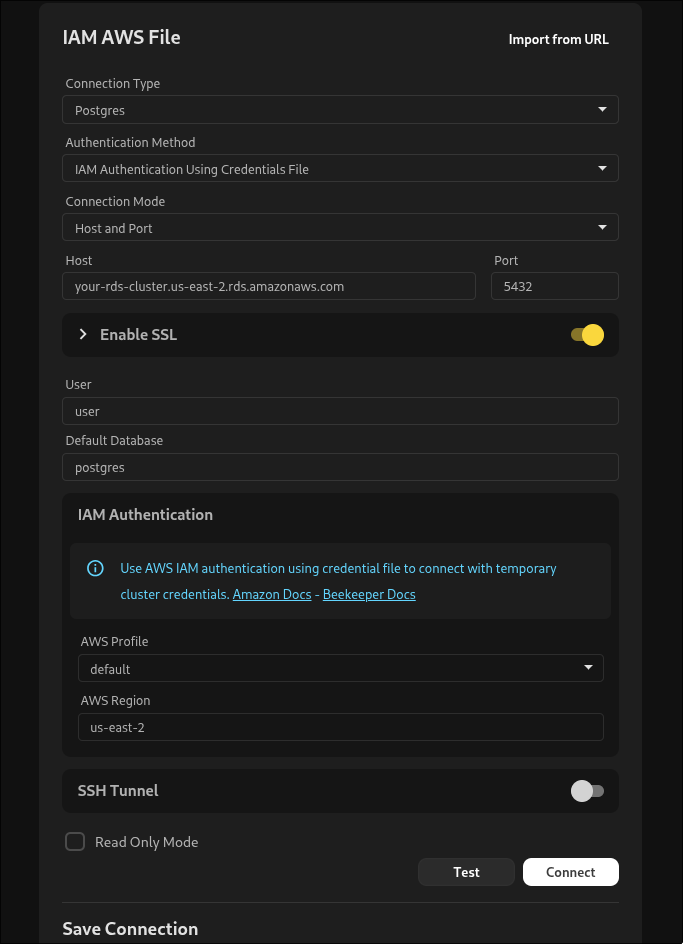

Conectarse a Amazon RDS requiere que configures un usuario IAM y te asegures de que tu grupo de seguridad permita trafico desde tu direccion IP.

## Configuracion de IAM en Amazon

Para configurar el acceso IAM a la base de datos, asegurate de que la base de datos en AWS este configurada para permitir la autenticacion IAM. Esto se puede hacer modificando la instancia de base de datos y habilitando la autenticacion IAM de base de datos.
Luego necesitaras crear un usuario IAM y adjuntar la politica `AmazonRDSFullAccess` al usuario. Esta politica permite al usuario conectarse a la instancia RDS.

Tambien puedes usar una politica similar a la siguiente:

``
{
    "Version": "2012-10-17",
    "Statement": [
        {
            "Effect": "Allow",
            "Action": [
                "rds-db:connect"
            ],
            "Resource": [
                "arn:aws:rds:eu-north-1:USERID:db:DB_NAME/USERNAME"
            ]
        }
    ]
}
``

## Conectarse a Amazon RDS

A continuacion se muestra un ejemplo de configuracion en Beekeeper Studio una vez que los permisos IAM estan configurados, necesitaras el nombre de host, puerto, nombre de usuario, region de AWS y si tienes multiples perfiles de Amazon puedes especificar el perfil que deseas usar.

## Cosas a tener en cuenta

- SSL es requerido en la mayoria de las instancias RDS, asi que asegurate de que este marcado.
- Necesitaras un archivo de credenciales configurado y tendras que seguir la guia vinculada para configurarlo:
[Configuracion de AWS CLI](https://docs.aws.amazon.com/cli/latest/userguide/cli-configure-files.html)

## Algunos enlaces utiles

- [Configuracion de AWS CLI](https://docs.aws.amazon.com/cli/latest/userguide/cli-configure-files.html)
- [Autenticacion IAM de base de datos de AWS](https://docs.aws.amazon.com/AmazonRDS/latest/UserGuide/UsingWithRDS.IAMDBAuth.html)
- [Politica IAM de AWS](https://docs.aws.amazon.com/IAM/latest/UserGuide/access_policies.html)
- [Usuario IAM de AWS](https://docs.aws.amazon.com/IAM/latest/UserGuide/id_users.html)
- [Roles IAM de AWS](https://docs.aws.amazon.com/IAM/latest/UserGuide/id_roles.html)
