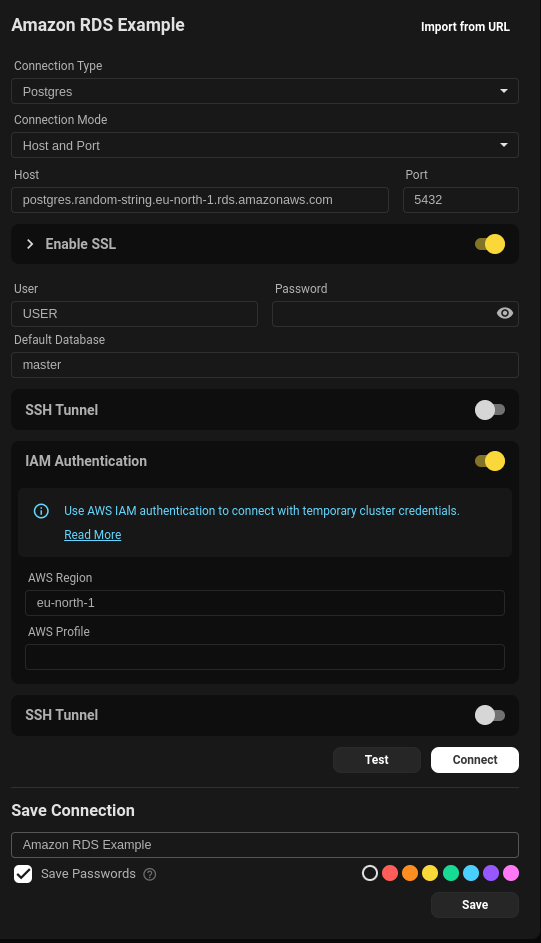
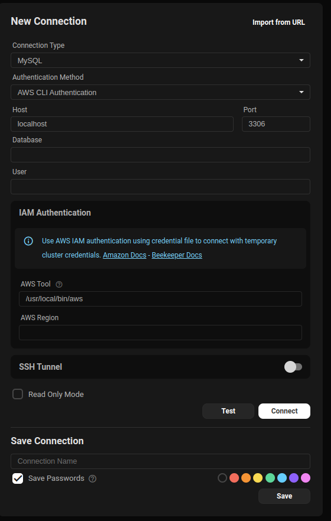

Connecting to Amazon RDS requires you to set up an IAM user and ensure your security group allows traffic from your IP address.

## IAM Configuration in Amazon

To configure IAM DB access, ensure the DB in AWS is configured to allow IAM authentication. This can be done by modifying the DB instance and enabling IAM DB authentication.
You will then need to create an IAM user and attach the `AmazonRDSFullAccess` policy to the user. This policy allows the user to connect to the RDS instance.

You can also use a similar policy to the below:

```json
{
    "Version": "2012-10-17",
    "Statement": [
        {
            "Effect": "Allow",
            "Action": [
                "rds-db:connect"
            ],
            "Resource": [
                "arn:aws:rds:eu-north-1:USERID:db:DB_NAME/USERNAME"
            ]
        }
    ]
}
```

## Connecting to Amazon RDS

Below is an example config in Beekeeper Studio once IAM permissions are setup, you will need the hostname, port, username, AWS Region and if you have multiple Amazon profiles you can specify the profile you want to use.



## Things to note

- SSL has is required on most RDS instances, so ensure this is checked.
- You will need a credentials file configured and would need to follow the guide linked to set this up:
[AWS CLI Configuration](https://docs.aws.amazon.com/cli/latest/userguide/cli-configure-files.html)

## Some useful links

- [AWS CLI Configuration](https://docs.aws.amazon.com/cli/latest/userguide/cli-configure-files.html)
- [AWS IAM DB Authentication](https://docs.aws.amazon.com/AmazonRDS/latest/UserGuide/UsingWithRDS.IAMDBAuth.html)
- [AWS IAM Policy](https://docs.aws.amazon.com/IAM/latest/UserGuide/access_policies.html)
- [AWS IAM User](https://docs.aws.amazon.com/IAM/latest/UserGuide/id_users.html)
- [AWS IAM Roles](https://docs.aws.amazon.com/IAM/latest/UserGuide/id_roles.html)

### 1. AWS CLI Authentication (PostgreSQL, MS SQL)

Uses your local AWS CLI session to retrieve an access token.



[Install AWS CLI From Amazon](https://aws.amazon.com/cli/)

**Steps:**
1. Make sure AWS Credentials are set
2. In the application, select **AWS CLI Authentication**.
3. Provide:
   - **Host**
   - **Database**
   - **Username**
   - **AWS Region**

> Postgres requires a database to be provided otherwise it defaults to username

> ✅ The application will use your active CLI session to authenticate securely.
