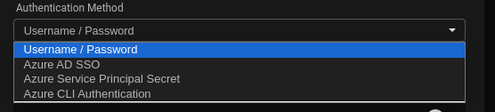
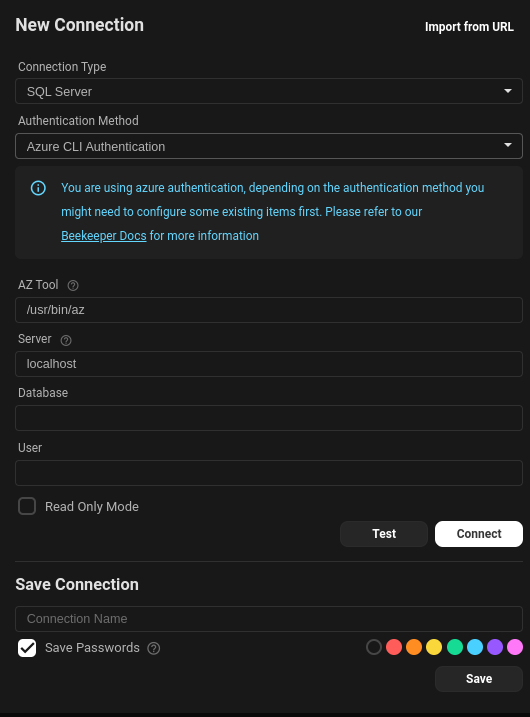
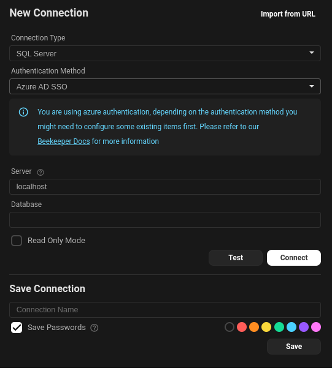
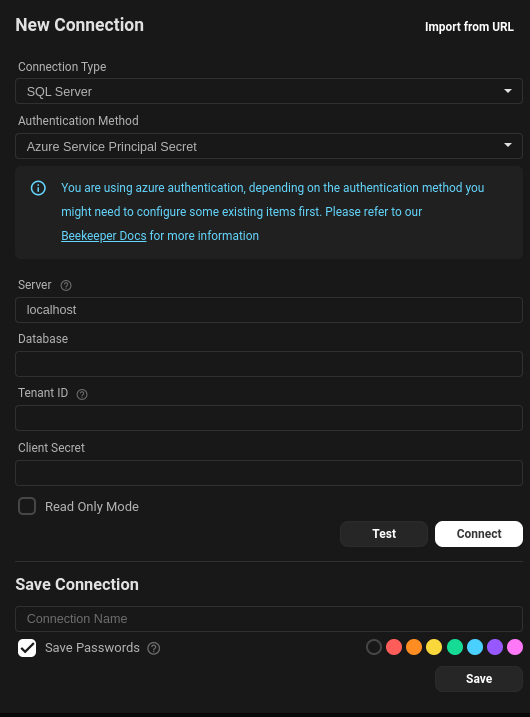

# Connecting to Azure Entra ID

Connecting to Azure Entra ID is straightforward once you're familiar with Azure's authentication methods. This guide outlines the three most common methods to connect to databases such as **MySQL**, **PostgreSQL**, and **MS SQL** via Entra ID.

---

## Prerequisites

- **Azure CLI** – Required only for CLI-based authentication
  [Install AZ CLI](https://learn.microsoft.com/en-us/cli/azure/)

---

## Authentication Methods



### 1. Azure CLI Authentication (MySQL, PostgreSQL, MS SQL)

Uses your local Azure CLI session to retrieve an access token.



[Install Azure CLI From Microsoft](https://learn.microsoft.com/en-us/cli/azure/?view=azure-cli-latest)

**Steps:**
1. Open your terminal and log in:
   ```bash
   az login
   ```
2. In the application, select **Azure CLI Authentication**.
3. Provide:
   - **Server**
   - **Database**
   - **Username**

> ✅ The application will use your active CLI session to authenticate securely.

---

### 2. Azure AD SSO (MS SQL Only)

Uses your Microsoft Entra credentials via a browser for a streamlined sign-in experience.



**Steps:**
1. Select **Azure AD SSO** as the authentication method.
2. Enter:
   - **Server**
   - **Database**
3. Click **Connect**. A browser will open for Microsoft login.

> ✅ Credentials are not stored; the login is handled securely by Microsoft.

---

### 3. Service Principal Authentication (MS SQL Only)

Best suited for automated services or non-interactive applications.



**Steps:**
1. [Create a Service Principal](https://learn.microsoft.com/en-us/azure/active-directory/develop/howto-create-service-principal-portal)
2. Grant the Service Principal access to the database.
3. In the application, select **Service Principal** as the method.
4. Provide:
   - **Server**
   - **Database**
   - **Tenant ID**
   - **Client ID**
   - **Client Secret**

> ⚠️ Ensure proper role assignments in both Azure and the target database.

---

## Signing in with Azure CLI

Use this method when you have an active Azure CLI session:

1. Ensure Azure CLI is installed.
2. Run the following to authenticate:
   ```bash
   az login
   ```
3. In the application, choose **Azure CLI Authentication**.
4. Input:
   - **Server**
   - **Database**
   - **Username**

Your session token will be used to access the database.

---

## Summary

| Authentication Method     | Supported Databases        |
|---------------------------|----------------------------|
| Azure CLI Authentication  | MySQL, PostgreSQL, MS SQL  |
| Azure AD SSO              | MS SQL only                |
| Service Principal         | MS SQL only                |

---

## Troubleshooting

### Error: Login failed for user '<user>@<tenant>.onmicrosoft.com'

**Cause:**
This error occurs when the SSO-authenticated user is not mapped to a SQL database user.

**Resolution:**

You need to explicitly create a user in SQL that maps to the Microsoft Entra identity.

📖 Reference: [Login failed for user - Microsoft Q&A](https://learn.microsoft.com/en-us/answers/questions/133709/login-failed-for-user)

**Fix Example (run in SQL):**
```sql
CREATE USER [<user>@<tenant>.onmicrosoft.com] FROM EXTERNAL PROVIDER;
ALTER ROLE db_datareader ADD MEMBER [<user>@<tenant>.onmicrosoft.com];
ALTER ROLE db_datawriter ADD MEMBER [<user>@<tenant>.onmicrosoft.com];
```

Ensure the user has necessary permissions within the target database.

---
