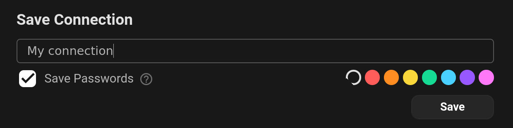

Connecting to a ClickHouse database from Beekeeper Studio is straightforward. Simply select ClickHouse from the dropdown, and fill in the host, port, username, and password fields, then click Connect.

## Connection Details

To connect to a ClickHouse database, you'll need the following information:

- Host: The IP address or hostname of your ClickHouse server.
- Port: The default port is 9000, but this can be customized if your server uses a different port.
- Username: Your ClickHouse username, with default being the typical default.
- Password: Your ClickHouse password, if applicable.

## Testing Your Connection

Before saving your connection details, Beekeeper Studio allows you to test the connection:

1. Enter your connection details.
2. Click the Test Connection button.
3. If the test is successful, you’re ready to connect. Otherwise, check your details and try again.

## Saving Your Connection

Once your connection details have been verified, you can choose to save them by entering a name, checking the `Save Passwords` box if desired, and then clicking save.

## Advanced Settings (Optional)

For users needing advanced configurations:

- TLS/SSL Settings: If your ClickHouse server requires a secure connection, expand the TLS/SSL settings and configure the necessary certificates and keys if necessary.
- SSH Tunnel: If you need to connect to your ClickHouse server via an SSH tunnel, you can configure the SSH settings by expanding the SSH Tunnel settings and configuring the necessary SSH server details.
