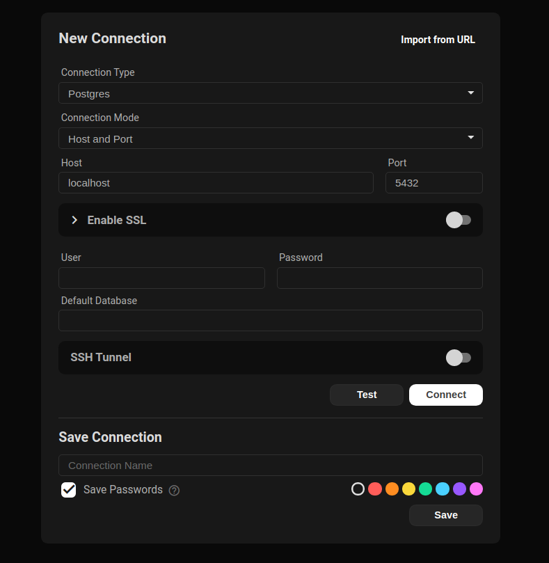
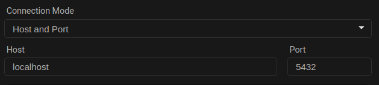
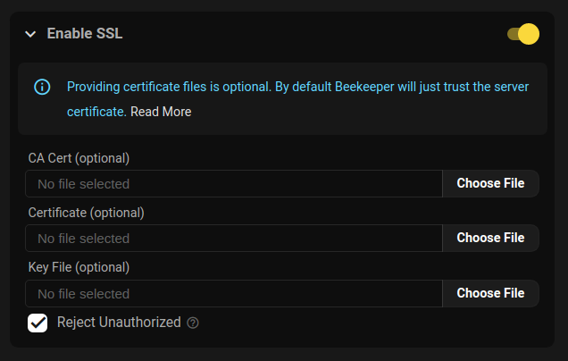
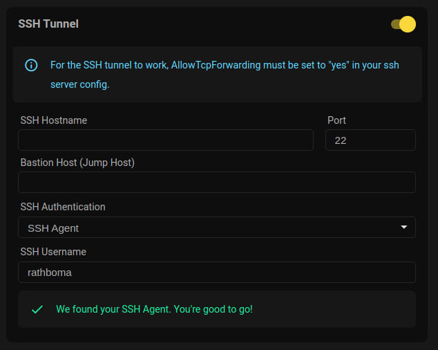

Conectarte a tu base de datos desde Beekeeper Studio es facil. Puedes conectarte a una base de datos de varias maneras:

1. Para bases de datos SQLite, simplemente puedes hacer doble clic en el archivo en tu explorador de archivos
2. Para otras bases de datos, puedes especificar host y puerto, o la ruta del socket unix.
3. Algunos proveedores de nube admiten conexion con metodos de autenticacion personalizados, Beekeeper Studio tambien admite muchos de estos (ej: SSO para Azure SQL).


## Primer paso: Seleccionar tipo de conexion

Cuando abras Beekeeper Studio por primera vez, veras la pantalla de conexion. Puedes seleccionar el tipo de conexion que deseas hacer desde el menu desplegable.

Tambien puedes importar una URL de base de datos aqui, esto es muy util para Heroku Postgres, Azure SQL y otras bases de datos en la nube.

### Opcional: Explorar la base de datos de demostracion

Cada nueva instalacion de Beekeeper Studio viene con una `Base de datos de demostracion` en el menu lateral derecho. Esta es una pequena base de datos SQLite que incluimos con la aplicacion. Puedes usarla para explorar las funciones de Beekeeper Studio sin conectarte a una base de datos real.

## Completar


La pantalla de conexion de Beekeeper Studio

## Modo de conexion

Puedes conectarte a algunas bases de datos con una conexion `socket` o `TCP`. Las conexiones socket solo funcionan cuando el servidor de base de datos se ejecuta en tu maquina local (es la configuracion predeterminada para una instalacion de MySQL, por ejemplo). Las conexiones TCP requieren un nombre de host y puerto.



Ejemplo de conexion TCP (Host/Puerto)

Ten en cuenta que SSL, SSH y otras opciones de conexion avanzadas solo estan disponibles con una conexion TCP.

## SSL



Configuracion SSL de Beekeeper Studio


Hay tres formas de conectarse a una base de datos con SSL

1. **Confiar en el servidor:** Conectarse con SSL sin proporcionar tu propio certificado. Este es el valor predeterminado.
2. **Certificado requerido:** Conectarse con SSL, proporcionar tus propios certificados y deshabilitar `rejectUnauthorized`.
3. **Certificado verificado:** Conectarse con SSL, proporcionar tus propios certificados y habilitar `rejectUnauthorized`.

Aqui hay una tabla de como los varios flags `sslmode` de clientes de linea de comandos se mapean a Beekeeper:

| sslmode     | Activar SSL? | rejectUnauthorized |
| ----------- | ------------ | ------------------ |
| disable     | no           | n/a                |
| allow       | no           | n/a                |
| prefer      | no           | n/a                |
| require     | si           | false              |
| verify-ca   | si           | false              |
| verify-full | si           | true               |

Puedes proporcionar tus propios archivos de certificado personalizados si es necesario.


## SSH



Configuracion SSH de Beekeeper Studio


### Configuracion del servidor

Antes de poder usar un tunel SSH para conectarte a tu base de datos, debes asegurarte de que tu servidor SSH este configurado correctamente.

Primero asegurate de que la siguiente linea este configurada en tu `/etc/ssh/sshd_config`:

```
AllowTcpForwarding yes
```

#### Claves publicas ssh-rsa

Si estas usando una clave ssh generada por el algoritmo `ssh-rsa`, necesitaras habilitar el soporte para este algoritmo en tu servidor ssh.

Para hacer esto, puedes agregar la siguiente linea al archivo `/etc/ssh/sshd_config` en tu servidor SSH

```
PubkeyAcceptedKeyTypes +ssh-rsa
```
Si, el `+` es intencional
{: .text-muted .small .text-center }


### Opciones de configuracion del cliente


Beekeeper admite tunelizar tu conexion a traves de SSH. Para conectarte a una base de datos remota usando tu cuenta SSH en esa maquina:

1. **Activa el tunel SSH** para revelar los campos de detalles de conexion ssh

2. **Ingresa el nombre de host SSH** o direccion IP del servidor SSH remoto

3. **Cambia el puerto del servidor SSH** si no acepta conexiones en el puerto predeterminado 22

4. **Ingresa el host bastion (JumpHost)** (opcional) si la red de tu servidor requiere que te conectes a traves de un [JumpHost](https://www.redhat.com/sysadmin/ssh-proxy-bastion-proxyjump)

5. **Ingresa el intervalo de Keepalive** (opcional) para especificar, _en segundos_, con que frecuencia hacer ping al servidor mientras esta inactivo para evitar desconectarse debido a un tiempo de espera. Esto es equivalente a la opcion [ServerAliveInterval](https://superuser.com/questions/37738/how-to-reliably-keep-an-ssh-tunnel-open#answer-601644) que podrias usar en la linea de comandos ssh, o en tu archivo `~/.ssh/config` -- **Ingresar 0 (cero) deshabilita esta funcion**

6. **Selecciona tu metodo de autenticacion SSH**:

    * `Agente SSH` si tu maquina local esta ejecutando un agente SSH, solo necesitas proporcionar el **nombre de usuario SSH** remoto de tu cuenta ssh en el servidor

    * `Usuario y contrasena` para ingresar tanto tu **nombre de usuario SSH** como tu **contrasena SSH** (tambien consulta la opcion _Guardar contrasenas_, a continuacion)

    * `Archivo de clave` Selecciona tu **archivo de clave privada SSH** (y opcionalmente ingresa tu **frase de paso del archivo de clave**) si usas tu [clave publica SSH](https://stackoverflow.com/questions/7260/how-do-i-setup-public-key-authentication#answers-header) en el servidor para autenticacion

7. **Ingresa un nombre para tu conexion** (opcionalmente marca la casilla **Guardar contrasenas**) y presiona **Guardar** para que Beekeeper recuerde todo lo anterior por ti

8. **Presiona el boton Conectar** para acceder a tu base de datos!

## Asociaciones de archivos

Beekeeper Studio proporciona asociaciones de archivos para que puedas hacer lo siguiente sin abrir la aplicacion:

- Haz doble clic en un archivo sqlite `.db` en un explorador de archivos para abrirlo en Beekeeper Studio!
- Abre URLs y archivos desde la terminal:
  - Mac: `open postgresql://user@host/database` o `open ./example.db`
  - Linux: `xdg-open postgresql://user@host/database` o `xdg-open ./example.db`
