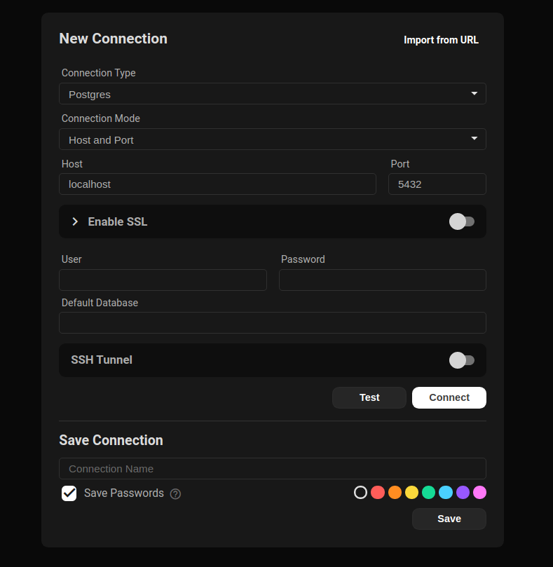
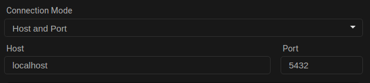
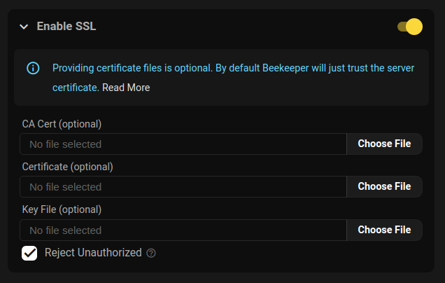
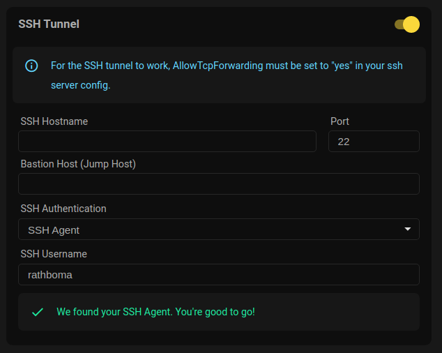

Connecting to your database from Beekeeper Studio is easy. You can connect to a database in a few different ways:

1. For SQLite databases, you can simply double click the file in your file browser
2. For other databases, you can specify host & port, or the unix socket path.
3. Some cloud vendors support connecting with custom authentication methods, Beekeeper Studio supports many of these too (eg: SSO for Azure SQL).


## First Step: Select Connection Type

When you open Beekeeper Studio for the first time, you'll see the connection screen. You can select the type of connection you want to make from the dropdown.

You can also import a database URL here, this is super useful for Heroku Postgres, Azure SQL, and other cloud databases.

### Optional: Explore The Demo Database

Every new Beekeeper Studio installation comes with a `Demo Database` in the right side menu. This is a small SQLite database we bundle with the app. You can use this to explore Beekeeper Studio's features without connecting to a real database.

## Complete


The Beekeeper Studio Connection Screen

## Connection Mode

You can connect to some databases with either a `socket` or a `TCP` connection. Socket connections only work when the database server is running on your local machine (it's the default set-up for a MySQL installation for example). TCP connections require a hostname and port.



TCP (Host/Port) connection example

Note that SSL, SSH, and other advanced connection options are only available with a TCP connection.

## SSL



Beekeeper Studio's SSL Configuration


There are three ways to connect to a database with SSL

1. **Trust the server:** Connect with SSL without providing your own certificate. This is the default.
2. **Required Cert:** Connect with SSL, provide your own certs, and disable `rejectUnauthorized`.
3. **Verified Cert:** Connect with SSL, provide your own certs, and enable `rejectUnauthorized`.

Here's a table of how the various `sslmode` flags from command line clients map to Beekeeper:

| sslmode     | Turn on SSL? | rejectUnauthorized |
| ----------- | ------------ | ------------------ |
| disable     | no           | n/a                |
| allow       | no           | n/a                |
| prefer      | no           | n/a                |
| require     | yes          | false              |
| verify-ca   | yes          | false              |
| verify-full | yes          | true               |

You can provide your own custom certificate files if needed.


## SSH



Beekeeper Studio's SSH configuration


### Server Configuration

Before you can use an SSH tunnel to connect to your database, you need to make sure your SSH server is setup correctly.

Firstly make sure the following line is set in your `/etc/ssh/sshd_config`:

```
AllowTcpForwarding yes
```

#### ssh-rsa public keys

If you are using an ssh key generated by the `ssh-rsa` algorithm, you'll need to enable support for this algorithm in your ssh server.

To do this, you can add the following line to the `/etc/ssh/sshd_config` file on your SSH server

```
PubkeyAcceptedKeyTypes +ssh-rsa
```
Yes, the `+` is intentional
{: .text-muted .small .text-center }


### Client Configuration Options


Beekeeper supports tunneling your connection via SSH. To connect to a remote database using your SSH account on that machine:

1. **Activate the SSH Tunnel** to reveal the ssh connection detail fields

2. **Enter the SSH Hostname** or IP address of the remote SSH server

3. **Change the SSH server's Port** if it doesn't accept connections on the default port 22

4. **Enter Bastion Host (JumpHost)** (optional) if your server's network requires that you connect through a [JumpHost](https://www.redhat.com/sysadmin/ssh-proxy-bastion-proxyjump)

5. **Enter the Keepalive Interval** (optional) to specify, _in seconds_, how often to ping the server while idle to prevent getting disconnected due to a timeout.  This is equivalent to the [ServerAliveInterval](https://superuser.com/questions/37738/how-to-reliably-keep-an-ssh-tunnel-open#answer-601644) option you might use on the ssh command line, or in your `~/.ssh/config` file -- **Entering 0 (zero) disables this feature**

6. **Select your SSH Authentication method**:

    * `SSH Agent` if your local machine is running an SSH Agent, you only need to provide the remote **SSH Username** of your ssh account on the server

    * `Username and Password` to enter both your **SSH Username** and **SSH Password** (also see the _Save Passwords_ option, below)

    * `Key File` Select your **SSH Private key File** (and optionally enter your **Key File PassPhrase**) if you use your [SSH Public Key](https://stackoverflow.com/questions/7260/how-do-i-setup-public-key-authentication#answers-header) on the server for authentication

7. **Enter a name for your Connection** (optionally check the **Save Passwords** checkbox) and Press **Save** to have Beekeeper remember all of the above for you

8. **Press the Connect button** to access your database!

### Using `~/.ssh/config`

Beekeeper Studio reads your `~/.ssh/config` file (the same file `ssh` itself uses) to look up connection details. This works for **both the SSH Hostname and the Bastion Host fields**, and for **all three authentication methods** (SSH Agent, Key File, Username and Password).

If you type a `Host` alias from your SSH config into either host field, Beekeeper will resolve the following options from the matching entry:

| SSH config key    | What Beekeeper uses it for                |
| ----------------- | ----------------------------------------- |
| `HostName`        | The actual hostname/IP to connect to      |
| `Port`            | The SSH port                              |
| `User`            | The SSH username                          |
| `IdentityFile`    | The private key file. In Key File mode it's used when you leave the picker blank. In SSH Agent mode it's tried as a fallback after the agent (matching `ssh`'s behavior). |
| `IdentitiesOnly`  | If `yes`, restricts the agent to identities that match your `IdentityFile` entries (Agent mode only). |

For example, given this entry in `~/.ssh/config`:

```
Host production
  HostName db.internal.example.com
  Port 22022
  User admin
  IdentityFile ~/.ssh/prod_ed25519
```

You can simply type `production` into the **SSH Hostname** field, leave the other fields blank, and Beekeeper will fill in the rest.

#### Order of Precedence

When deciding which value to use for the hostname, port, username, or key file, Beekeeper picks the **first** match in this order:

1. **What you typed in the connection form.** Anything you enter in Beekeeper always wins. The exception is the hostname itself: if you typed an alias (e.g. `production`), Beekeeper resolves it to the real `HostName` from `~/.ssh/config` so the connection can actually be made.
2. **The matching entry in `~/.ssh/config`.** Used to fill in any field you left blank.
3. **SSH defaults.** Port `22`, your OS username, and (in SSH Agent mode) the agent advertised by `SSH_AUTH_SOCK` (or PuTTY's pageant on Windows).

This precedence applies independently to the target host and the bastion host, so you can mix and match: for example, type a real hostname for the target while using a `~/.ssh/config` alias for the bastion (or vice versa).

#### Authentication path per mode

The selected authentication mode in the form decides which credentials are tried. `~/.ssh/config` can supply additional credentials within that mode but cannot pull in a method you didn't pick:

| Mode | Agent | `IdentityFile` from `~/.ssh/config` | `IdentitiesOnly=yes` |
| ---- | ----- | ----------------------------------- | -------------------- |
| **SSH Agent** | Tried first | Tried as fallback after the agent | Wraps the agent so it only offers identities matching your `IdentityFile`. The IdentityFile keys are still tried. |
| **Key File** | Not used | Tried only if you leave the form's Private Key picker empty | Ignored (no agent involved) |
| **Username & Password** | Not used | Ignored | Ignored |

Picking "Key File" deliberately doesn't engage the agent, even if `~/.ssh/config` would. If you want both, pick **SSH Agent** and rely on the IdentityFile fallback.

#### What is *not* read from `~/.ssh/config`

To keep things predictable, Beekeeper Studio only reads the keys listed above. Other directives in your config file (`ProxyJump`, `ProxyCommand`, `ForwardAgent`, `LocalForward`, `RemoteForward`, `Match` blocks, included files, etc.) are **ignored**. If you rely on `ProxyJump`, configure the bastion host explicitly in the connection form.

## File Associations

Beekeeper Studio provides file associations so you can do the following things without opening the app:

- Double click a sqlite `.db` file in a file browser to open it in Beekeeper Studio!
- Open URLs and files from the terminal:
  - Mac: `open postgresql://user@host/database` or `open ./example.db`
  - Linux: `xdg-open postgresql://user@host/database` or `xdg-open ./example.db`


