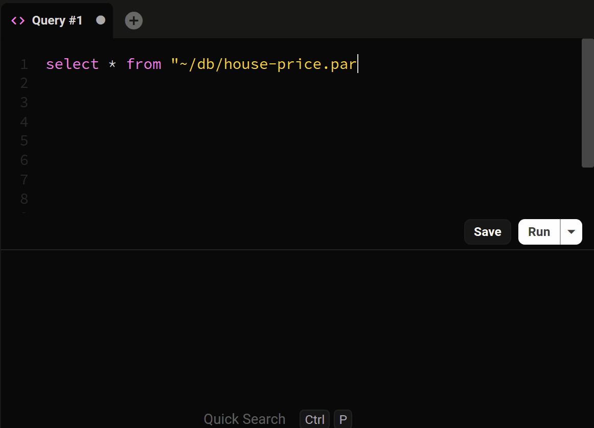

Conectarse a una base de datos DuckDB desde la aplicacion es sencillo. Simplemente selecciona DuckDB del menu desplegable, elige tu archivo DuckDB y haz clic en `conectar`.

## Haz doble clic en archivos .duckdb

Cuando instalas Beekeeper Studio, se creara una asociacion para archivos con la extension `.duckdb`.

Mientras Beekeeper Studio siga siendo la aplicacion predeterminada para estos tipos de archivos, ahora puedes simplemente hacer doble clic en cualquier archivo DuckDB para abrirlo en Beekeeper Studio.

## Abrir desde la linea de comandos

Tambien puedes usar tu terminal para abrir una base de datos en Beekeeper Studio siempre que tengas las asociaciones de archivos configuradas.

- **MacOS** `open ./ruta/a/ejemplo.duckdb`
- **Linux** `xdg-open ./ruta/a/ejemplo.duckdb`

## Crear una nueva base de datos

Para crear una nueva base de datos, puedes hacer clic en el boton `Crear` o especificar la ubicacion del archivo de base de datos en el campo de entrada `Archivo de base de datos`.

## Consultar archivos



DuckDB te permite importar y consultar datos de varios formatos de archivo, como CSV, Parquet y JSON, usando comandos SQL.

Por ejemplo, para consultar un archivo CSV sin importarlo a la base de datos:

```sql
SELECT * FROM 'ruta/a/datos.csv';
```

Para crear una tabla e importar datos desde un archivo CSV:

```sql
CREATE TABLE mi_tabla AS FROM 'ruta/a/datos.csv';
```

Para mas detalles, consulta la [documentacion de DuckDB](https://duckdb.org/docs/stable/data/overview).
