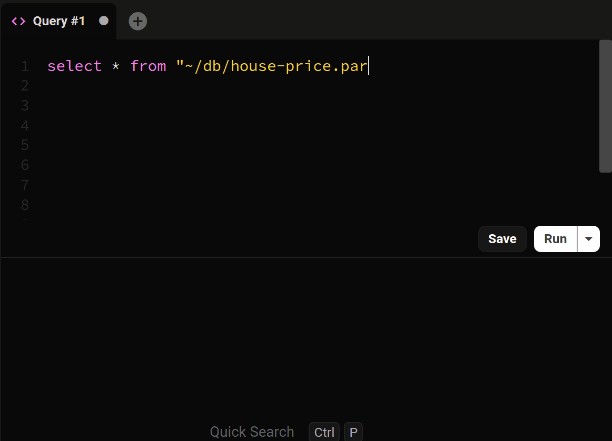

Connecting to a DuckDB database from the app is straightforward. Simply select DuckDB from the dropdown, choose your DuckDB file, and click `connect`.

## Double click .duckdb files

When you install Beekeeper Studio it will create an association for files with the `.duckdb` extension.

So long as Beekeeper Studio remains the default app for these file types, you can now just double click any DuckDB file to open it in Beekeeper Studio.

## Opening from the command line

You can also use your terminal to open a database in Beekeeper Studio so long as you have the file associations set-up.

- **MacOS** `open ./path/to/example.duckdb`
- **Linux** `xdg-open ./path/to/example.duckdb`

## Creating a new database

To create a new database, you can click the `Create` button or specify the location of the database file in the `Database File` input field.

## Query files



DuckDB allows you to import and query data from various file formats, such as CSV, Parquet, and JSON, using SQL commands.

For example, to query a CSV file without importing it into the database:

```sql
SELECT * FROM 'path/to/data.csv';
```

To create a table and import data from a CSV file:

```sql
CREATE TABLE my_table AS FROM 'path/to/data.csv';
```

For more details, please refer to the [DuckDB documentation](https://duckdb.org/docs/stable/data/overview).
