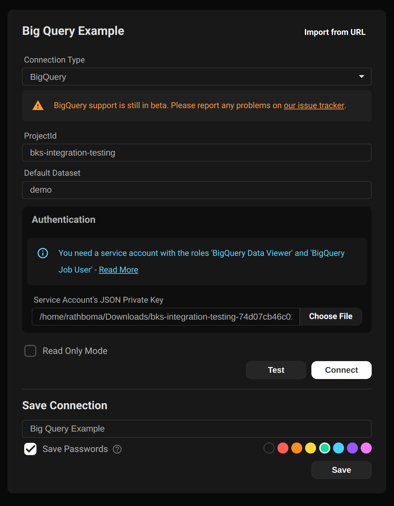
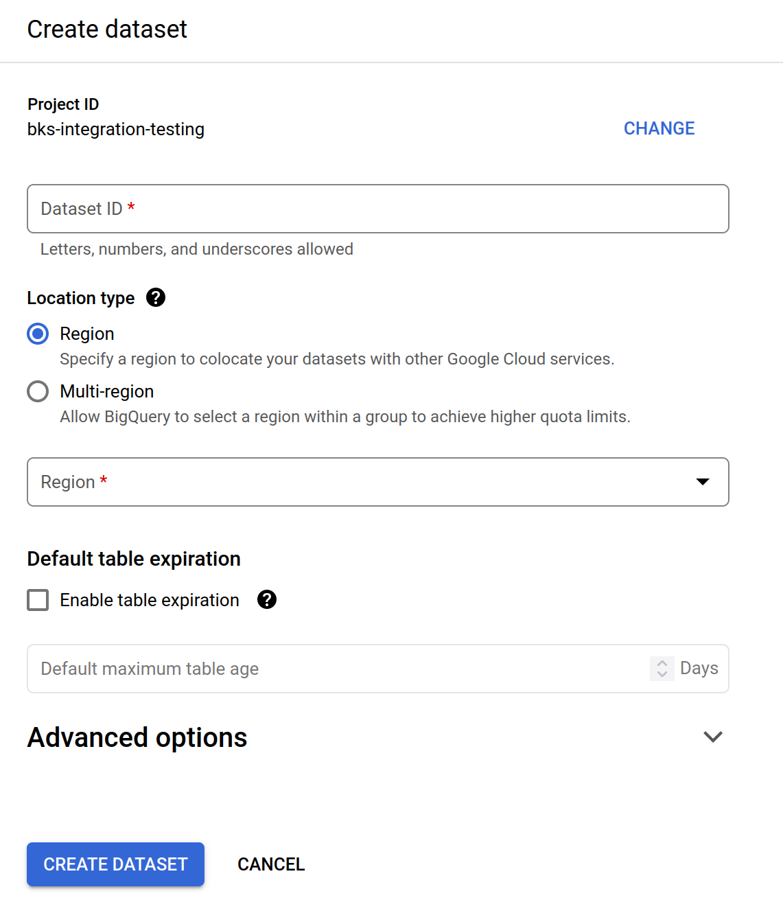

Conectarse a Google BigQuery requiere que configures un usuario IAM (ya sea un 'usuario' o una 'cuenta de servicio', no importa) y descargues el archivo json de clave privada para ese usuario.

## Rol IAM minimo requerido

**BigQuery User**

(o BigQuery Data Viewer + BigQuery Job User)

Como minimo, los usuarios necesitan tener el rol `BigQuery User`. Esto proporciona acceso a la mayoria de las funciones de Beekeeper Studio.

Esto *no* proporcionara acceso a la funcionalidad completa de tu cluster BigQuery. Si necesitas acceso mas avanzado, recomendamos usar `BigQuery Admin` para desbloquear la modificacion de esquema y datos.

Tu administrador de Google Cloud probablemente puede proporcionar controles mas detallados si es necesario.

## Conectarse desde Beekeeper Studio

Una vez que hayas configurado tu usuario IAM y descargado tu archivo JSON de clave privada, solo necesitas la siguiente informacion para conectarte a tu instancia de Big Query:

1. ID del proyecto de Google Cloud
2. Dataset predeterminado de Big Query a usar una vez conectado
3. Ruta al archivo de clave primaria JSON

## Advertencia: Usa solo datasets especificos de region

Al configurar un dataset en BigQuery, asegurate de especificar explicitamente una region.

Si eliges 'Multi-Region', muchas funciones comunes no funcionaran, tanto en Beekeeper Studio como en la consola de Google Cloud.

Ejemplos de tareas que no funcionaran con multi-region habilitado:

- Subir un CSV
- Ver estructura de tabla
- Importar datos
- Vincular datos desde un bucket de almacenamiento
- Vincular datos desde S3
- Copiar datos desde S3 o un bucket de almacenamiento

Al conectarte a BigQuery desde Beekeeper Studio, proporciona la ruta a este archivo JSON de clave privada para autenticarte con Google Cloud. Este es el unico metodo de autenticacion actualmente soportado por Beekeeper Studio.
