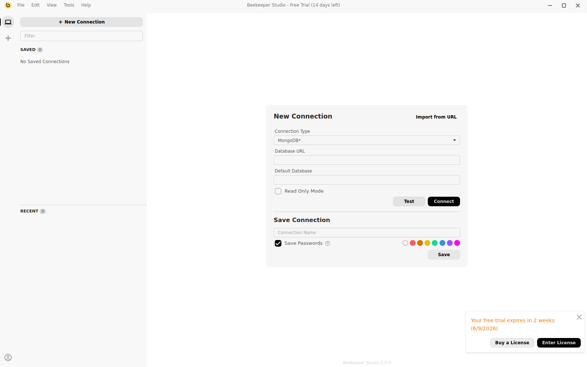

# MongoDB Support

## How To Connect

Select **MongoDB** from the connection type dropdown, enter your MongoDB URL (for example `mongodb://localhost:27017`), and optionally fill in the default database. Click **Connect**.

## Supported Features

- Table data view
- Table data sorting, filtering
- Table structure view
- Entity sidebar
- Editing data
- Running queries in some sort of REPL
- Writing SQL against Mongo
- Import/Export
- Backup/Restore
- Schema editing
- Read only mode

## Still TBD

- SSH tunneling