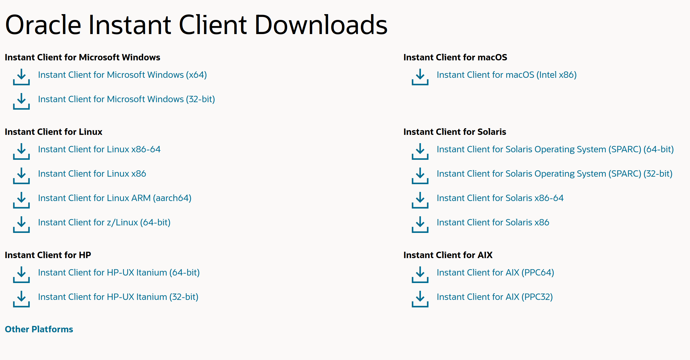

# Como conectarse a Oracle Database

Beekeeper Studio soporta conexion a bases de datos Oracle en dos modos:

1. **Modo Thin**: Este es el modo predeterminado y no requiere ninguna configuracion adicional. No todas las opciones de conexion estan disponibles en este modo. Si obtienes un error de `thin mode`, puede que necesites usar el `Modo Thick`.
2. **Modo Thick**: Este modo requiere que Oracle Instant Client este instalado en tu sistema. Permite opciones de conexion mas avanzadas y es recomendado para la mayoria de los usuarios.

Para una comparacion de como difieren los modos thin y thick, consulta la documentacion de Oracle Database en [el sitio web de Oracle](https://node-oracledb.readthedocs.io/en/latest/user_guide/appendix_a.html#oracle-database-features-supported-by-node-oracledb)

## Requisitos del modo Thick

1. En todos los sistemas operativos debes tener instalado Oracle Instant Client.
2. En Linux debes tener instalado `libaio-dev` (apt) / `libaio-devel` (yum/dnf).
3. Para Ubuntu 24.04+ Tambien necesitas crear un enlace simbolico: `sudo ln -s /usr/lib/x86_64-linux-gnu/libaio.so.1t64 /usr/lib/x86_64-linux-gnu/libaio.so.1`

A continuacion se encuentran instrucciones especificas para cada uno de los requisitos anteriores

### Descargar Oracle Instant Client

Descarga el Instant Client [desde el sitio web de Oracle](https://www.oracle.com/cis/database/technologies/instant-client/downloads.html).

Elige la descarga para tu sistema operativo.

[](https://www.oracle.com/cis/database/technologies/instant-client/downloads.html)


### Linux: Instalar libaio

```bash
sudo apt-get install libaio1 libaio-dev #debian/ubuntu
sudo yum install libaio #redhat/fedora
```

## Conectarse a bases de datos Oracle

Hay varias formas de conectarte a una base de datos Oracle usando Beekeeper Studio.

1. Cadena de conexion PSA
1. Cadena de conexion SID o Service Name
2. Alias TSA
3. Host y puerto

## Usando tnsnames.ora

Puedes especificar tu directorio 'config' al agregar una conexion Oracle. Beekeeper Studio usara esto para encontrar tu archivo tnsnames.ora, luego puedes usar un alias en tu cadena de conexion.

### Ingresa tu cadena de conexion Oracle

Si estas usando una cadena de conexion para conectarte a tu base de datos, Beekeeper soporta todas las formas comunes de cadenas de conexion Oracle. Ve los ejemplos a continuacion, o [mas en el sitio web de Oracle](https://docs.oracle.com/en/database/other-databases/essbase/21/essoa/connection-string-formats.html)

#### Ejemplos de cadenas de conexion Oracle

```bash
# Cadena de conexion PDB
<host>:<puerto>/<PDB>

# ejemplo simple con SID o service name
<host>:<puerto>/<SID o servicename>

# Service name largo
(DESCRIPTION=(ADDRESS=(host=nombre_host)(protocol=nombre_protocolo)(port=numero_puerto))
      (CONNECT_DATA=(SERVICE_NAME=nombre_servicio)))

 # Version larga con SID
 (DESCRIPTION=(ADDRESS=(PROTOCOL=TCP)(Host=nombre_host)(Port=puerto))(CONNECT_DATA=(SID=sid_aqui)))
```
