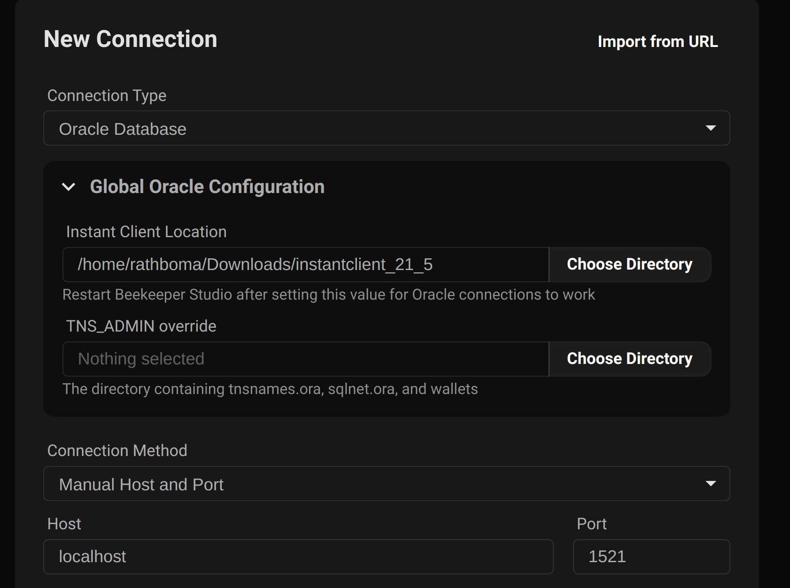

## Requirements

1. On all operating systems you must have the Oracle Instant Client installed.
2. On Linux you must have `libaio` installed.
3. On MacOS you must be using the `Intel` version of Beekeeper Studio. This is because Oracle does not publish an `Apple Silicon` version of the Instant Client.

Below are specific instructions for each of the above requirements

### Download Oracle Instant Client

Download the Instant Client [from the Oracle website](https://www.oracle.com/cis/database/technologies/instant-client/downloads.html).

Choose the download for your operating system.

[](https://www.oracle.com/cis/database/technologies/instant-client/downloads.html)


### Linux: Install libaio

```bash
sudo apt-get install libaio1 libaio-dev #debian/ubuntu
sudo yum install libaio #redhat/fedora
```

## Connecting To Oracle Database

There are a number of ways you can connect to an Oracle database using Beekeeper Studio.

1. PSA connection string
1. SID or Service Name connection string
2. TSA alias
3. Host and port


### Before You Connect: Set Instant Client Location

Before you can connect to Oracle at all you need to tell Beekeeper where on your computer the Oracle Instant Client libraries are stored.

This is an Oracle requirement and not something Beekeeper Studio controls.

In Beekeeper Studio you can choose the location of the instant client in the `Global Configuration` section before making your first connection:




### Enter Your Oracle Connection String

If you are using a connection string to connect to your database, Beekeeper supports all common forms of Oracle connection strings. See the examples below, or [more on the Oracle website](https://docs.oracle.com/en/database/other-databases/essbase/21/essoa/connection-string-formats.html)

#### Oracle Connection String Examples

```bash
# PDB connection string
<host>:<port>/<PDB>

# simple example with SID or service name
<host>:<port>/<SID or servicename>

# Long service name
(DESCRIPTION=(ADDRESS=(host=host_name)(protocol=protocol_name)(port=port_number))
      (CONNECT_DATA=(SERVICE_NAME=service_name)))

 # Long version with SID
 (DESCRIPTION=(ADDRESS=(PROTOCOL=TCP)(Host=host_name)(Port=port))(CONNECT_DATA=(SID=sid_here)))
```
