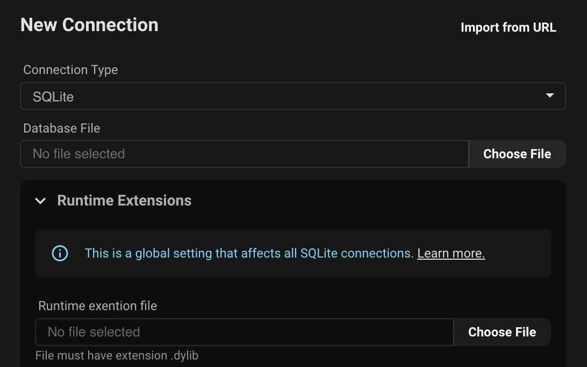

# Como conectarse a SQLite

Conectarse a una base de datos SQLite desde la aplicacion es bastante facil, simplemente selecciona `SQLite` del menu desplegable, elige tu archivo SQLite, luego haz clic en `conectar`.

## Conectarse a SQLite haciendo doble clic

Cuando instalas Beekeeper Studio, se creara una asociacion para archivos con las siguientes extensiones: `.db`, `.sqlite3` y `.sqlite`.

Mientras Beekeeper Studio siga siendo la aplicacion predeterminada para estos tipos de archivos, ahora puedes simplemente hacer doble clic en cualquier archivo SQLite para abrirlo en Beekeeper Studio.

## Abrir archivos SQLite desde la linea de comandos

Tambien puedes usar tu terminal para abrir una base de datos en Beekeeper Studio siempre que tengas las asociaciones de archivos configuradas.

- **MacOS** `open ./ruta/a/ejemplo.db`
- **Linux** `xdg-open ./ruta/a/ejemplo.db`

## Habilitar extensiones de tiempo de ejecucion de SQLite

SQLite soporta [extensiones de tiempo de ejecucion](https://www.sqlite.org/loadext.html). Esto proporciona capacidades extendidas para interactuar con SQLite.

Hay muchas de estas extensiones, muchas de ellas son de codigo abierto. Por ejemplo [sqlean](https://github.com/nalgeon/sqlean) es una extension que proporciona una gama de nuevas funciones y caracteristicas desde funciones criptograficas hasta manejo de arrays.

Beekeeper Studio proporciona la capacidad de cargar una extension SQLite cada vez que te conectas a una base de datos SQLite.

Esta es una configuracion **global**, por lo que se aplica a todas las conexiones SQLite en la maquina.

Para agregar una extension de tiempo de ejecucion, expande el bloque de configuracion `Extension de tiempo de ejecucion` y elige el archivo.

### Requisitos de extension SQLite

1. La extension de tiempo de ejecucion debe estar compilada para el sistema operativo que estas usando actualmente
2. La extension de tiempo de ejecucion debe tener la extension de archivo correcta
	- Windows: `.dll`
    - MacOS: `.dylib`
    - Linux: `.so`
