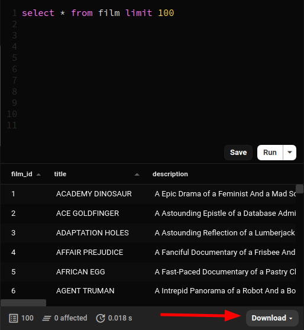
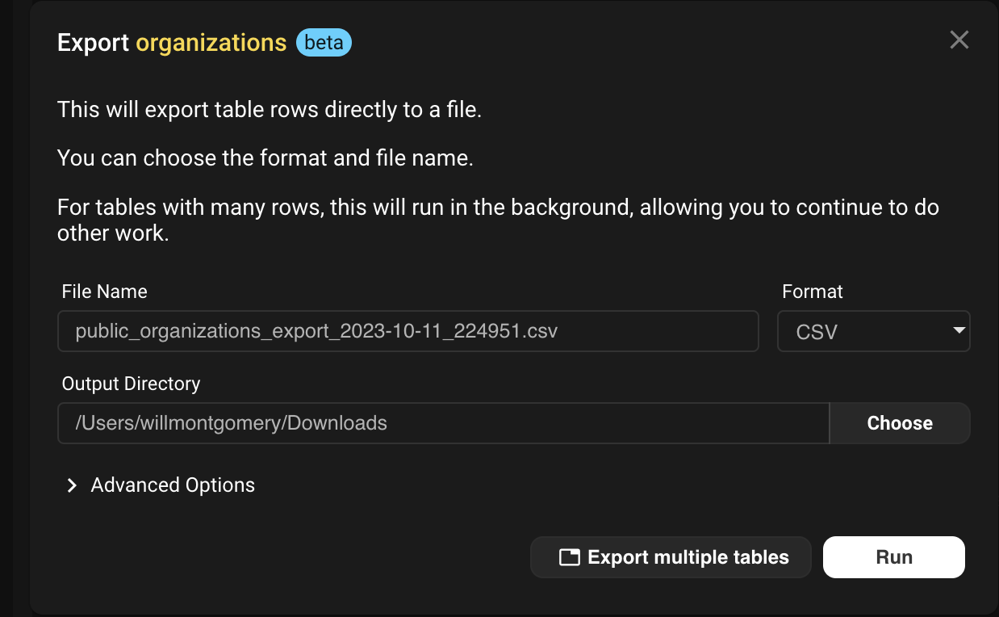
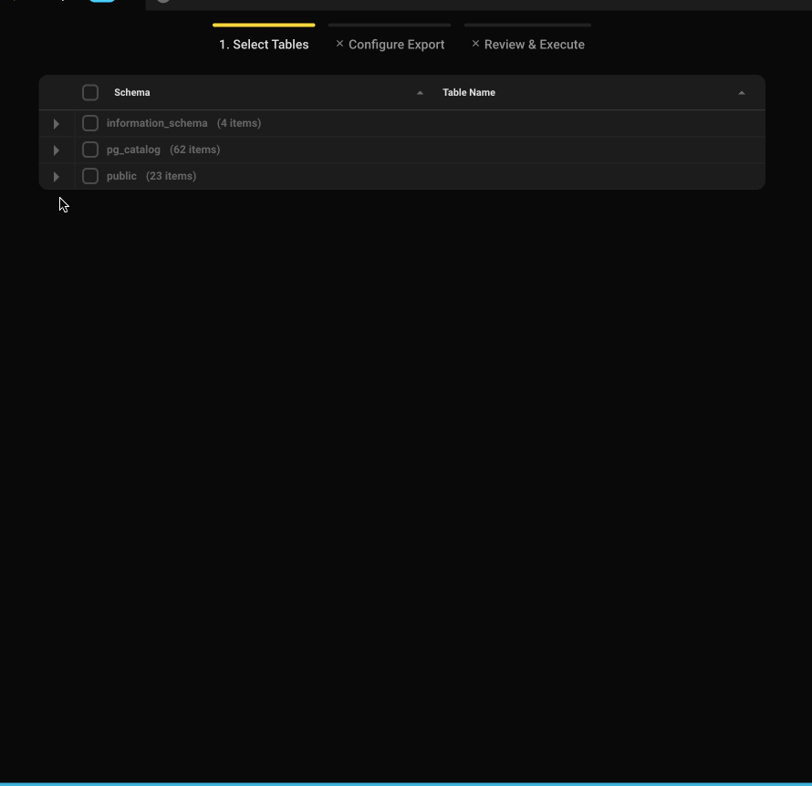
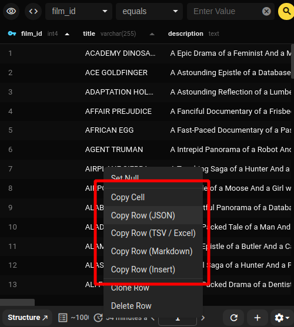
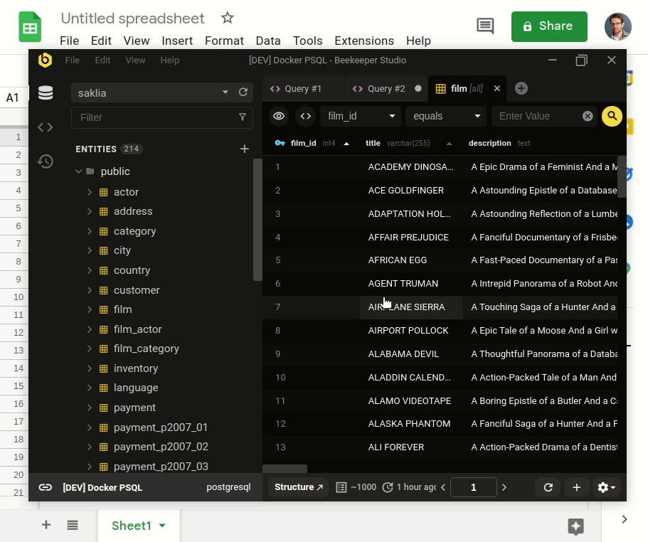

Hay dos formas de exportar datos de base de datos en Beekeeper Studio.

1. Exportar los resultados de una consulta SQL
2. Exportar una tabla(s) completa o una vista de tabla filtrada
3. Copiar filas individuales

## Formatos de exportacion

Beekeeper soporta guardar datos en varios formatos

## Exportar resultados de consultas SQL

Despues de ejecutar tu consulta en el [Editor SQL](./sql_editor/editor.md), haz clic en el boton `descargar` para exportar los resultados en un formato soportado.

Puedes elegir descargar como archivo o copiar el resultado a tu portapapeles.

### Formatos de descarga soportados

- CSV
- Excel
- JSON
- Markdown
- TSV compatible con Excel para pegar en Excel o Google Sheets

### Limites en descargas de consultas SQL

Por defecto, Beekeeper Studio limita los resultados de consultas a 20,000 registros (para que no colapses la aplicacion). Este limite tambien se aplica a la descarga.

Para acceder al conjunto de resultados completo, puedes seleccionar `Descargar resultados completos` en el menu de descarga para obtener el resultado completo de la consulta y enviarlo directamente a un archivo JSON o CSV.

## Exportar una tabla o tablas

Exportar una tabla es un poco mas complejo, porque una tabla podria contener millones de registros.

Cuando exportas una tabla, tablas o vista de tabla filtrada, Beekeeper Studio ejecutara la consulta y luego transmitira los resultados al archivo de descarga.

Hay algunas opciones para comenzar:
- Ve a la vista del explorador de tablas, haz clic en el icono de engranaje en la parte inferior derecha y elige `Exportar`.
- Haz clic derecho en la tabla y selecciona `Exportar a archivo`.
- [Selecciona `Exportar datos` desde la barra de herramientas de la aplicacion.](#multitable)

Puedes elegir la ubicacion del archivo final y el formato de la exportacion, junto con algunas opciones avanzadas, donde sea apropiado (como imprimir JSON con formato).

Desde aqui, simplemente haz clic en ejecutar para iniciar el proceso y generar tu exportacion.

Exportar una tabla grande puede tomar mucho tiempo. Veras una notificacion en la parte inferior derecha de la aplicacion para indicar el progreso mientras se ejecuta.

### Exportacion de multiples tablas

Selecciona `Exportar multiples tablas` en el modal de exportacion o ve a traves de la barra de herramientas de la aplicacion (herramientas -> exportar).

Todas las tablas en la base de datos se mostraran agrupadas por esquemas (si la base de datos los soporta) y tienes la capacidad de seleccionar todas las tablas en un esquema (o todas realmente) con un simple clic o elegir lo que quieras.

Cada tabla se almacena como un archivo separado con un formato determinado de `nombretabla.{sql,csv,json}`.

!!! note
    El proceso de exportacion puede tomar mucho tiempo dependiendo del tamano de la tabla y el numero de tablas que se exportan.

### Formatos de exportacion de tablas

- CSV
- SQL (insert)
- JSON
- JSON delimitado por nueva linea (JSONL)

## Copiar filas individuales

Para cualquier tabla en Beekeeper Studio, ya sea en el explorador de tablas o en los resultados de consultas, puedes hacer clic derecho en una celda y elegir exportar toda la fila en varios formatos.

### Formatos de copia de filas

- [TSV compatible con Excel](#tsv)
- JSON
- Markdown
- SQL Insert

## Exportar facilmente a Excel o Google Sheets

El formato de copia de filas de Beekeeper Studio esta disenado para permitir pegar datos de forma rapida y facil en Google Sheets y Microsoft Excel.

Pegar datos en una hoja de calculo usando este formato permitira que tu software de hoja de calculo analice automaticamente los datos y los distribuya correctamente entre columnas.

Agregue esta funcion porque esta es una de mis quejas con copiar datos de otras herramientas.

