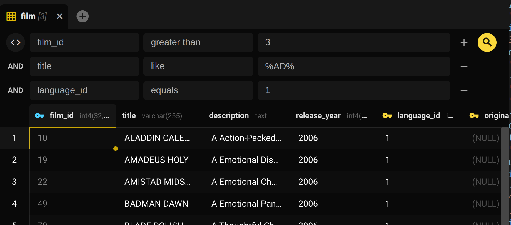
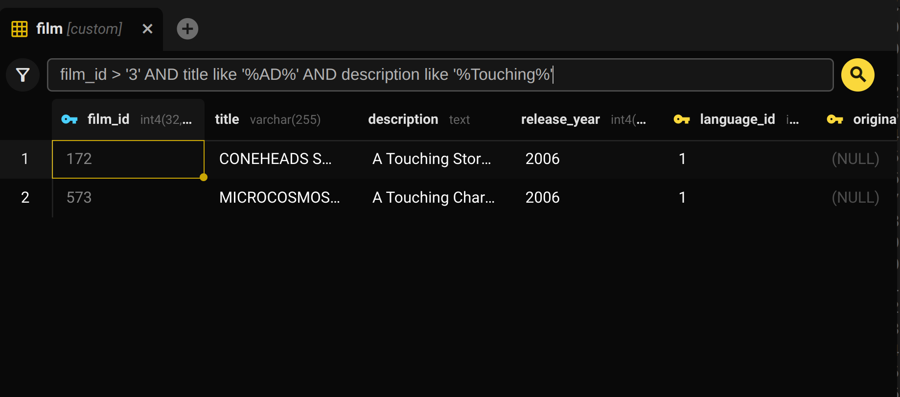
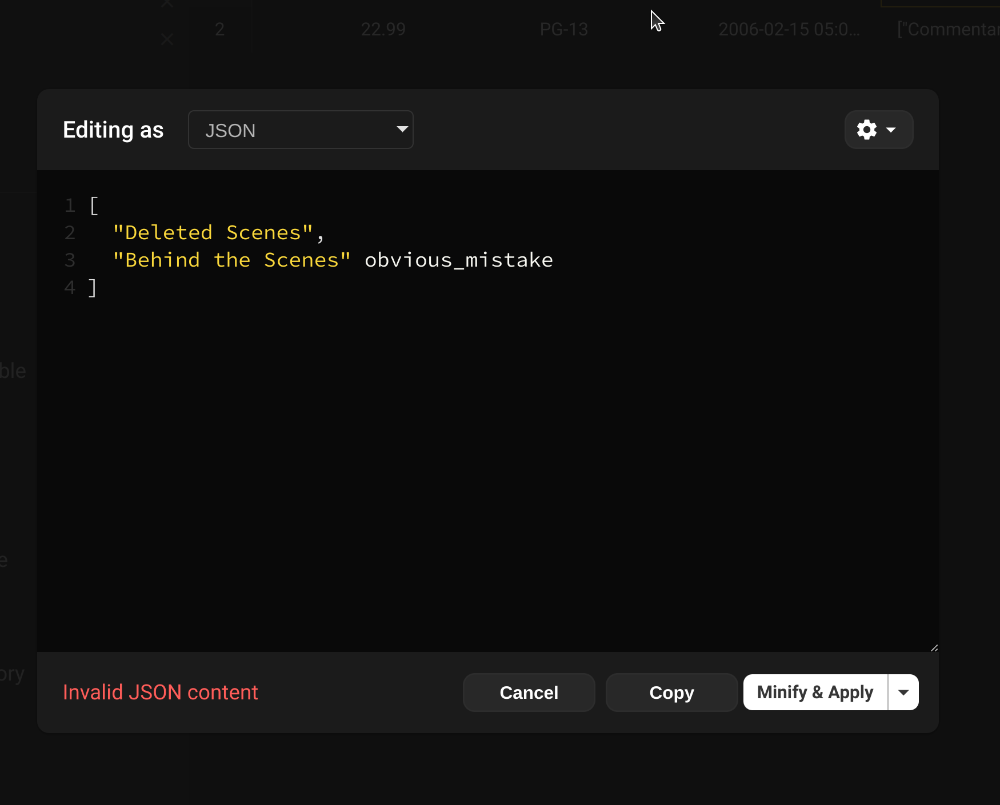
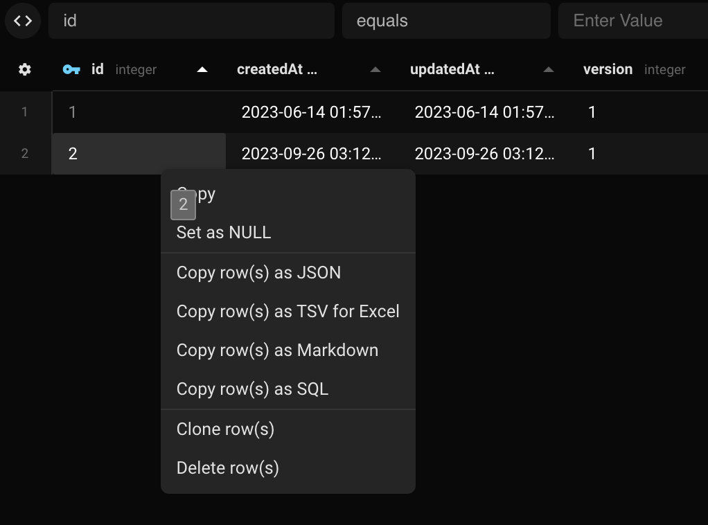

Haz doble clic en una tabla en la barra lateral izquierda para abrir una interfaz tipo Excel para ver y editar los datos. Llamamos a esto la **Vista de tabla**

Esta vista te permite:
- Interactuar con tu tabla como si fuera una hoja de calculo
- Filtrar la vista para ver registros especificos
- Editar datos facilmente
- Copiar/Pegar datos desde otro lugar
- Exportar toda la tabla o parte de ella a varios formatos

## Interaccion

La vista de tabla proporciona una experiencia tipo hoja de calculo para seleccionar, copiar y pegar datos. Beekeeper soporta muchas primitivas de interaccion tipo hoja de calculo.

1. Selecciona rangos arbitrarios de celdas usando clic y arrastrar, ctrl-clic y shift-clic.
2. Oculta columnas haciendo clic derecho en el encabezado y eligiendo `ocultar columna`
3. Redimensiona columnas, ya sea una a la vez o juntas
4. Copia y pega rangos de celdas desde Excel o Google Sheets con atajos de teclado nativos

## Filtrar la vista de tabla

En la parte superior de la tabla hay filtros de datos. Puedes usarlos para buscar en tu tabla los datos especificos que deseas.

Hay dos tipos de filtro que puedes usar: la GUI de filtro y el filtro SQL sin procesar

### GUI de filtro

La GUI de filtro te permite verificar cualquier columna en la tabla para una variedad de condiciones:
- Igualdad
- Mayor que / menor que
- Like
- IN

!!! warning
    Cuando uses `LIKE` en tus filtros, no olvides usar `%`. Por ejemplo, para encontrar todos los titulos que contienen `foo` escribirias: `%foo%`, no `foo`

### Filtros SQL sin procesar

Haz clic en el pequeno icono `<>` a la izquierda de los filtros para ingresar un filtro sql. Puedes escribir cualquier cosa aqui que apareceria en la clausula `WHERE` de una declaracion sql.

## Editar datos

En la vista de tabla puedes editar facilmente cualquier celda que desees. Simplemente haz doble clic en la celda para editar.

!!! note
    Beekeeper solo soporta edicion de tablas con claves primarias.

### Editar JSON y otros valores grandes

Editar un documento JSON en una pequena celda de tabla no es una gran experiencia. En su lugar, puedes hacer clic derecho en la celda y seleccionar `Editar en modal`. Esto proporcionara un modal emergente con resaltado de sintaxis y verificacion.

### Editar tablas que no tienen claves primarias

Beekeeper Studio tipicamente no te permite editar una tabla que no contiene una clave primaria, pero otras GUIs de base de datos lo permiten, entonces que pasa?

En general, si no tienes una clave primaria en tu tabla, **no hay forma confiable de identificar una fila especifica**. Algunas GUIs soportan edicion en esta situacion, pero usan una *heuristica* para determinar que fila actualizar. Una tecnica comun es hacer coincidir todos los valores de la fila para realizar la actualizacion, o usar un identificador de fila secreto.

#### Una nota sobre identificadores de fila secretos/internos

Algunas bases de datos proporcionan un identificador interno para filas, pero no siempre son estables.

El [ctid](https://www.postgresql.org/docs/current/ddl-system-columns.html#DDL-SYSTEM-COLUMNS-CTID) de PostgreSQL identifica la ubicacion fisica de una fila, pero puede cambiar durante un vacuum, haciendolo inadecuado como identificador de fila real en ciertas situaciones.

El [ROWID](https://docs.oracle.com/en/database/oracle/oracle-database/19/sqlrf/ROWID-Pseudocolumn.html#GUID-F6E0FBD2-983C-495D-9856-5E113A17FAF1) de Oracle es similar, pero la documentacion establece explicitamente que `No debes usar ROWID como la clave primaria de una tabla.`.

#### Suficientemente bueno no es suficiente

Nunca queremos que Beekeeper Studio sea la razon por la que actualizas la fila incorrecta en una base de datos de produccion. Nunca. Una solucion que funciona el 99% del tiempo, o incluso el 99.9% del tiempo *no es suficiente* cuando se trata de datos de produccion.

Por esa razon, la edicion de datos de tabla esta deshabilitada a menos que tu tabla tenga una clave primaria.

#### Excepciones

- SQLite siempre da a las filas una clave primaria, ya sea especificada o no. Este `rowid` es usado por Beekeeper Studio en SQLite para habilitar la edicion de datos donde no has especificado una clave primaria.

### Aplicar cambios

Beekeeper tiene un diseno unico que 'prepara' los cambios antes de aplicarlos, para que puedas hacer multiples cambios que se apliquen dentro de una sola transaccion.

Los tipos de cambios preparados se indican por color:

- Verde - nuevos datos a agregar
- Rojo - datos a eliminar
- Naranja - datos a actualizar

Para confirmar un cambio, haz clic en `Aplicar` en la parte inferior derecha de la pantalla. Para descartar el cambio, haz clic en `Restablecer`. Tambien puedes hacer clic en `Copiar a SQL` si deseas hacer cambios manuales a las operaciones.

!!! warning
    Ordenar o filtrar la tabla durante la edicion descartara tus cambios preparados.

### Editar filas completas

Puedes clonar, eliminar y crear nuevas filas de datos bastante facilmente.

Haz clic derecho en una fila (o multiples filas) para eliminar o clonar.
Haz clic en el boton `+` en la parte inferior derecha para agregar una nueva fila. Las nuevas filas se agregaran al final de la tabla, aunque aparecen en la parte superior de la UI por conveniencia.

## Copiar datos

La vista de tabla te permite copiar

- Una celda individual
- Una fila completa
- Un conjunto arbitrario de celdas seleccionadas.

Si presionas el atajo de teclado `copiar` (`ctrl+c` o `cmd+c`), copiaras los datos en un formato compatible con hojas de calculo (se pegara hermosamente en Google Sheets o Excel)

Alternativamente, haz clic derecho en cualquier celda para copiar esa fila (o todas las celdas seleccionadas) en varios formatos como CSV, JSON y Markdown.

### Exportar toda la tabla

Haz clic en el icono de engranaje en la parte inferior derecha y selecciona `exportar` para exportar una tabla completa o la vista de tabla filtrada.

Desde aqui puedes obtener una instantanea completa de la tabla, lista para compartir con otros.
