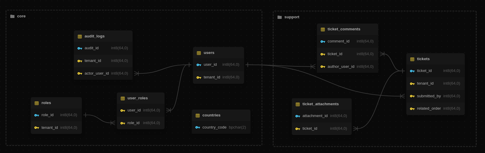
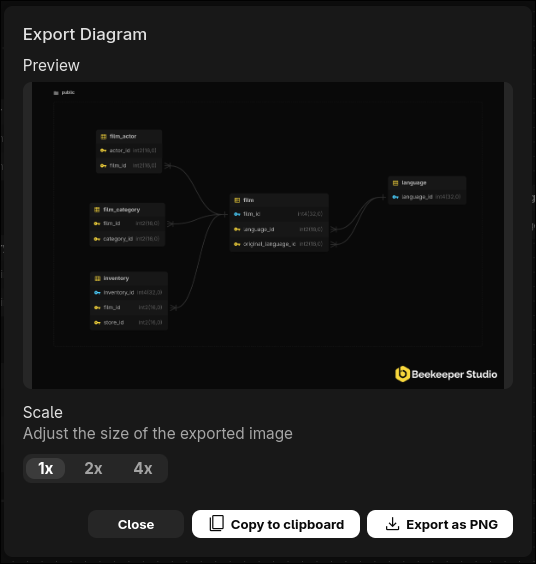
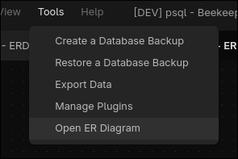
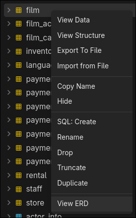
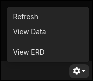

Para visualizar el esquema de tu base de datos, Beekeeper Studio proporciona Diagramas de Entidad-Relacion (ERD). Te da una vista clara e interactiva de como se conectan tus tablas, para que puedas entender la estructura de un vistazo.

## Relaciones multi-esquema

El diagrama puede mostrar relaciones que cruzan los limites del esquema. Las tablas de otros esquemas todavia aparecen en la vista, pero con una distincion visual clara para que siempre sepas cuando una relacion se extiende mas alla del esquema activo.

## Exportar como imagen

Puedes guardar el diagrama actual como imagen o copiarlo a tu portapapeles. Esto facilita compartir el diseno o incluirlo en documentacion.

## Como abrir el diagrama ER

Puedes abrir el diagrama desde **Herramientas > Abrir diagrama ER** para ver la base de datos activa.

Tambien puedes abrirlo **haciendo clic derecho en una tabla o esquema** en la barra lateral.

O puedes abrirlo desde la **pestana Estructura** mientras ves una tabla especifica. Hay un boton de engranaje en la barra de estado - haz clic en el, luego selecciona `Ver ERD`.

## Precios del diagrama ER

El diagrama ER **esta incluido en todas las versiones de pago de Beekeeper Studio**, sin cargo adicional.

Todas las descargas de Beekeeper Studio vienen con una prueba gratuita de 14 dias, [descarga Beekeeper Studio](https://beekeeperstudio.io/get) para probar el diagrama ER ahora mismo.
