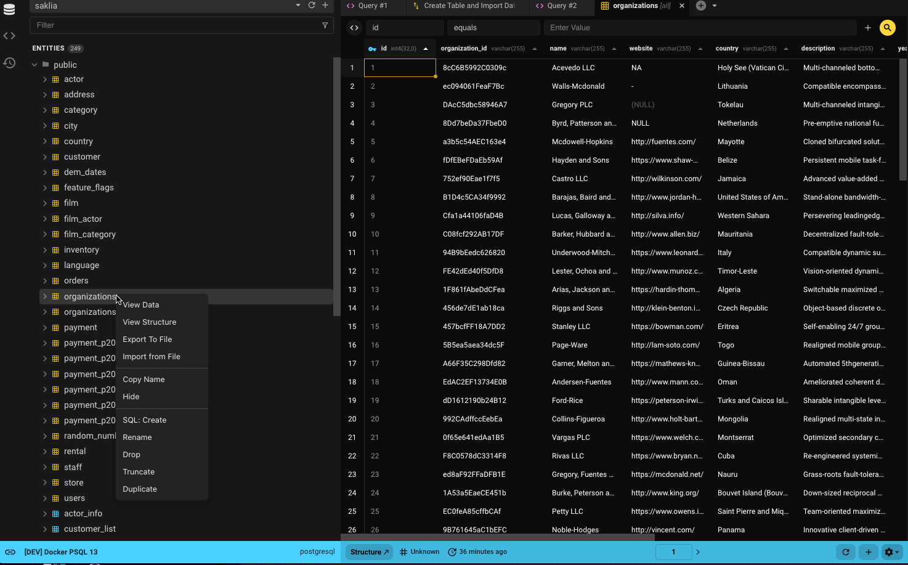
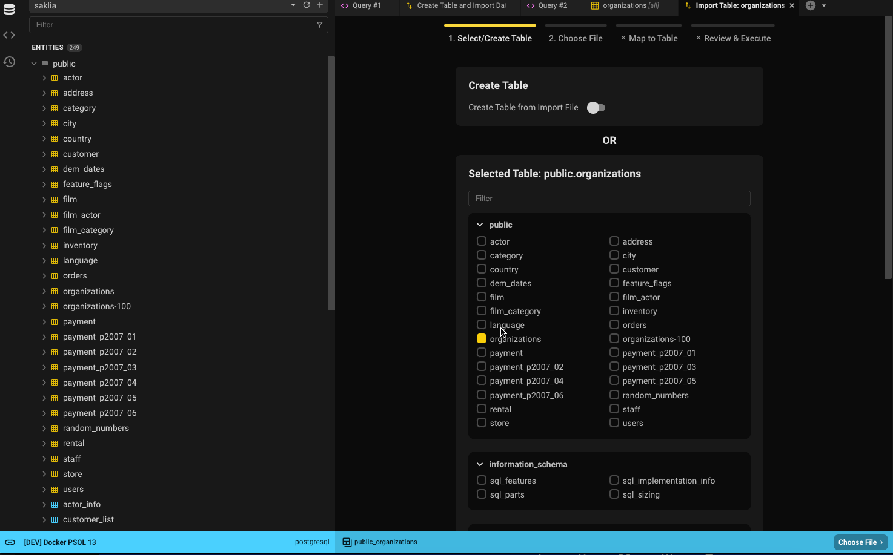
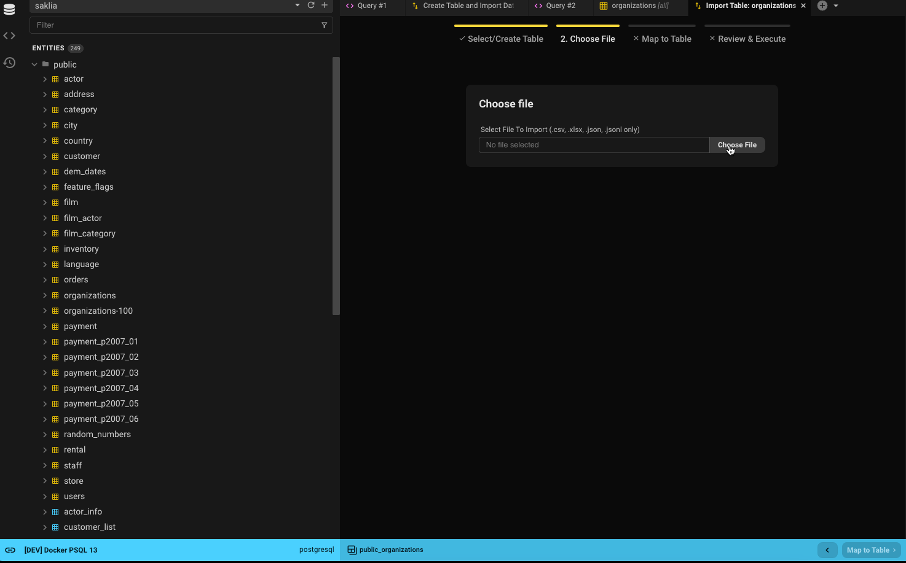
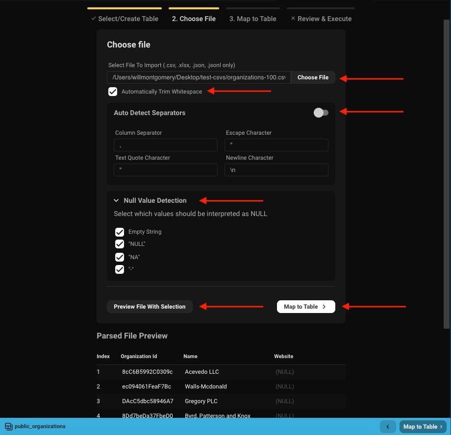
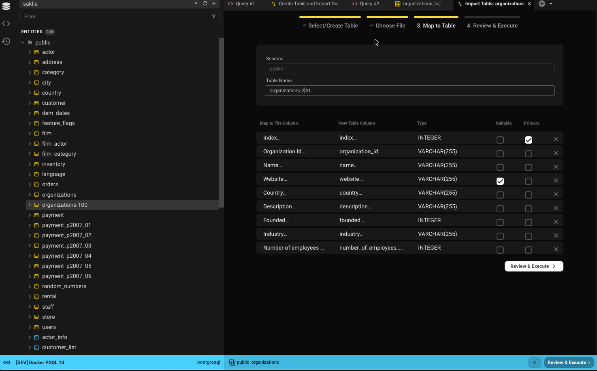
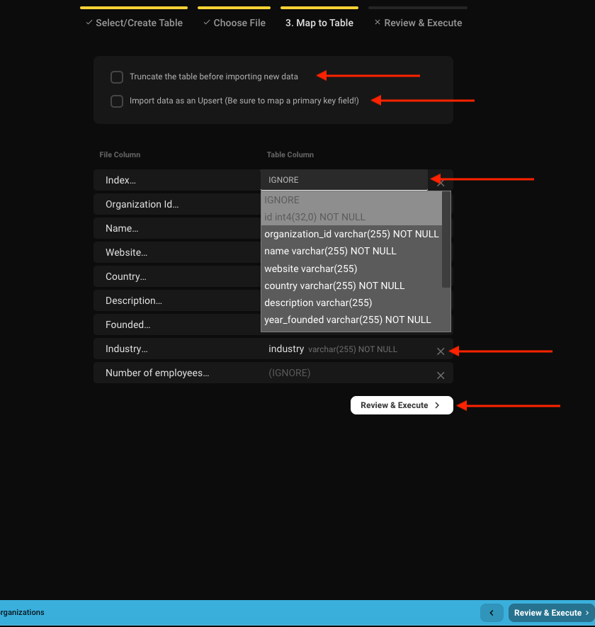
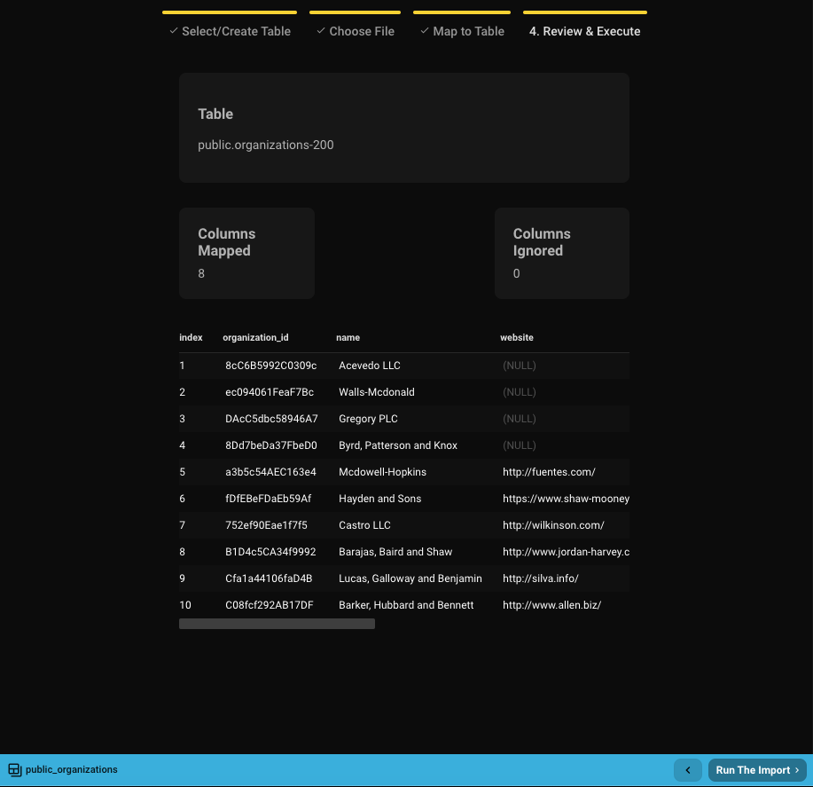

## Formatos de importacion soportados
1. CSV
2. JSON
3. JSON Lines
4. Excel (XLSX)

## Primeros pasos
Con una licencia de pago, puedes importar datos desde un archivo a una tabla existente o crear una tabla desde el archivo.

Hay multiples formas de iniciar la importacion:
- Haz clic derecho en una tabla y selecciona **Importar desde archivo**
- En la vista de datos, ve al icono de engranaje y selecciona **Importar desde archivo**
- Desde el menu desplegable "Crear tabla", selecciona **Nueva tabla desde archivo**

Las dos primeras opciones importan por defecto a una tabla existente, mientras que la tercera crea una nueva.

## Paso 1: Seleccionar o crear tabla
Como inicies el proceso de importacion determinara los valores predeterminados para la seleccion de tabla.
- Si seleccionas **Importar desde archivo**, la tabla estara preseleccionada.
  - Por ejemplo, seleccionar *organizations* usara por defecto *public.organizations*.
- Si seleccionas **Nueva tabla desde archivo**, entonces **Crear tabla** estara seleccionado por defecto.

Siempre puedes buscar otra tabla usando el filtro o navegar por la lista.
Si prefieres crear una nueva tabla, cambia el interruptor. Solo puedes seguir un camino.

## Paso 2: Seleccionar archivo

- Elige el archivo a importar.
- Decide si recortar espacios en blanco de cada celda.
- Beekeeper auto-detecta separadores y establece valores predeterminados sensatos - puedes anularlos.
- Especifica que valores en el archivo deben tratarse como `NULL`.
- Usa la opcion de vista previa para ver las primeras 10 filas con la configuracion actual aplicada.
- Cuando estes listo, haz clic en **Mapear a tabla** para continuar.

## Paso 3: Mapear columnas

Si estas creando una nueva tabla, definiras nombres y tipos de columna.
Si estas importando a una tabla existente, mapearas columnas del archivo a columnas de la tabla.

### Nueva tabla

- Si tu base de datos soporta esquemas, selecciona el esquema (por defecto el esquema predeterminado de la base de datos).
- Nombra la nueva tabla (por defecto el nombre del archivo sin extension).
- Los nombres de columna se generan desde los encabezados del archivo (espacios reemplazados por guiones bajos).
- Los tipos de columna se infieren de las primeras cinco filas.
  - Se soportan tipos comunes como numeros, cadenas (varchar), booleanos y fechas.
  - Las columnas con valores marcados como `NULL` en el paso 2 se estableceran como anulables.
  - La primera columna sera la clave primaria predeterminada (modificable).
- Haz clic en **Revisar y ejecutar** para continuar.

### Tabla existente

- Elige entre una importacion limpia (truncar tabla) o agregar a datos existentes.
  - Las importaciones se ejecutan como transacciones para prevenir cambios parciales de datos.
- Opcionalmente realiza un upsert:
  - Actualiza filas cuando existen valores de clave primaria coincidentes, de lo contrario inserta nuevas filas.
- Mapea columnas del archivo a columnas de la tabla.
  - El mapeo se sugiere automaticamente basandose en coincidencia de nombres alfanumericos sin distincion de mayusculas.
  - Ejemplo: `Organization ID` -> `organization_id`
- Haz clic en **Revisar y ejecutar** para continuar.

### Reglas y cosas a saber

**Compartido**
- Se muestran todos los encabezados de tabla y archivo y pueden ser mapeados.
- Las columnas marcadas como **(IGNORAR)** no seran importadas.
- Usa el icono **X** o el menu desplegable **IGNORAR** para desmapear una columna.

**Tablas existentes**
- No hay verificacion automatica de tipos de datos del archivo - verifica los mapeos.
- Solo se soportan mapeos de columna 1:1.
- Las columnas de tabla que son `NOT NULL` y carecen de valores predeterminados **deben** ser mapeadas.
- Se muestran los tipos de columna y anulabilidad como referencia.

## Paso 4: Importar

Una vez que el mapeo este completo, veras una vista previa de 10 filas de lo que se importara.
Si todo se ve correcto, haz clic en **Ejecutar la importacion**.

- Las importaciones mas grandes (ej. 100k filas) pueden tomar 30-40 segundos.
- Si se crea una nueva tabla, se creara antes de que se ejecute la importacion.
- Al completar, puedes cerrar la ventana o ver tus datos recien importados.

Si hay un error, Beekeeper mostrara el error de la base de datos, que puedes copiar para soporte.
Como las importaciones se ejecutan en transacciones, las fallas resultan en una reversion - el estado de tu tabla permanecera sin cambios (o la nueva tabla sera eliminada).

Necesitas ayuda? Unete a nuestra [comunidad de Slack](https://launchpass.com/beekeeperstud-lvg5276).
