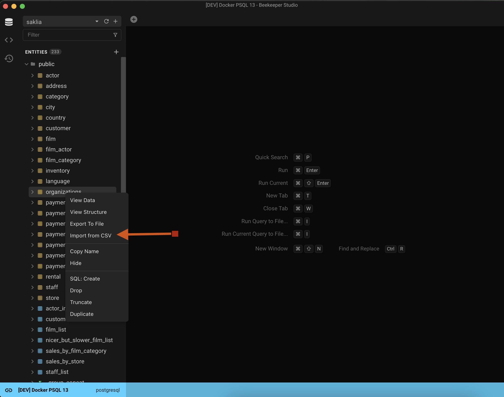
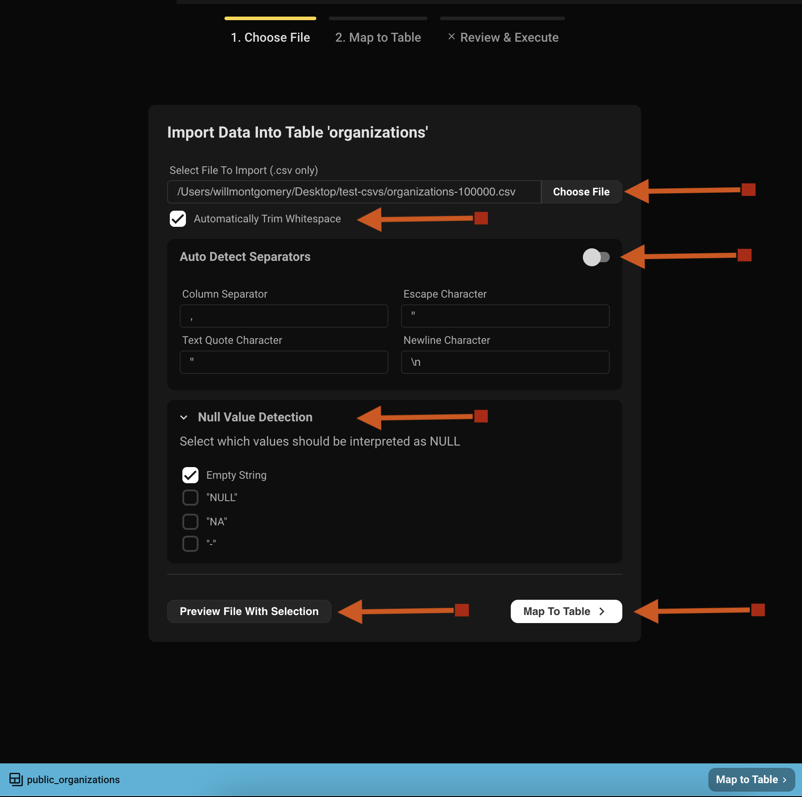
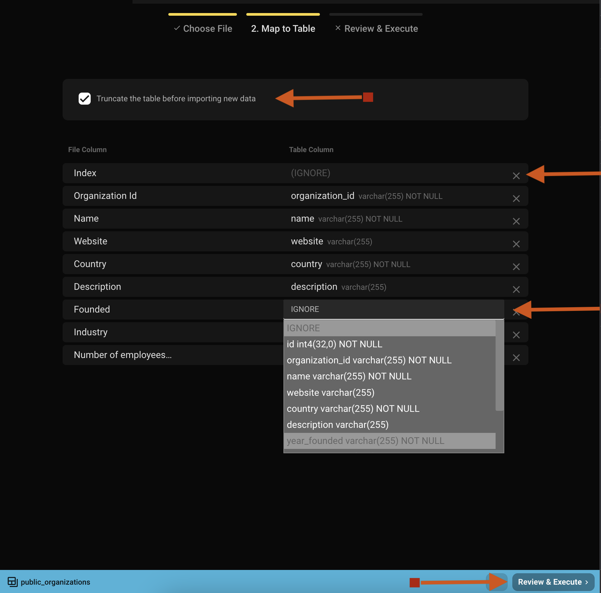
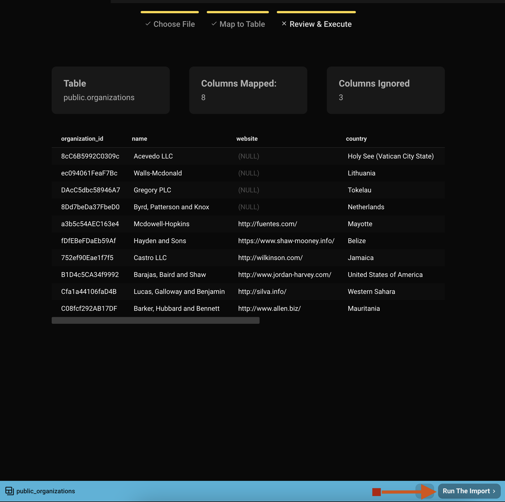

## Supported Import Formats
1. CSV
2. More to come. Stay Tuned!

## Step 1: Select File
- Start by finding the table you want to import data into and right click it. Click `Import From File`.

- Select which file to import.

- Select if each cell should have existing wrapping white space removed from it or if the string should be trimmed..
- Beekeeper will autodetect specific file type separators and set defaults. You have the ability to override these.
- Certain entries in the file can and should be turned to `NULL` in the table. Select any permutation of these. Any not selected will be stored in the table exactly as presented.
- While selecting separators and Null Values, make use of the option to preview what the file translates to (as if it were a table). The first 10 rows of the imported file will be shown sporting the options selected above (totally optional to do).
- When finished, select `Map To Table` in either spot and go on to step 2.

## Step 2: Map Columns
Now, map the columns from the file to the columns in your table.

- Decide if this is to be a clean import (truncates the table) or if adding data to what's already in the table. Beekeeper runs the import as a transaction so don't worry about losing anything.
- Go through and map each file column to a table column. Some mappings will be made based on the file column name to the table column (you can change these if it's not quite right). Column names will be matched on case insensitive alphanumeric only characters.
    - For example: **Organization ID** === **organization_id**
- Continue by selecting **Review & Execute**.

### Some Rules and Good-to-Knows
- All of the headers of the table and file will be shown and can be mapped.
- There is no type checking of the file's data to the table. Make use of the information presented in the drop down to ensure you're mapping proper data types.
- Can only have a 1:1 match of columns.
- Table Columns that cannot be **NULL** and have no default value must be mapped.
- **(IGNORE)** means the column's data will not be imported.
- Select the **X** on the table itself or **IGNORE** in the dropdown to unmap.
- Each table column will show the type and if nullable or not to help with decision making.

## Step 3: Import

When mapping has been completed, a final 10 row preview of what will be dropped into the table will be shown to make sure things are good to go. If it looks good, select **Run The Import** to bring in the file. Larger imports will take some time to complete (tested with 100k rows and took on average 30-40 seconds).

When the import is complete, you can either close the window or view the new data in your table.

If there is an error importing the data, Beekeeper will return a response to the screen showing the exact database error received which can be copied to the clipboard to either look up or ask for some help in our [Slack community](https://launchpass.com/beekeeperstud-lvg5276). The inserts are run in a transaction so the database's equivalent of a **ROLLBACK** will be performed keeping your table's state before the attempted import.
