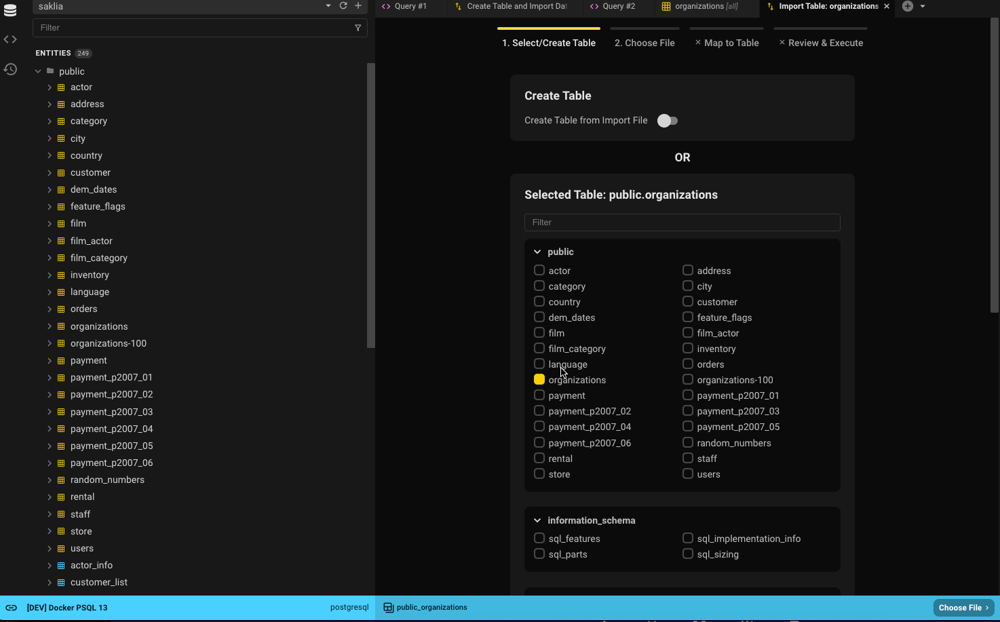
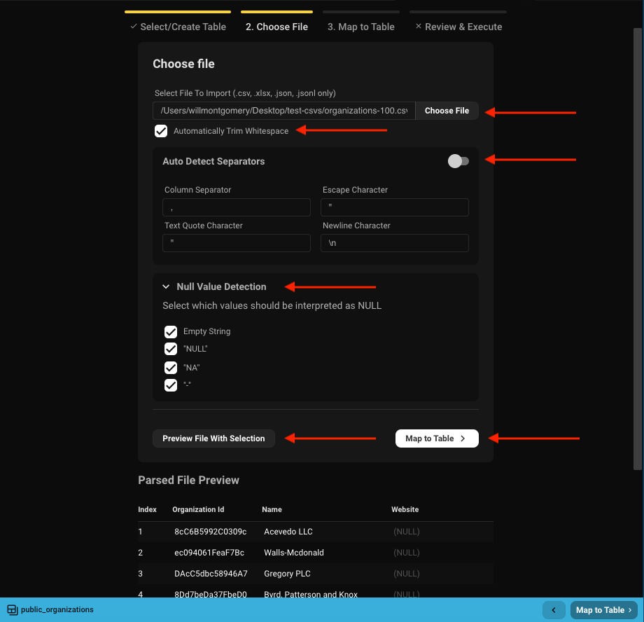

## Supported Import Formats
1. CSV
2. JSON
3. JSON Lines
4. Excel (XLSX)

## Getting Started
With a paid license, you can import data from a file into an existing table or create a table from the file.  

There are multiple ways to initiate the import:  
- Right-click a table and select **Import From File**  
- In Data View, go to the ⛭ icon and select **Import From File**  
- From the "Create Table" dropdown, select **New Table From File**  

The first two options default to importing into an existing table, while the third creates a new one.

## Step 1: Select or Create Table
How you start the import process will determine the defaults for the table selection.  
- If you select **Import From File**, the table will be preselected.  
  - For example, selecting *organizations* will default to *public.organizations*.  
- If you select **New Table From File**, then **Create Table** will be selected by default.  

You can always search for another table using the filter or browse through the list.  
If you’d rather create a new table, flip the toggle. You can only follow one path.

## Step 2: Select File
  

- Choose the file to import.  
- Decide whether to trim whitespace from each cell.  
- Beekeeper auto-detects separators and sets sensible defaults — you can override them.  
- Specify which values in the file should be treated as `NULL`.  
- Use the preview option to see the first 10 rows with current settings applied.  
- When ready, click **Map To Table** to continue.

## Step 3: Map Columns

If you're creating a new table, you'll define column names and types.  
If you're importing into an existing table, you'll map file columns to table columns.

### New Table

- If your database supports schemas, select the schema (defaults to the database's default schema).  
- Name the new table (defaults to the filename without extension).  
- Column names are generated from the file headers (spaces replaced with underscores).  
- Column types are inferred from the first five rows.  
  - Common types like numbers, strings (varchar), booleans, and dates are supported.  
  - Columns with values marked as `NULL` in Step 2 will be set as nullable.  
  - The first column will be the default primary key (modifiable).  
- Click **Review & Execute** to continue.

### Existing Table

- Choose between a clean import (truncate table) or appending to existing data.  
  - Imports run as transactions to prevent partial data changes.  
- Optionally perform an upsert:
  - Updates rows when matching primary key values exist, otherwise inserts new rows.  
- Map file columns to table columns.  
  - Mapping is auto-suggested based on case-insensitive, alphanumeric name matching.  
  - Example: `Organization ID` → `organization_id`  
- Click **Review & Execute** to continue.

### Rules and Good-to-Knows

**Shared**
- All table and file headers are shown and can be mapped.  
- Columns marked as **(IGNORE)** will not be imported.  
- Use the **X** icon or **IGNORE** dropdown to unmap a column.

**Existing Tables**
- No automatic type checking of file data — double-check mappings.  
- Only 1:1 column mappings are supported.  
- Table columns that are `NOT NULL` and lack defaults **must** be mapped.  
- Column types and nullability are shown for reference.

## Step 4: Import

Once mapping is complete, you'll see a 10-row preview of what will be imported.  
If everything looks correct, click **Run the Import**.

- Larger imports (e.g., 100k rows) may take 30–40 seconds.  
- If creating a new table, it will be created before the import runs.  
- Upon completion, you can close the window or view your newly imported data.

If there's an error, Beekeeper will display the database error, which you can copy for support.  
Since imports run in transactions, failures result in a rollback — your table's state will remain unchanged (or the new table will be removed).

Need help? Join our [Slack community](https://launchpass.com/beekeeperstud-lvg5276).
