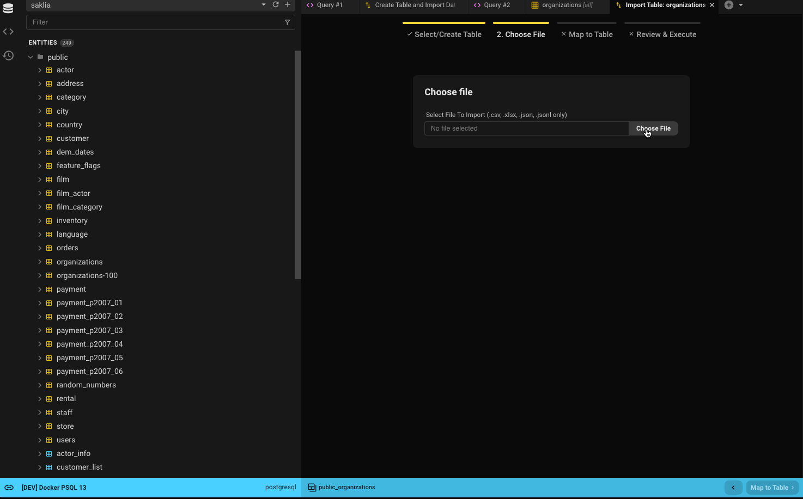

## Supported Import Formats
1. CSV
2. JSON
3. JSON Line
4. Excel (XLSX)

## Getting Started
With a paid license, you can import data from a file into an existing table or create a table from the file.
There are multiple ways to initiate the import. Either right click a table and select **Import from File**; in Data View go to the ⛭ icon and select **Import From File**; or from the create table drop down, select **New Table From File**. The first two will default to importing to an existing table whereas the latter will 

## Step 1: Select/Create Table
Depending how you got started will determine defaults for the select/create table tab. If you select one of the **Import From File** options, the table will be preselected. If you chose *organizations*, then *public.organizations* will be selected to continue. If you select **New Table From File**, then **Create Table** will be selected. Nothing is etched in stone at this point, so you can decide to find another table either by entering the table name in the filter or by looking through the list shown.

If you decided you'd rather just create a new table, go ahead and flip that switch. You'll only be able to choose one path though.

## Step 2: Select File

- Select which file to import.
- Select if each cell should have existing wrapping white space removed from it or if the string should be trimmed.
- Beekeeper will autodetect specific file type separators and set defaults. You have the ability to override these.
- Certain entries in the file can and should be turned to `NULL` in the table. Select any permutation of these. Any not selected will be stored in the table exactly as presented.
- While selecting separators and Null Values, make use of the option to preview what the file translates to (as if it were a table). The first 10 rows of the imported file will be shown sporting the options selected above (totally optional to do).
- When finished, select `Map To Table` in either spot and go on to step 2.

## Step 3: Map Columns
If you're creating a new table, now's the time to name the columns.  
If you're importing into an existing table, map the columns from the file to the columns.

### New Table

- Decide which schema to use (the default schema for the database will be used be default).
- Name your table whatever you want. It will default to the name of the file minus the extension.
- Each heading in the file you're importing from will be presented as a column replacing any spaces with underscores. 
  - The first 5 rows of the file will then be used to determine the type for the row. Basic types will be selected such as numbers, varchars (or dialect equivalent), booleans, dates, etc.
  - If any of the columns come back as anything marked as *null* in Step 2 will set the option **nullable**. You can always change this. Be advised trying to import a null value into a non-nullable column will result in failure.
  - The first header will default to the primary key. You can change that if you'd like.
- Continue by selecting **Review & Execute**.

### Existing Table

- Decide if this is to be a clean import (truncates the table) or if adding data to what's already in the table. Beekeeper runs the import as a transaction so don't worry about losing anything.
- Decide if you want to run the import as an upsert. Upserts work by either updating a row if a matching primary key value is found OR inserting a new row 
- Go through and map each file column to a table column. Some mappings will be made based on the file column name to the table column (you can change these if it's not quite right). Column names will be matched on case insensitive alphanumeric only characters.
    - For example: **Organization ID** === **organization_id**
- Continue by selecting **Review & Execute**.

### Some Rules and Good-to-Knows
**Shared**
- All of the headers of the table and file will be shown and can be mapped.
- **(IGNORE)** means the column's data will not be imported.
- Select the **X** on the table itself or **IGNORE** in the dropdown to unmap.

**Existing Tables**
- There is no type checking of the file's data. Make use of the information presented in the drop down to ensure you're mapping proper data types.
- Can only have a 1:1 match of columns.
- Table Columns that cannot be **NULL** and have no default value must be mapped.
- Each table column will show the type and if nullable or not to help with decision making.

## Step 4: Import

When mapping has been completed, a final 10 row preview of what will be dropped into the table will be shown to make sure things are good to go. If it looks good, select **Run The Import** to bring in the file. Larger imports will take some time to complete (tested with 100k rows and took on average 30-40 seconds). If you're creating a new table, then the table will be created prior to importing.

When the import is complete, you can either close the window or view the new data in your table.

If there is an error importing the data, Beekeeper will return a response to the screen showing the exact database error received which can be copied to the clipboard to either look up or ask for some help in our [Slack community](https://launchpass.com/beekeeperstud-lvg5276). The inserts are run in a transaction so the database's equivalent of a **ROLLBACK** will be performed keeping your table's state before the attempted import or removing the new table if something happened on the import.
