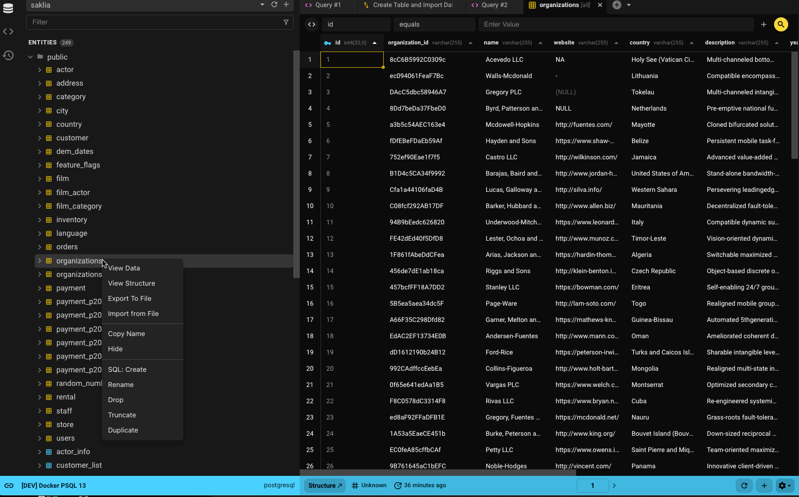
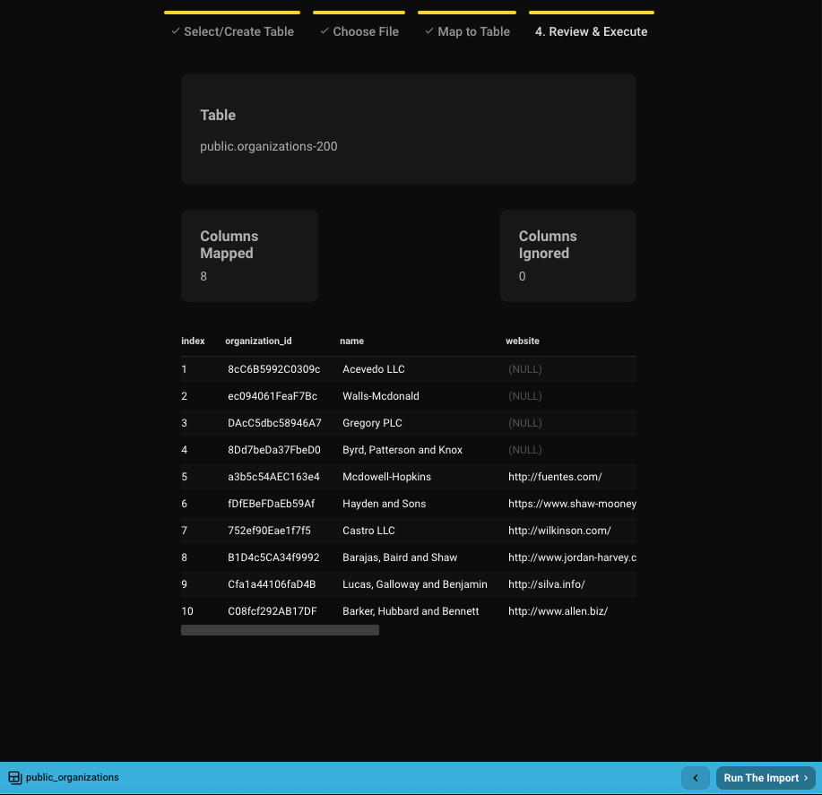

## Formatos de Importação Suportados
1. CSV
2. JSON
3. JSON Lines
4. Excel (XLSX)

## Começando
Com uma licença paga, você pode importar dados de um arquivo para uma tabela existente ou criar uma tabela a partir do arquivo.

Há múltiplas formas de iniciar a importação:
- Clique com o botão direito em uma tabela e selecione **Import From File**
- Na Visualização de Dados, vá ao ícone ⛭ e selecione **Import From File**
- Do dropdown "Create Table", selecione **New Table From File**

As duas primeiras opções padrão para importar para uma tabela existente, enquanto a terceira cria uma nova.

## Passo 1: Selecionar ou Criar Tabela
Como você inicia o processo de importação determinará os padrões para a seleção de tabela.
- Se você selecionar **Import From File**, a tabela será pré-selecionada.
  - Por exemplo, selecionar *organizations* irá padrão para *public.organizations*.
- Se você selecionar **New Table From File**, então **Create Table** será selecionado por padrão.

Você sempre pode buscar por outra tabela usando o filtro ou navegar pela lista.
Se preferir criar uma nova tabela, alterne o botão. Você só pode seguir um caminho.

## Passo 2: Selecionar Arquivo

- Escolha o arquivo para importar.
- Decida se deve cortar espaços em branco de cada célula.
- O Beekeeper detecta automaticamente separadores e define padrões sensatos — você pode sobrescrever.
- Especifique quais valores no arquivo devem ser tratados como `NULL`.
- Use a opção de visualização para ver as primeiras 10 linhas com configurações atuais aplicadas.
- Quando pronto, clique em **Map To Table** para continuar.

## Passo 3: Mapear Colunas

Se você está criando uma nova tabela, definirá nomes e tipos de colunas.
Se você está importando para uma tabela existente, mapeará colunas do arquivo para colunas da tabela.

### Nova Tabela

- Se seu banco de dados suporta esquemas, selecione o esquema (padrão para o esquema padrão do banco de dados).
- Nomeie a nova tabela (padrão para o nome do arquivo sem extensão).
- Nomes de colunas são gerados dos cabeçalhos do arquivo (espaços substituídos por sublinhados).
- Tipos de colunas são inferidos das primeiras cinco linhas.
  - Tipos comuns como números, strings (varchar), booleanos, e datas são suportados.
  - Colunas com valores marcados como `NULL` no Passo 2 serão definidas como anuláveis.
  - A primeira coluna será a chave primária padrão (modificável).
- Clique em **Review & Execute** para continuar.

### Tabela Existente

- Escolha entre uma importação limpa (truncar tabela) ou anexar a dados existentes.
  - Importações executam como transações para prevenir mudanças de dados parciais.
- Opcionalmente execute um upsert:
  - Atualiza linhas quando valores de chave primária correspondentes existem, caso contrário insere novas linhas.
- Mapeie colunas do arquivo para colunas da tabela.
  - Mapeamento é auto-sugerido baseado em correspondência de nome alfanumérico, insensível a maiúsculas.
  - Exemplo: `Organization ID` → `organization_id`
- Clique em **Review & Execute** para continuar.

### Regras e Bom-Saber

**Compartilhado**
- Todos os cabeçalhos de tabela e arquivo são mostrados e podem ser mapeados.
- Colunas marcadas como **(IGNORE)** não serão importadas.
- Use o ícone **X** ou dropdown **IGNORE** para desmapear uma coluna.

**Tabelas Existentes**
- Nenhuma verificação automática de tipo de dados do arquivo — verifique duplo os mapeamentos.
- Apenas mapeamentos de coluna 1:1 são suportados.
- Colunas da tabela que são `NOT NULL` e carecem de padrões **devem** ser mapeadas.
- Tipos de colunas e anulabilidade são mostrados para referência.

## Passo 4: Importar

Uma vez que o mapeamento está completo, você verá uma visualização de 10 linhas do que será importado.
Se tudo parece correto, clique em **Run the Import**.

- Importações maiores (ex., 100k linhas) podem levar 30–40 segundos.
- Se criando uma nova tabela, ela será criada antes da importação executar.
- Após conclusão, você pode fechar a janela ou visualizar seus dados recém-importados.

Se há um erro, o Beekeeper exibirá o erro do banco de dados, que você pode copiar para suporte.
Como importações executam em transações, falhas resultam em rollback — o estado da sua tabela permanecerá inalterado (ou a nova tabela será removida).

Precisa de ajuda? Junte-se à nossa [comunidade Slack](https://launchpass.com/beekeeperstud-lvg5276).