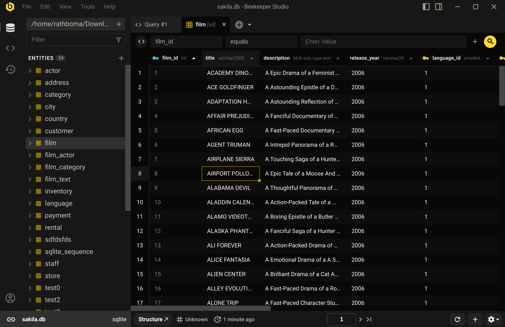

Abre la barra lateral JSON en cualquier tabla de datos de dos formas - Haz clic derecho en cualquier fila y selecciona `Ver detalles`, o haz clic en el icono :material-dock-right: en la barra de titulo de la aplicacion.

La barra lateral JSON te permite ver cualquier registro en formato JSON. Es una excelente manera de ver tablas anchas, esquemas complejos y campos anidados.

Una vez que tengas los datos que te gustan, simplemente copia los datos -- es JSON normal!

## Ver relaciones en linea

Puedes hacer clic en una clave foranea en la barra lateral JSON para expandir el registro en linea. Esto es muy util para tablas de union o esquemas donde se usan muchos joins para organizar mejor los datos (te estamos mirando Ruby on Rails).

<video controls>
    <source id="json-fks" type="video/mp4" src="/assets/videos/json-sidebar-fks.mp4" />
</video>

## Buscar con texto o expresiones regulares

El cuadro de busqueda en la parte superior de la barra lateral JSON soporta tanto busqueda de texto difusa como expresiones regulares, para que puedas encontrar facilmente los datos que deseas.

<video controls>
    <source id="json-regex" type="video/mp4" src="/assets/videos/json-sidebar-regex.mp4" />
</video>
