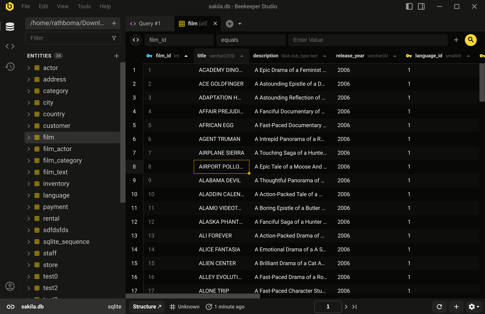

Abra a Barra Lateral JSON em qualquer tabela de dados de uma das duas maneiras - Clique com o botão direito em qualquer linha e selecione `See Details`, ou clique no ícone :material-dock-right: na barra de título da aplicação.

A barra lateral JSON permite que você visualize qualquer registro em formato JSON. É uma ótima maneira de visualizar tabelas largas, esquemas complexos e campos aninhados.

Uma vez que você tenha os dados que gosta, simplesmente copie os dados -- é JSON normal!

## Ver Relações inline

Você pode clicar em uma chave estrangeira na barra lateral JSON para expandir o registro inline. Isso é super útil para tabelas de junção ou esquemas onde muitas junções são usadas para organizar dados melhor (olhando para você Ruby on Rails 👀).

<video controls>
    <source id="json-fks" type="video/mp4" src="/assets/videos/json-sidebar-fks.mp4" />
</video>

## Pesquisar com texto ou expressões regulares

A caixa de pesquisa no topo da barra lateral JSON suporta tanto busca de texto difusa quanto expressões regulares, então você pode facilmente encontrar os dados que deseja.

<video controls>
    <source id="json-regex" type="video/mp4" src="/assets/videos/json-sidebar-regex.mp4" />
</video>