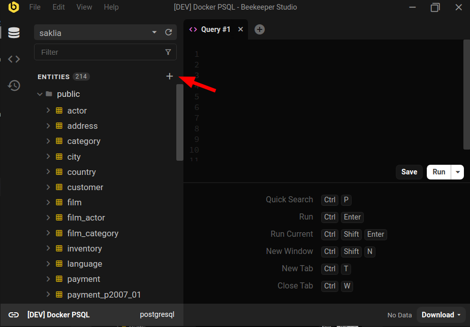
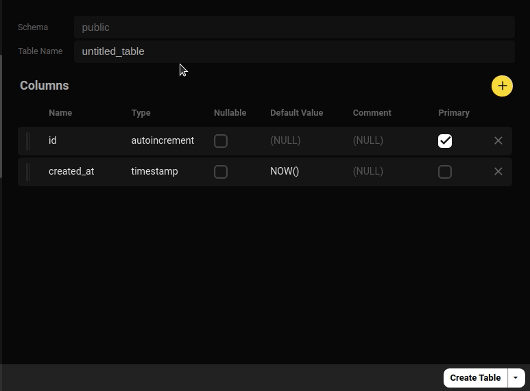
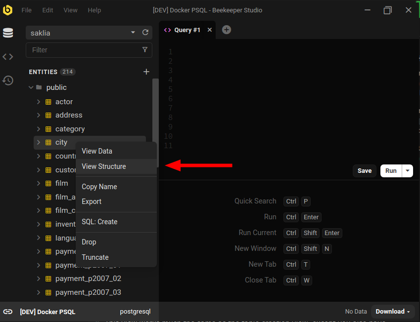
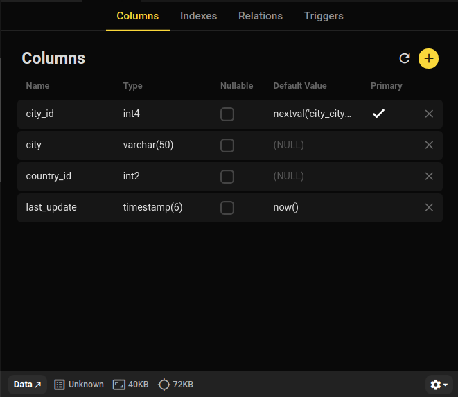

Beekeeper Studio te permite **CREAR** y **MODIFICAR** tablas de base de datos con una interfaz amigable **sin tener que escribir ningun SQL**.

## Crear nuevas tablas SQL

En la parte superior de la lista de entidades en la barra lateral izquierda, haz clic en el boton `+` para abrir la interfaz de creacion de tablas.

En esta pantalla puedes agregar y eliminar columnas de tu nueva tabla, luego haz clic en `crear tabla` en la parte inferior derecha

### Agregar una columna autoincremental

Para nuevas tablas automaticamente incluimos una columna de clave primaria `autoincrement` para agilizar el proceso de crear una tabla con una clave primaria que se incrementa automaticamente. Esto es consistente en todos los tipos de base de datos.

Puedes agregar tantas de estas como quieras.

### Agregar una clave primaria

Probablemente querras establecer una clave primaria en tu nueva tabla, por defecto seleccionamos la columna `id` como la clave primaria, pero puedes marcar multiples columnas y Beekeeper Studio creara una clave primaria compuesta.

### Crear indices y relaciones

Despues de crear tu tabla podras agregar indices y relaciones, pero esto no esta disponible hasta despues de crear inicialmente la tabla.

### Finalmente - crear tu tabla

Haz clic en `CREAR TABLA` en la parte inferior derecha para crear tu nueva tabla de base de datos automaticamente.

Tambien puedes hacer clic en `Copiar a SQL` en lugar de `crear tabla` para abrir la sintaxis `CREATE TABLE` generada en una nueva pestana del editor sql, para que puedas editarla antes de aplicarla.

## Modificar una tabla existente

Haz clic derecho en cualquier tabla en la barra lateral y haz clic en `Ver estructura` para ver y editar el esquema de la tabla.

Esta vista funciona de manera muy similar a la vista de creacion de tablas, excepto que tambien tienes opciones para modificar indices, relaciones y triggers.

**Nota**: Algunos motores de base de datos no soportan algunos tipos de modificaciones de esquema, en estos casos Beekeeper Studio proporcionara una advertencia y esa funcion estara deshabilitada
{: .alert .alert-info }

## Vista previa del creador de tablas SQL

Quieres jugar con nuestro codigo de creador de tablas? Puedes usar la version en linea del creador de tablas en el [sitio web de SQL Tools aqui](https://sqltools.beekeeperstudio.io/build). Esta es una version simplificada de nuestro creador de tablas integrado y no puede crear tu nueva tabla, pero te proporciona el SQL generado para descargar.
