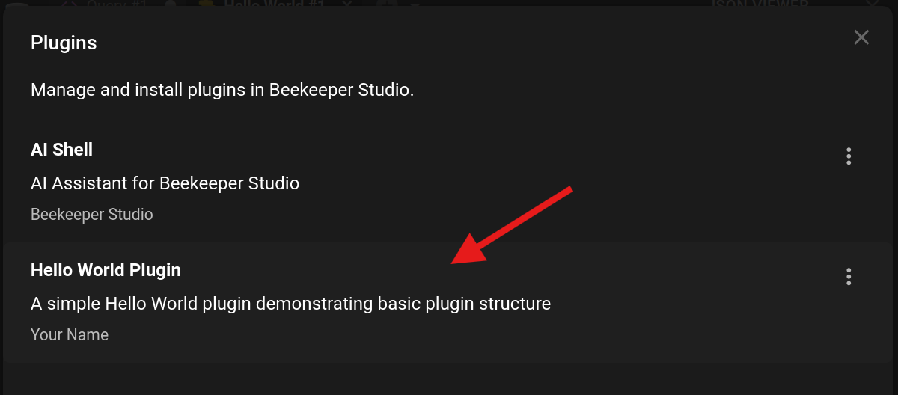
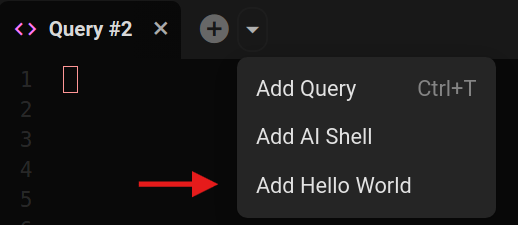
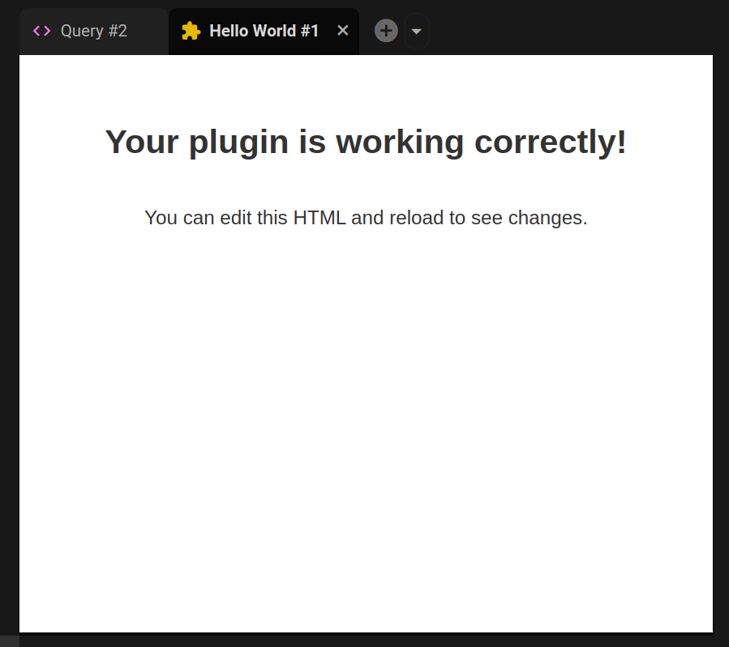
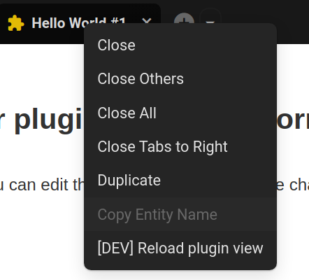
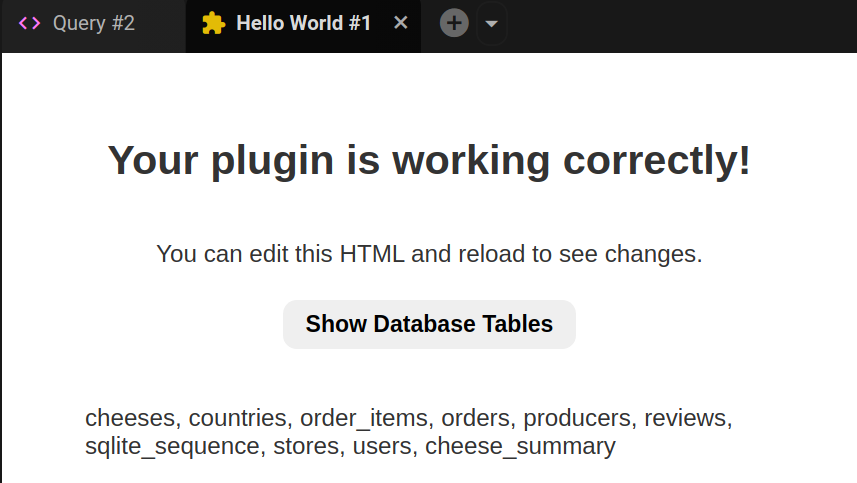
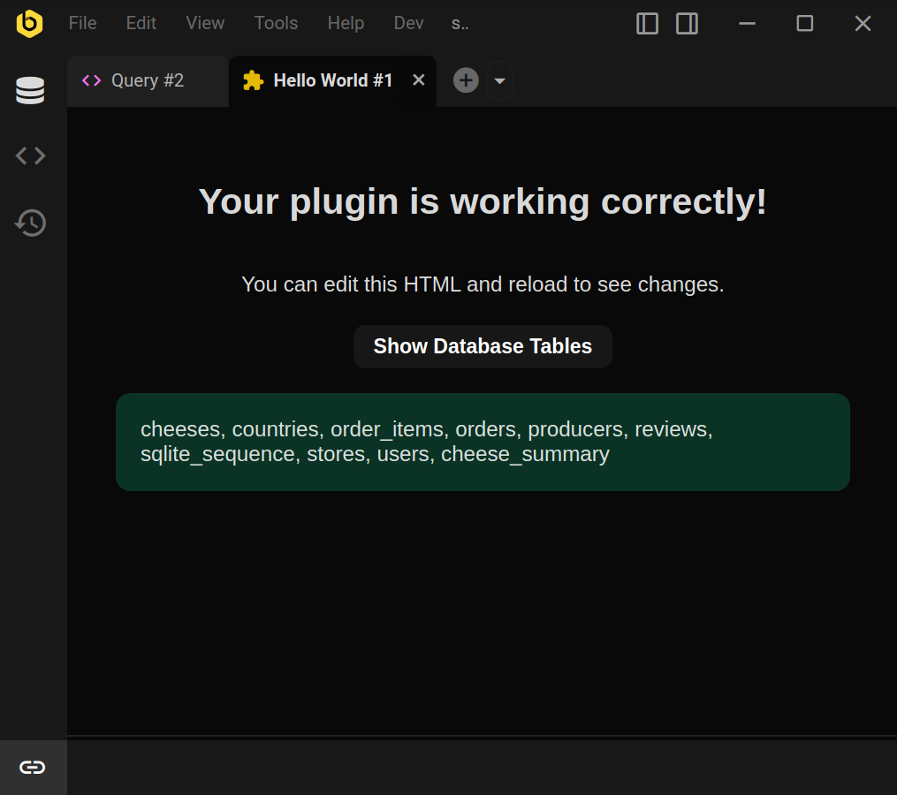

# Creating Your First Plugin

!!! warning "Beta Feature"
    The plugin system is currently in beta. APIs and functionality may change in future releases. Please provide feedback and report issues to help us improve the system.

This guide will walk you through creating a simple "Hello World" plugin to demonstrate the basic plugin structure and development workflow.

## What You'll Build

A simple plugin that:

-   Creates a new tab type that displays "Hello World!"
-   Includes an image asset to demonstrate file handling
-   Shows the basic plugin structure

## Prerequisites

-   Basic knowledge of HTML, CSS, and JavaScript
-   Node.js and npm installed
-   Text editor
-   Beekeeper Studio installed

## Development Setup

### Step 1: Locate the plugins directory

Navigate to the plugins directory for your operating system:

**Linux:**
```bash
~/.config/beekeeper-studio/plugins/
```

**Windows:**
```bash
%APPDATA%/beekeeper-studio/plugins/
# Usually: C:\Users\YourUsername\AppData\Roaming\beekeeper-studio\plugins\
```

**macOS:**
```bash
~/Library/Application Support/beekeeper-studio/plugins/
```

### Step 2: Create your plugin directory

Create a new folder for your plugin:

**Linux:**
```bash
mkdir ~/.config/beekeeper-studio/plugins/hello-world-plugin
```

**Windows (Command Prompt):**
```cmd
mkdir "%APPDATA%\beekeeper-studio\plugins\hello-world-plugin"
```

**Windows (PowerShell):**
```powershell
mkdir "$env:APPDATA\beekeeper-studio\plugins\hello-world-plugin"
```

**macOS:**
```bash
mkdir "~/Library/Application Support/beekeeper-studio/plugins/hello-world-plugin"
```

### Step 3: Create the manifest file

Create `manifest.json` to define your plugin's metadata:

```json
{
    "id": "hello-world-plugin",
    "name": "Hello World Plugin",
    "author": "Your Name",
    "description": "A simple Hello World plugin demonstrating basic plugin structure",
    "version": "1.0.0",
    "capabilities": {
        "views": {
            "tabTypes": [
                {
                    "id": "hello-world-tab",
                    "name": "Hello World",
                    "kind": "shell",
                    "entry": "index.html"
                }
            ]
        }
    }
}
```

### Step 4: Create the main interface

Create `index.html` as your plugin's main interface:

```html
<!DOCTYPE html>
<html lang="en">
    <head>
        <meta charset="UTF-8" />
        <meta name="viewport" content="width=device-width, initial-scale=1.0" />
        <title>Hello World Plugin</title>
        <style>h1,p{margin-bottom:16px}*{box-sizing:border-box}body{font-family:Roboto,Helvetica,Arial,sans-serif;font-size:14px;margin:0;padding:0;overflow:hidden;background-color:#fff;color:#333}.container{display:flex;flex-direction:column;align-items:center;width:100%;height:100%;padding:2rem}h1{font-size:24px}p{line-height:1.5}button{border:none;border-radius:.5rem;padding:.4rem .8rem;font-weight:700;cursor:pointer}.tables{margin-top:1rem;padding:1rem;border-radius:.6rem}.tables:empty{display:none}</style>
    </head>
    <body>
        <div class="container">
            <h1>Your plugin is working correctly!</h1>
            <p>You can edit this HTML and reload to see changes.</p>
        </div>
    </body>
</html>
```

Your folder structure should look like this:

```
hello-world-plugin/
├── manifest.json
└── index.html
```

## Testing Your Plugin

### Step 5: Verify plugin installation

1. Open Beekeeper Studio
2. Go to **Tools > Manage Plugins**
3. Look for "Hello World Plugin" in the plugin list
4. If you see it, your plugin is successfully installed



### Step 6: Use your new tab type

1. Connect to any database
2. Look for the dropdown arrow beside the **+** (plus) icon
3. Click it and select "Hello World" from the menu
4. Your plugin will open in a new tab





## Development Workflow

### Reloading

During development, you can reload your plugin without restarting Beekeeper Studio:

1. Edit your plugin files
2. Right-click on your plugin tab
3. Select **"[DEV] Reload Plugin View"**
4. Your changes will appear immediately



## Next Steps

### Install `@beekeeperstudio/plugin`

The `@beekeeperstudio/plugin` package is a TypeScript wrapper library that enables communication between your plugin and the main Beekeeper Studio application. It provides essential functions for:

-   **`request()`** - Interact with Beekeeper Studio (get database tables, run SQL queries, etc.)
-   **`notify()`** - Send notifications to the application
-   **`addNotificationListener()`** - Listen for events like theme changes
-   **Event forwarding** - Prevent iframe event trapping for better user experience

Install the plugin package:

```bash
npm install github:beekeeper-studio/plugin
```

### Adding Interactivity

You can add JavaScript to interact with the database. First, create a separate JavaScript file:

**Create `main.js`:**

```javascript
import "./node_modules/@beekeeperstudio/plugin/dist/eventForwarder.js"; // IMPORTANT! Enables keyboard/mouse event forwarding from iframe to parent
import { request } from "./node_modules/@beekeeperstudio/plugin/dist/index.js";

async function showTables() {
    const tables = await request("getTables");
    document.querySelector(".tables").innerHTML = tables
        .map((table) => table.name)
        .join(", ");
}

document.addEventListener("DOMContentLoaded", async () => {
    document
        .querySelector("#show-tables-btn")
        .addEventListener("click", showTables);
});
```

**Update your HTML to add a script, a button, and a `.tables` element:**

```html
<button id="show-tables-btn">Show Database Tables</button>
<div class="tables"></div>

<script type="module" src="main.js"></script>
```



### Syncing with Beekeeper Studio Theme

To make your plugin automatically adapt to Beekeeper Studio's theme, add theme synchronization:

**Add this to your `main.js`:**

```javascript
import { addNotificationListener } from "./node_modules/@beekeeperstudio/plugin/dist/index.js";

addNotificationListener("themeChanged", (args) => {
    const css = `:root { ${args.cssString} }`;
    const style = document.createElement("style");
    style.innerHTML = css;
    const existingStyle = document.getElementById("bks-theme-style");
    if (existingStyle) {
        document.head.removeChild(existingStyle);
    }
    style.id = "bks-theme-style";
    document.head.appendChild(style);
});
```

**Update your CSS to use CSS variables:**

Add this to your CSS:

```html
<style>
    body {
        background-color: var(--query-editor-bg);
        color: var(--text-dark);
    }

    button {
        background-color: rgba(from var(--theme-base) r g b / 6%);
        color: var(--theme-base);
    }

    .tables {
        background-color: rgba(from var(--brand-success) r g b / 20%);
    }
</style>
```

## Complete Example

This is how your `index.html` and `main.js` should look like after following this guide:

### Final `index.html`

```html
<!DOCTYPE html>
<html lang="en">
    <head>
        <meta charset="UTF-8" />
        <meta name="viewport" content="width=device-width, initial-scale=1.0" />
        <title>Hello World Plugin</title>
        <style>h1,p{margin-bottom:16px}*{box-sizing:border-box}body{font-family:Roboto,Helvetica,Arial,sans-serif;font-size:14px;margin:0;padding:0;overflow:hidden;background-color:#fff;color:#333}.container{display:flex;flex-direction:column;align-items:center;width:100%;height:100%;padding:2rem}h1{font-size:24px}p{line-height:1.5}button{border:none;border-radius:.5rem;padding:.4rem .8rem;font-weight:700;cursor:pointer}.tables{margin-top:1rem;padding:1rem;border-radius:.6rem}.tables:empty{display:none}</style>
        <style>
            body {
                background-color: var(--query-editor-bg);
                color: var(--text-dark);
            }

            button {
                background-color: rgba(from var(--theme-base) r g b / 6%);
                color: var(--theme-base);
            }

            .tables {
                background-color: rgba(from var(--brand-success) r g b / 20%);
            }
        </style>
    </head>
    <body>
        <div class="container">
            <h1>Your plugin is working correctly!</h1>
            <p>You can edit this HTML and reload to see changes.</p>

            <button id="show-tables-btn">Show Database Tables</button>
            <div class="tables"></div>

            <script type="module" src="main.js"></script>
        </div>
    </body>
</html>
```

### Final `main.js`

```javascript
import "./node_modules/@beekeeperstudio/plugin/dist/eventForwarder.js"; // IMPORTANT! Enables keyboard/mouse event forwarding from iframe to parent
import {
    request,
    addNotificationListener,
} from "./node_modules/@beekeeperstudio/plugin/dist/index.js";

async function showTables() {
    const tables = await request("getTables");
    document.querySelector(".tables").innerHTML = tables
        .map((table) => table.name)
        .join(", ");
}

// Theme synchronization
addNotificationListener("themeChanged", (args) => {
    const css = `:root { ${args.cssString} }`;
    const style = document.createElement("style");
    style.innerHTML = css;
    const existingStyle = document.getElementById("bks-theme-style");
    if (existingStyle) {
        document.head.removeChild(existingStyle);
    }
    style.id = "bks-theme-style";
    document.head.appendChild(style);
});

document.addEventListener("DOMContentLoaded", async () => {
    document
        .querySelector("#show-tables-btn")
        .addEventListener("click", showTables);
});
```



### Further Reading

-   **[Plugin API Reference](api-reference.md)** - Complete API documentation
-   **[Publishing Plugins](publishing-plugins.md)** - Share your plugin with others
