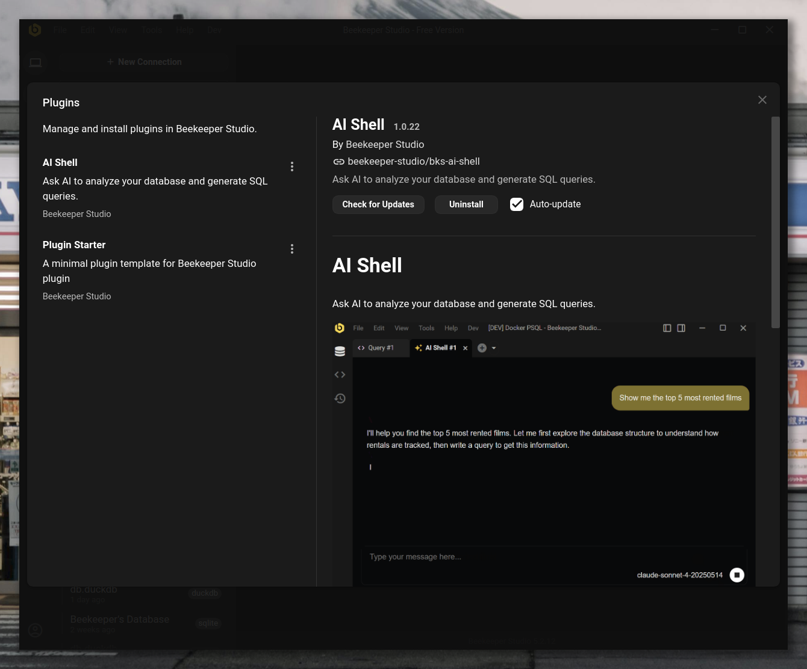
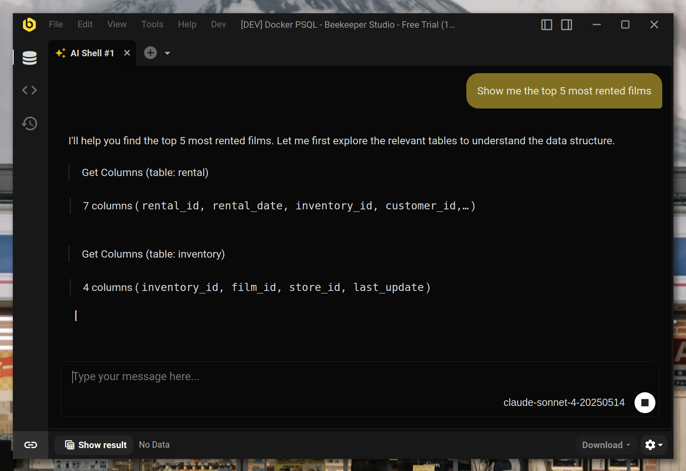

# Plugins

Los plugins extienden Beekeeper Studio con funcionalidad adicional, trayendo nuevas herramientas y capacidades directamente a tu flujo de trabajo con bases de datos. Piensa en ellos como complementos especializados que mejoran lo que puedes hacer con tus datos.



## Que son los plugins?

Los plugins son mini-aplicaciones que se ejecutan dentro de Beekeeper Studio para proporcionar funcionalidad especializada. Aparecen como nuevas pestanas o paneles en la barra lateral, integrandose perfectamente con el resto de la interfaz.

Cada plugin opera en su propio entorno seguro mientras tiene acceso a tus conexiones de base de datos y capacidades de consulta a traves de una interfaz controlada.

## Quien puede usar plugins?

Los plugins estan disponibles para **todos los usuarios de Beekeeper Studio**, incluyendo aquellos que usan la edicion Community gratuita.

Sin embargo, algunos plugins individuales pueden tener sus propios requisitos de acceso. Por ejemplo, los plugins premium desarrollados por el equipo de Beekeeper Studio pueden requerir una suscripcion de pago.

## Plugins disponibles

### AI Shell

**Requiere suscripcion de pago**



El plugin AI Shell trae inteligencia artificial directamente a tu flujo de trabajo con bases de datos. Haz preguntas sobre tus datos en espanol simple y obtiene respuestas inteligentes impulsadas por IA.

El AI Shell aparece como un nuevo tipo de pestana que puedes abrir junto a tus pestanas de consulta regulares, con un visor de resultados integrado para cualquier consulta que ejecute.

## Instalar plugins

1. Ve a Herramientas > Administrar plugins
2. Encuentra el plugin que quieres instalar
3. Haz clic en **Instalar**

## Actualizar plugins

Beekeeper Studio verifica automaticamente actualizaciones de plugins cada vez que inicias la aplicacion. Cuando hay actualizaciones disponibles, Beekeeper Studio las descargara e instalara automaticamente. O puedes deshabilitar este comportamiento:

1. Ve a Herramientas > Administrar plugins
2. Encuentra el plugin
3. Desmarca **Auto-actualizar**

## Desinstalar plugins

1. Ve a Herramientas > Administrar plugins
2. Encuentra el plugin
3. Haz clic en **Desinstalar**

## Instalar una version especifica de plugin

A veces puedes necesitar una version especifica de plugin - quizas el ultimo plugin requiere una version mas nueva de Beekeeper Studio de la que tienes, no puedes actualizar la aplicacion por alguna razon, o necesitas degradar a una version de plugin anterior. Aqui te mostramos como instalar manualmente cualquier version de plugin:

1. **Deshabilita auto-actualizar primero**
    - Ve a Herramientas > Administrar plugins
    - Encuentra el plugin del que quieres instalar una version especifica
    - Desmarca **Auto-actualizar** (esto previene que Beekeeper Studio lo actualice de vuelta a la ultima version)

2. **Encuentra el plugin en el Administrador de plugins**
    - Ve a Herramientas > Administrar plugins
    - Encuentra tu plugin y haz clic en el **enlace de GitHub**

3. **Navega a releases**
    - Ve a la pagina de **Releases** en GitHub
    - Navega las versiones disponibles

4. **Verifica compatibilidad de version**
    - Haz clic en un release para ver sus assets
    - Busca `manifest.json` en las notas del release o assets
    - Verifica el campo `minAppVersion` para asegurar compatibilidad con tu version de Beekeeper Studio
    - Anota el `id` del plugin del manifest

5. **Descarga el plugin**
    - Descarga el archivo ZIP (ej. `bks-ai-shell-1.2.0.zip`, no el archivo de codigo fuente)

6. **Instala manualmente**
    - Navega a tu directorio de plugins:

        === "Linux"
            ```bash
            ~/.config/beekeeper-studio/plugins/
            ```

        === "macOS"
            ```bash
            ~/Library/Application Support/beekeeper-studio/plugins/
            ```

        === "Windows"
            ```
            %APPDATA%\beekeeper-studio\plugins\
            ```

        === "Portable"
            ```bash
            /ruta/a/beekeeper-studio/beekeeper-studio-data/plugins/
            ```

    - Encuentra la carpeta del plugin existente y eliminala
    - Crea una nueva carpeta con el mismo ID del plugin
    - Extrae el contenido del archivo ZIP descargado en esta nueva carpeta

7. **Reinicia Beekeeper Studio**

    La version especifica del plugin ahora deberia estar instalada y lista para usar.

## Solicitudes de funciones

Tienes ideas para nuevos plugins o funciones? Nos encantaria escucharte:

-   Envianos un email a traves de los canales de soporte
-   Unete a las discusiones de nuestra comunidad
-   Envia solicitudes de funciones en nuestro repositorio de GitHub

!!! tip
    Interesado en desarrollar tus propios plugins? Consulta nuestra [documentacion de desarrollo de plugins](../plugin_development/index.md) para comenzar!
