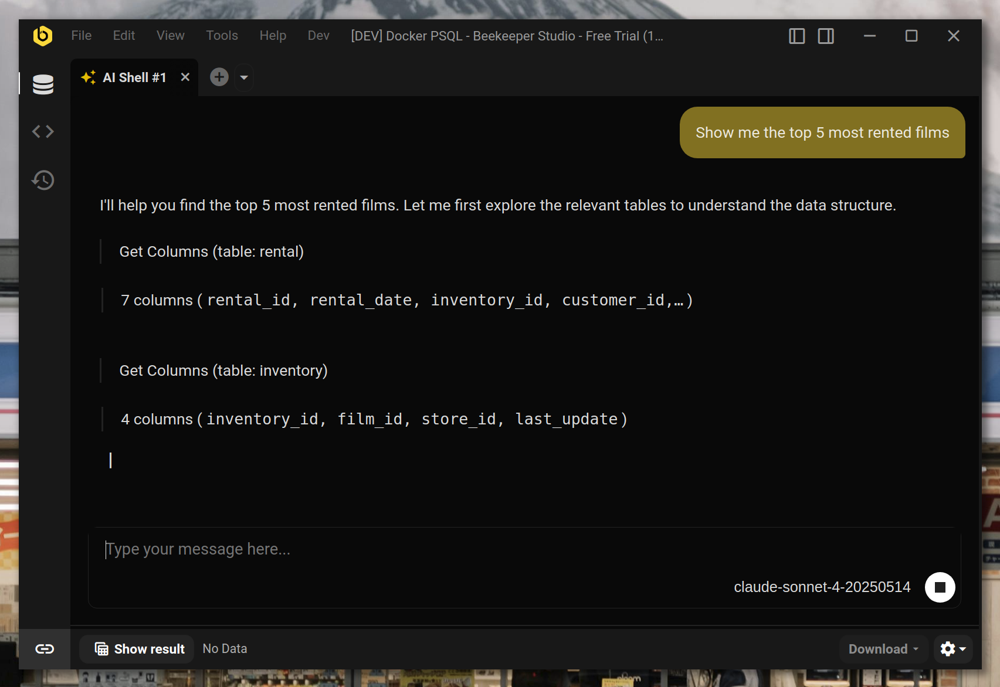

# Plugins

Plugins extend Beekeeper Studio with additional functionality, bringing new tools and capabilities directly into your database workflow. Think of them as specialized add-ons that enhance what you can do with your data.


## What are Plugins?

Plugins are mini-applications that run inside Beekeeper Studio to provide specialized functionality. They appear as new tabs or sidebar panels, integrating seamlessly with the rest of the interface.

Each plugin operates in its own secure environment while having access to your database connections and query capabilities through a controlled interface.

## Who Can Use Plugins?

Plugins are available to **all Beekeeper Studio users**, including those using the free Community Edition.

However, some individual plugins may have their own access requirements. For example, premium plugins developed by the Beekeeper Studio team may require a paid subscription.

## Plugin Limits by License

The number of plugins you can install depends on your Beekeeper Studio license tier:

| License Tier | Plugin Limit |
|--------------|--------------|
| **Pro+** | Unlimited plugins |
| **Indie** | Up to 5 plugins (any type) |
| **Free** | Up to 2 community plugins |

!!! note "About Core Plugins"
    **Core plugins** are official plugins developed and maintained by the Beekeeper Studio team. These plugins require a paid subscription to use.

## Available Plugins

### AI Shell

**Requires Paid Subscription**



The AI Shell plugin brings artificial intelligence directly into your database workflow. Ask questions about your data in plain English and get intelligent responses powered by AI.

The AI Shell appears as a new tab type that you can open alongside your regular query tabs, with a built-in result viewer for any queries it runs.

## Installing Plugins

1. Go to Tools > Manage Plugins
2. Find the plugin you want to install
3. Click **Install**

## Updating Plugins

Beekeeper Studio automatically checks for plugin updates everytime you start the application. When updates are available, Beekeeper Studio will automatically download and install them. Or you can disable this behaviour by:

1. Go to Tools > Manage Plugins
2. Find the plugin
3. Uncheck **Auto-update**

## Uninstalling Plugins

1. Go to Tools > Manage Plugins
2. Find the plugin
3. Click **Uninstall**

## Installing a Specific Plugin Version

Sometimes you might need a specific plugin version - maybe the latest plugin requires a newer Beekeeper Studio version than you have, you can't update the app for some reason, or you need to downgrade to an older plugin version. Here's how to manually install any plugin version:

1. **Disable auto-update first**
    - Go to Tools > Manage Plugins
    - Find the plugin you want to install a specific version of
    - Uncheck **Auto-update** (this prevents Beekeeper Studio from updating it back to the latest version)

2. **Find the plugin in Plugin Manager**
    - Go to Tools > Manage Plugins
    - Find your plugin and click the **GitHub link**

3. **Navigate to releases**
    - Go to the **Releases** page on GitHub
    - Browse available versions

4. **Check version compatibility**
    - Click on a release to see its assets
    - Look for `manifest.json` in the release notes or assets
    - Check the `minAppVersion` field to ensure compatibility with your Beekeeper Studio version
    - Note the plugin `id` from the manifest

5. **Download the plugin**
    - Download the ZIP file (e.g., `bks-ai-shell-1.2.0.zip`, not the source code archive)

6. **Install manually**
    - Navigate to your plugins directory:

        === "Linux"
            ```bash
            ~/.config/beekeeper-studio/plugins/
            ```

        === "macOS"
            ```bash
            ~/Library/Application Support/beekeeper-studio/plugins/
            ```

        === "Windows"
            ```
            %APPDATA%\beekeeper-studio\plugins\
            ```

        === "Portable"
            ```bash
            /path/to/beekeeper-studio/beekeeper-studio-data/plugins/
            ```

    - Find the existing plugin folder and delete it
    - Create a new folder with the same plugin ID
    - Extract the downloaded ZIP file contents into this new folder

7. **Restart Beekeeper Studio**

    The specific plugin version should now be installed and ready to use.

## Feature Requests

Have ideas for new plugins or features? We'd love to hear from you:

-   Email us through the support channels
-   Join our community discussions
-   Submit feature requests on our GitHub repository

!!! tip
    Interested to develop your own plugins? Check out our [Plugin Development documentation](../plugin_development/index.md) to get started!
