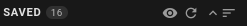
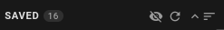
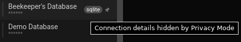
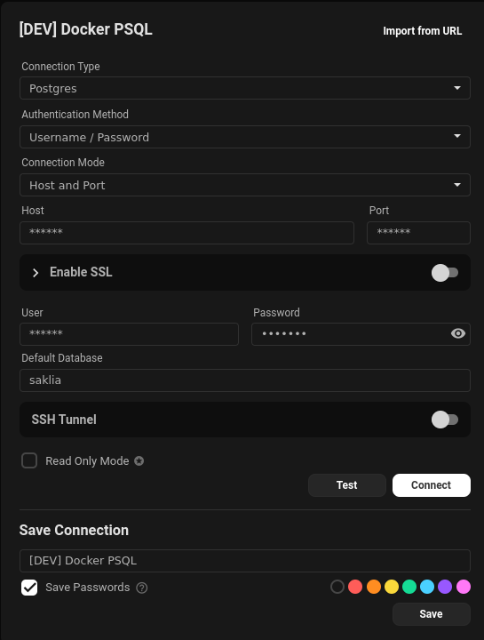
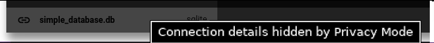

Beekeeper Studio proporciona un modo de privacidad que oculta datos sensibles cuando compartes tu pantalla, para que puedas mantener la informacion privada en privado.

## Interaccion

Al pasar el cursor sobre la barra lateral, puedes ver el boton "Alternar modo de privacidad", representado con un ojo.
Hacer clic en este boton alternara el modo de privacidad entre encendido/apagado.

| Modo de privacidad apagado | Modo de privacidad encendido |
| - | - |
|| |
| Fig.1 Boton apagado | Fig.2 Boton encendido |

## Que se oculta?

El modo de privacidad oculta algunos campos que podrian considerarse sensibles:
- Host / Puerto / BD en conexiones guardadas
- Ventana emergente con la URL completa al pasar el cursor
- Host / Puerto / BD en configuracion de conexion
- URL al pasar el cursor sobre el nombre de la BD despues de conectarse

| Host / Puerto / BD ocultos en conexiones guardadas | La ventana emergente con la URL completa al pasar el cursor |
|-|-|
| | |
| Fig.3 - Funcion oculta 1 | Fig.4 - Funcion oculta 2 |

| Host / Puerto / BD en configuracion de conexion |  URL al pasar el cursor sobre el nombre de la BD despues de conectarse |
| - | - |
| |  |
| Fig.5 - Funcion oculta 3 | Fig.6 - Funcion oculta 4 |
