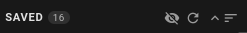

Beekeeper Studio provides a Privacy Mode that hides sensitive data when you're sharing your screen, so you can keep private information private.

## Interaction

While hovering the Sidebar, you can see the "Toggle Privacy Mode" button, represented with an eye.
Clicking this button will toggle the Privacy Mode On/Off.

| Privacy Mode Off | Privacy Mode On |
| - | - |
|| |
| Fig.1 Button Off | Fig.2 Button On |

## What Gets Hidden?

Privacy Mode hides some fields that might be considered as sensitive:
- Host / Port / DB in Saved Connections
- Pop-up with the full URL on Hover
- Host / Port / DB in Connection Settings
- URL when hovering over the DB name after connecting

| Hidden Host / Port / DB in Saved Connections | The pop-up with the full URL on Hover |
|-|-|
| | |
| Fig.3 - Hidden Feature 1 | Fig.4 - Hidden Feature 2 |

| Host / Port / DB in Connection Settings |  URL when hovering over the DB name after connecting |
| - | - |
| |  |
| Fig.5 - Hidden Feature 3 | Fig.6 - Hidden Feature 4 |
